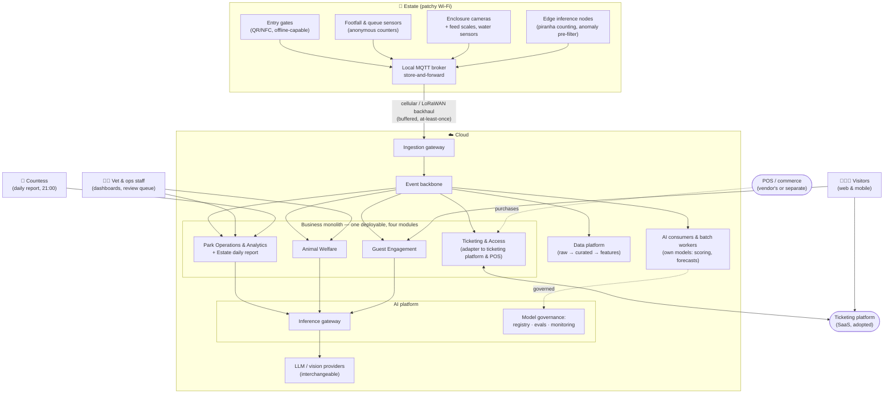

# Architectural Katas 2026: AI-Assisted Software Architecture — Von Digitalis Estates

> Proposal for a modern, AI-assisted architecture that helps the 72nd Countess Von Digitalis turn a sprawling estate — 40 historic rides and 200+ exotic (and poisonous) animals — into a profitable, growing attraction, without going back to the garden gnome business.

**Team:** BONK · **Submission:** September 2026

---

## Table of Contents

- [How to read this repository](#how-to-read-this-repository)
- [The problem in one paragraph](#the-problem-in-one-paragraph)
- [Why this pays back](#why-this-pays-back)
- [Our approach: how we used AI](#our-approach-how-we-used-ai)
- [Where AI sits in the working day](#where-ai-sits-in-the-working-day)
- [The number to challenge first](#the-number-to-challenge-first)
- [Architecture at a glance](#architecture-at-a-glance)
- [Delivery roadmap: what we build when, and what we buy](#delivery-roadmap-what-we-build-when-and-what-we-buy)
- [Requirements](#requirements)
- [High Level Design](#high-level-design)
- [AI scenarios](#ai-scenarios)
- [Architecture Decision Records](#architecture-decision-records)
- [Traceability: capability → requirement → decision](#traceability-capability--requirement--decision)
- [Dealing with uncertainty in AI](#dealing-with-uncertainty-in-ai)
- [Does it work? Validation & verification of AI](#does-it-work-validation--verification-of-ai)
- [What this architecture does not do](#what-this-architecture-does-not-do)
- [Risks](#risks)
- [Appendix](#appendix)
- [Video](#video)

---

## How to read this repository

| Folder | What is inside | Start here if you are… |
| --- | --- | --- |
| `requirements/` | Business goals, pain points, FRs, NFRs, assumptions, OKRs, risks, and the [business case](requirements/08-business-case.md) | …checking whether we understood the problem, and whether it pays |
| `hld/core/` | The non-AI foundation: edge, connectivity, ticketing, event backbone, data, and the game days that verify it | …checking whether the AI fits the rest of the system |
| `hld/scenarios/` | One folder per AI use case: why, what, containers, diagram, validation | …judging innovation and suitability |
| `hld/ai-platform/` | Inference gateway (adopted) and model governance: registry, evaluation, monitoring, cost | …judging how we handle uncertainty and verify AI |
| [`hld/architecture-evaluation.md`](hld/architecture-evaluation.md) | Quality-attribute scenarios, the styles we rejected, sensitivity and trade-off points, risks and non-risks | …asking how the characteristics were evaluated |
| `adrs/` | Architecture Decision Records with alternatives and trade-offs | …looking for the "why" behind any choice |
| [`appendix/`](appendix/README.md) | The work the architecture rests on but does not consist of: business-case model, generative-cost model, daily-report specification, vendor ticketing rules, data-health runbooks, LoRaWAN airtime | …checking a number or a calculation |
| [`how-we-used-ai.md`](how-we-used-ai.md) | How AI was used to produce this proposal, where it was wrong, and what we changed in the process because of it | …judging the kata's own theme |
| `video/` | Semi-final video (if we get there) | |

Every scenario links to its ADRs; every ADR links back to the requirements it serves. The [traceability table](#traceability-capability--requirement--decision) is the shortcut. `uv run scripts/lint_docs.py` checks links, anchors, ids, traceability, duplicated prose and every number derived from the business-case model; `uv run scripts/check_mermaid.py` renders each diagram with mermaid's own parser. GitHub Actions runs both on every push.

---

## The problem in one paragraph

The estate receives ~5,000 visitors/day and must reach 15,000/day within three years. Nobody knows which parts of the park are popular, so investment and staffing are guesswork. The animal collection is expensive to run — dramatically more so when animals get sick — and the jumping piranha population needs counting. Visitors rarely come back and the estate does not know why. Wi-Fi is patchy, cloud services are allowed, and there is a budget for MQTT-capable devices. Full statement: [`requirements/`](requirements/).

---

## Why this pays back

The platform costs about 3% of today's revenue, and its savings alone never cover it. On the roadmap's own gates it pays back in **years 4–7** — year 4 only if the platform is credited with 36% of the growth between year 2 and year 3, which the roadmap cannot deliver before Phase 3. It is a growth bet, sized accordingly, and conditional on the ticketing-vendor evaluation ([TODOS.md](TODOS.md)): without a capacity API and an upgrade credit, the second growth lever becomes a desk process and the window moves right.

The estate's physical capacity binds before the software does: 15,000 a day is not feasible on the current car park and lunch seating, and those are the Countess's decisions before the first summer. The findings and what the architecture takes from them are in [requirements/08](requirements/08-business-case.md); the arithmetic behind them, and how season 1 replaces its assumptions, is in the [appendix model](appendix/business-case-model.md).

---

## Our approach: how we used AI

**AI sits inside the estate's working day, not beside it.** It belongs to the keeper's morning round, the ops manager's opening plan, a visiting family's afternoon and the Countess's 21:00 review — recurring decisions that already exist and are made badly today for want of information. What stays *on top* is the coupling and not the AI: every capability is reached by name, so a model can be swapped, degraded or switched off without stopping the decision it serves.

**Embedded in a process is not embedded in the critical path.** Each of those decisions is still made with the AI switched off: every read the platform offers is also a dashboard, every draft is also a form, and every model alert has a rule standing behind it. That is the whole difference between AI *in* a business process and a business process that *depends* on AI.

The order of work:

1. **Business first.** The brief rewritten as goals, pain points and [OKRs](requirements/06-suggested-okrs.md) with current and target values, so every scenario points at a number it should move.
2. **Foundation second.** Patchy Wi-Fi is the dominant constraint, so the [core architecture](hld/core/README.md) is edge-first: a local MQTT broker with store-and-forward, cellular/LoRaWAN backhaul, offline ticket validation. Everything that keeps people and animals safe works without the cloud.
3. **AI inside the decision, and only where the process needs a judgement a rule cannot make.** Each candidate had to answer: which OKR does it move, why is deterministic logic insufficient, how will we know it works, and what happens when it is wrong? Five survived — [animal welfare monitoring](hld/scenarios/animal-welfare-monitoring/README.md) (the reference scenario, fully worked), [piranha counting](hld/scenarios/piranha-population-counting/README.md), [visitor flow forecasting](hld/scenarios/visitor-flow-forecasting/README.md), [guest companion](hld/scenarios/guest-companion/README.md) and [dynamic family passes](hld/scenarios/dynamic-family-passes/README.md).
4. **Uncertainty and verification as architecture.** An adopted [inference gateway](hld/ai-platform/README.md) isolates us from any single provider; one governance loop covers every model, rented or owned; confidence bands, evaluation gates and production monitoring are specified in [ADR-0007](adrs/ADR-0007-human-in-the-loop-confidence-bands.md), [ADR-0008](adrs/ADR-0008-ai-evaluation-and-production-monitoring.md) and [ADR-0005](adrs/ADR-0005-model-gateway-and-provider-independence.md).

Three kinds of AI, treated differently: **classical ML** (forecasting, pricing) is deterministic given its inputs and tested like software; **computer vision** produces probabilities and gets confidence bands and human review; **generative AI** is grounded, constrained and continuously evaluated.

AI also helped *write* this proposal, which the kata's theme makes fair game for scrutiny: what it did, the five places it was wrong, and the checks we added once we noticed are in [how we used AI](how-we-used-ai.md).

---

## Where AI sits in the working day

Five processes, each with a named owner and a decision that already happens. The last two columns are the test of the claim above: someone human commits, and the process survives the AI being gone.

| Process | Owner | Trigger | Where AI enters the decision | Who commits | With the AI switched off | KR |
| --- | --- | --- | --- | --- | --- | --- |
| **P1 · The morning welfare round** | Keeper, then the vet | Opening; and any alert during the day | Overnight telemetry and camera features are scored, so the round begins with a ranked list and the evidence behind each item rather than 55 equally likely enclosures | The vet confirms or dismisses, with a reason code | The round runs in its usual order; tier-0 rules and feed-scale thresholds still raise alerts | 3.1, 3.2, 3.5 |
| **P2 · The opening and staffing plan** | Ops manager | The evening before; revisited mid-morning | Tomorrow's footfall is forecast per zone, and a deterministic optimiser turns the forecast into a roster proposal | The ops manager approves or edits the roster | The heuristic — the same weekday last week, adjusted for season — produces the plan | 2.2, 2.3, 2.4 |
| **P3 · A family's day in the park** | The visiting family | Ticket purchase, then arrival | The companion builds the day around live queues and the forecast, answers questions from the knowledge base, and re-plans when a ride closes | The family chooses; staff take over on escalation | The cached itinerary and the printed map; the info point answers questions | 1.2, 2.2 |
| **P4 · The 21:00 review and the weekly commercial call** | The Countess and management | Daily at 21:00; weekly for pricing | Figures are inserted verbatim into the daily report and its wording drafted around them; quiet-day price proposals come from the elasticity model | The ops manager approves the wording; management approves any price outside the guardrails | The report goes out from its template with the same figures; prices stay fixed | 1.1, 1.4, 1.5 |
| **P5 · The census and the stock take** | Keeper, at tank maintenance | Planned maintenance, twice a year | Edge counting maintains a running population estimate between censuses, as an interval rather than a point | The keeper's count is the census of record | The population ledger and a manual count | 3.4 |

---

## The number to challenge first

If a reviewer has time to attack exactly one thing, it should be this: **thirteen must-have criteria are required from one ticketing vendor, and six of them may not be offered together by anyone.**

Adopt-not-build was decided on criteria, not on market facts ([ADR-0012](adrs/ADR-0012-ticketing-platform-adopt-not-build.md)). If the combination does not exist, the fallback matrix in [TODOS.md](TODOS.md) changes Phase 0's scope, turns the flywheel's second lever into a desk process, and moves the payback window right — the three things the rest of this proposal rests on. It is a two-to-three day landscape review and it is a prerequisite for Phase 0, not a footnote.

Everything else that could move a conclusion is a [sensitivity point](hld/architecture-evaluation.md#sensitivity-points), with the prompt-cache share and persons-per-gate-scan the two sharpest.

---

## Architecture at a glance

Notation follows the [HLD legend](hld/README.md#diagram-legend-used-in-every-diagram). This overview does not distinguish synchronous from asynchronous calls; the detailed views in [`hld/`](hld/README.md) do.

---

## Delivery roadmap: what we build when, and what we buy

Five AI scenarios, two radio technologies and an edge tier are a lot for ≤ 5 engineers (NFR-OPS-1, R9), so the scope is sequenced rather than cut: each phase has an entry gate, and no model is promoted before the data it needs exists (A6, R7).

| Phase | Enter when | Foundation delivered | AI delivered | Verified by |
| --- | --- | --- | --- | --- |
| **0 · Foundation** | Day 1 | Edge tier: MQTT broker, LoRaWAN gateway, gate readers, tier-0 safety rules, staff devices. Ticketing platform adopted and integrated (ADR-0012). Event backbone, business monolith skeleton, data platform, GitOps. | None. Data capture only — every sensor and gate produces events from day one. | Game days: uplink loss, broker failover, gate offline, revocation after outage, safety alert to a human → [resilience validation](hld/core/resilience-validation.md) |
| **1 · Data & rules** | Phase 0 in production | Anonymous counters in every zone (OKR 2.1). Feature store. Inference gateway and thin model governance. Spend ingestion (`PurchaseRecorded`, FR-2.6) after 14 days in shadow. [Estate daily report](hld/core/README.md#estate-daily-report) as a template (FR-2.7). | **S1** feeding-by-scale: rules + tabular anomaly on feed scales and sensors. **S3** live occupancy dashboard (no ML). **S4** FAQ answers: small model via the gateway, grounded on the knowledge base. | Thresholds table live; golden sets started by domain owners; heuristic staffing rules in place (R7); 7 consecutive green spend reconciliations; OKR 1.6 baseline at month 12 |
| **2 · Models on accumulated data** | ≥ 1 season of footfall and welfare data (A6, R7) | Edge compute sized N+1; visitor-masking gate. [requirements/08](requirements/08-business-case.md) re-issued with season-1 measured values. | **S1** per-enclosure activity anomalies, then camera features in shadow. **S3** footfall forecasting + staffing optimiser (must beat the heuristic). **S4** day planning with streaming answers. Daily report phrasing via the S1 drafter, after the numeric-fidelity eval. | Backtests vs. heuristic baseline; 2-week shadow runs; MAPE gate |
| **3 · Optimisation** | Phase 2 live + 1 year of sales and footfall | — | **S2** piranha counting against a census of record. **S5** demand-aware pricing as a year-1 randomised quiet-day experiment. **S4** return-visit nudges and the pass-upgrade prompt. **S1** per-animal vision for solitary or tagged animals. | Census comparison; A/B by date cohort; nudge control cohort |
| **4+ · Research** | Open questions in [`TODOS.md`](TODOS.md) | — | Per-animal re-identification in group enclosures; ride downtime analytics (FR-2.5). | Spikes with entry thresholds |

**Build vs. adopt.** The team builds what is specific to this estate and adopts the commodities:

| Component | Build or adopt | Why |
| --- | --- | --- |
| Ticketing, family passes, checkout, offline gate validation | **Adopt** an attraction-ticketing platform → [ADR-0012](adrs/ADR-0012-ticketing-platform-adopt-not-build.md) | Commodity with hard edge cases (PCI, refunds, fraud); [ADR-0011](adrs/ADR-0011-offline-ticket-validation.md) becomes our selection criteria |
| Event backbone, databases, object storage, IoT ingestion, model hosting | **Adopt** managed cloud services → [ADR-0003](adrs/ADR-0003-cloud-provider-selection.md) | Nobody on a team of five should run Kafka at 2 a.m. |
| Inference gateway (routing, budgets, fallback, tracing) | **Adopt** an OSS LLM gateway → [ADR-0005](adrs/ADR-0005-model-gateway-and-provider-independence.md) | Solved problem; our routing and budget config is declarative and portable |
| Open-weight fallback model | **Adopt** managed hosting of open weights → [ADR-0005](adrs/ADR-0005-model-gateway-and-provider-independence.md) | Provider independence without a GPU fleet (R9) |
| Model governance: registry, evaluation gate, monitoring | **Build thin**, on managed MLOps primitives → [ADR-0008](adrs/ADR-0008-ai-evaluation-and-production-monitoring.md) | Golden sets and thresholds are ours; the plumbing is not |
| Edge tier: broker, LoRaWAN server, tier-0 rules, gate adapters | **Configure** OSS, build small glue → [ADR-0001](adrs/ADR-0001-edge-first-store-and-forward.md) | Off-the-shelf components; the estate-specific part is the rules and the wiring |
| Visitor client (companion, itinerary, nudges) | **Build** as one installable web app → [S4](hld/scenarios/guest-companion/README.md#the-client-and-why-it-is-an-installable-web-app) | One codebase for phone and kiosk, offline cache for the plan, and no store download between a family and their day |
| Business logic of the four contexts | **Build** as a modular monolith → [ADR-0004](adrs/ADR-0004-event-driven-backbone.md) | This *is* the estate's domain |
| Own models: welfare vision and anomaly scoring, piranha counting, footfall forecast, price elasticity | **Build** → [ADR-0006](adrs/ADR-0006-edge-vs-cloud-inference.md) | No API knows what a lethargic cassowary looks like |

Each scenario README states its phase; the phases in `hld/` are summarised in [hld/README.md](hld/README.md#delivery-phases).

---

## Requirements

- [01 · Business goals & drivers](requirements/01-business-goals-and-drivers.md)
- [02 · Business challenges & pain points](requirements/02-business-challenges.md)
- [03 · Functional requirements](requirements/03-functional-requirements.md)
- [04 · Non-functional requirements & architectural characteristics](requirements/04-non-functional-requirements.md)
- [05 · Assumptions & constraints](requirements/05-assumptions-and-constraints.md)
- [06 · Suggested OKRs](requirements/06-suggested-okrs.md)
- [07 · Risks & mitigations](requirements/07-risks-and-mitigations.md)
- [08 · Business case & growth: capacity, ladder, flywheel, payback](requirements/08-business-case.md)

## High Level Design

- [HLD overview & diagram legend](hld/README.md)
- [Core platform: edge, connectivity, ticketing, events, data](hld/core/README.md)
- [Edge & connectivity: traffic classes, store-and-forward, downlink, capacity](hld/core/edge-and-connectivity.md)
- [Resilience validation: the game-day catalogue](hld/core/resilience-validation.md)
- [AI platform: inference gateway, model governance, cost](hld/ai-platform/README.md)
- [Architecture evaluation: utility tree, styles, sensitivity and trade-off points](hld/architecture-evaluation.md)

## AI scenarios

Attendance runs into the estate's physical capacity long before the software binds ([08 §1](appendix/business-case-model.md#1-capacity-reality-check)), so the levers that grow revenue *without* growing the crowd — spend per visit and repeat visits — are the capital-efficient ones. The column says which lever each scenario pulls; welfare pulls none of them, because healthy animals are the product rather than a lever on it.

| # | Scenario | AI type | Revenue lever | Moves OKR | Human in the loop? |
| --- | --- | --- | --- | --- | --- |
| S1 | [Animal welfare monitoring](hld/scenarios/animal-welfare-monitoring/README.md) *(reference)* | CV + anomaly detection, per animal or per enclosure | Cost avoided — and the product itself | 3.1, 3.2, 3.3 | Yes — veterinarian decides |
| S2 | [Piranha population counting](hld/scenarios/piranha-population-counting/README.md) | Edge CV | Cost avoided (collection integrity) | 3.4 | Census of record at tank maintenance; monthly visual sanity check |
| S3 | [Visitor flow forecasting & staffing](hld/scenarios/visitor-flow-forecasting/README.md) | Classical ML | Spend per visit (less time queueing) · staffing cost | 2.1, 2.2, 2.3 | Ops manager approves rosters |
| S4 | [Guest companion](hld/scenarios/guest-companion/README.md) | Grounded LLM | Repeat visits · spend per visit | 1.2, 1.3, 1.6, 2.2 | Escalation to staff |
| S5 | [Dynamic family passes](hld/scenarios/dynamic-family-passes/README.md) | Classical ML + rules | Attendance on quiet days | 1.5, 1.1, 1.4 | Pricing guardrails set by Countess |

## Architecture Decision Records

Index with status: [`adrs/README.md`](adrs/README.md)

---

## Traceability: capability → requirement → decision

| Business capability | FR | HLD | ADRs |
| --- | --- | --- | --- |
| **Core** | | | |
| Buy tickets & family passes online and on site | FR-1.x | [Core](hld/core/README.md) | [ADR-0012](adrs/ADR-0012-ticketing-platform-adopt-not-build.md), [ADR-0004](adrs/ADR-0004-event-driven-backbone.md) |
| Validate entry with patchy connectivity | FR-1.4 | [Edge](hld/core/edge-and-connectivity.md) | [ADR-0011](adrs/ADR-0011-offline-ticket-validation.md), [ADR-0012](adrs/ADR-0012-ticketing-platform-adopt-not-build.md), [ADR-0001](adrs/ADR-0001-edge-first-store-and-forward.md) |
| Collect telemetry from park & enclosures | FR-2.1, FR-3.1 | [Edge](hld/core/edge-and-connectivity.md) | [ADR-0001](adrs/ADR-0001-edge-first-store-and-forward.md), [ADR-0002](adrs/ADR-0002-mqtt-and-cellular-backhaul.md) |
| Store and analyse estate data | FR-2.x | [Core → Data](hld/core/README.md#data-platform) | [ADR-0003](adrs/ADR-0003-cloud-provider-selection.md), [ADR-0004](adrs/ADR-0004-event-driven-backbone.md) |
| Record on-site spend and report the day to the Countess | FR-2.6, FR-2.7 | [Core → Estate daily report](hld/core/README.md#estate-daily-report) | [ADR-0012](adrs/ADR-0012-ticketing-platform-adopt-not-build.md), [ADR-0004](adrs/ADR-0004-event-driven-backbone.md), [ADR-0010](adrs/ADR-0010-grounded-llm-with-guardrails.md) |
| **AI-enabled** | | | |
| Detect animal health & feeding anomalies | FR-3.2, FR-3.3 | [S1](hld/scenarios/animal-welfare-monitoring/README.md) | [ADR-0006](adrs/ADR-0006-edge-vs-cloud-inference.md), [ADR-0007](adrs/ADR-0007-human-in-the-loop-confidence-bands.md), [ADR-0008](adrs/ADR-0008-ai-evaluation-and-production-monitoring.md) |
| Count piranha population | FR-3.4 | [S2](hld/scenarios/piranha-population-counting/README.md) | [ADR-0006](adrs/ADR-0006-edge-vs-cloud-inference.md), [ADR-0008](adrs/ADR-0008-ai-evaluation-and-production-monitoring.md) |
| Understand zone popularity, forecast flows, plan staff | FR-2.2, FR-2.3 | [S3](hld/scenarios/visitor-flow-forecasting/README.md) | [ADR-0009](adrs/ADR-0009-visitor-privacy-anonymous-counting.md), [ADR-0008](adrs/ADR-0008-ai-evaluation-and-production-monitoring.md), [ADR-0007](adrs/ADR-0007-human-in-the-loop-confidence-bands.md), [ADR-0004](adrs/ADR-0004-event-driven-backbone.md) |
| Guide visitors, personalise the day, drive return visits | FR-4.1, FR-4.2 | [S4](hld/scenarios/guest-companion/README.md) | [ADR-0005](adrs/ADR-0005-model-gateway-and-provider-independence.md), [ADR-0010](adrs/ADR-0010-grounded-llm-with-guardrails.md), [ADR-0007](adrs/ADR-0007-human-in-the-loop-confidence-bands.md) |
| Price family passes to fill quiet days | FR-4.3 | [S5](hld/scenarios/dynamic-family-passes/README.md) | [ADR-0008](adrs/ADR-0008-ai-evaluation-and-production-monitoring.md), [ADR-0007](adrs/ADR-0007-human-in-the-loop-confidence-bands.md), [ADR-0004](adrs/ADR-0004-event-driven-backbone.md), [ADR-0012](adrs/ADR-0012-ticketing-platform-adopt-not-build.md) |
| **AI operations** | | | |
| Swap models/providers without rewriting services | NFR-EVO | [AI platform](hld/ai-platform/README.md) | [ADR-0005](adrs/ADR-0005-model-gateway-and-provider-independence.md) |
| Prove AI works before and after release | NFR-VER | [AI platform](hld/ai-platform/README.md) | [ADR-0008](adrs/ADR-0008-ai-evaluation-and-production-monitoring.md) |

---

## Dealing with uncertainty in AI

**The best model today is not the best model tomorrow.** No business service names a model or a provider. A service asks for a *capability* (`summarise-daily-welfare-report`, `plan-visit`); a thin resolver maps it to the versioned model/prompt bundle in the registry. Hosted models are reached through an adopted open-source [inference gateway](hld/ai-platform/README.md); our own vision, counting and forecasting models run on managed endpoints, edge nodes or batch jobs. All of them sit under the same governance: registry, evaluation gate, monitoring. Switching a model is a registry change plus a passing evaluation suite. → [ADR-0005](adrs/ADR-0005-model-gateway-and-provider-independence.md)

**A provider changes prices.** Per-capability budgets and cost-per-request telemetry in the gateway; tiered routing (cheap model first, escalate on low confidence); alerts at 70/90% of budget; a documented downgrade path to an open-weight model on managed hosting. The generative bill is costed per request class in [what the generative capabilities cost](hld/ai-platform/README.md#what-the-generative-capabilities-cost). → [ADR-0005](adrs/ADR-0005-model-gateway-and-provider-independence.md)

**A provider shuts down.** Every generative capability has a named fallback provider that passes the same evaluation suite, exercised monthly rather than assumed. Prompts, evals and traces stay on our side, and safety-critical paths never depend on a generative model at all. → [ADR-0005](adrs/ADR-0005-model-gateway-and-provider-independence.md), [ADR-0006](adrs/ADR-0006-edge-vs-cloud-inference.md)

## Does it work? Validation & verification of AI

- **Before release:** golden datasets per capability (labelled enclosure footage, historical footfall, annotated visitor conversations); a CI gate that blocks a bundle whose score regresses; shadow mode against the current version. Every gated metric names its instrument — [how the gated metrics are defined](hld/ai-platform/README.md#how-the-gated-metrics-are-defined).
- **In production:** confidence bands with human review for medium confidence; drift monitoring on inputs and outputs; LLM-as-judge on a sample plus weekly human spot checks; business-metric guardrails (vet override rate, forecast MAPE) with automatic rollback.
- **When it misbehaves:** every capability has a deterministic fallback — static schedules, rule-based alerts, fixed prices.

→ [ADR-0008](adrs/ADR-0008-ai-evaluation-and-production-monitoring.md), [ADR-0007](adrs/ADR-0007-human-in-the-loop-confidence-bands.md), [AI platform](hld/ai-platform/README.md)

The non-AI foundation gets the same treatment. A [game-day catalogue](hld/core/resilience-validation.md) of sixteen scripted faults — from uplink loss and broker failover to an erasure request, a POS webhook carrying a card number and a feed scale wedged at a plausible weight — each with expected behaviour, a metric, a pass threshold, a cadence and an owner. Five are the exit criterion for Phase 0.

## What this architecture does not do

The proposal removes the estate's blindness — where people are, how animals are doing, what a Wednesday is worth — and bounds the cost of running it ([cost model](requirements/04-non-functional-requirements.md#cost-model-tco-50): ≈ €0.60 per visitor today, ≈ €0.30 at 15,000/day, most of it ticketing fees and the team). It does **not**:

- **Guarantee the business case.** [requirements/08](requirements/08-business-case.md) shows the arithmetic and its assumptions; the decisions and marketing that make them true, and the parking that makes 15,000 a day physically possible, are the Countess's.
- **Manufacture demand.** The platform measures growth from day one and drives two of its three levers — weekday fill and repeat visits — only from Phase 3. New audiences come from marketing, and the platform claims none of them.
- **Run the rides.** Ride control systems, their certification and predictive maintenance are out of scope (A10, [requirements/05](requirements/05-assumptions-and-constraints.md#out-of-scope)); rides appear as status events and queue counters, feeding the forecast, the companion and the daily report.
- **Replace people.** The vet decides, the keeper identifies the animal, the ops manager approves the roster and the daily report, management sets prices; ≈ 17–26 staff hours a week go into that ([who does what](hld/ai-platform/README.md#humans-in-the-loop-who-does-what)).
- **Identify anyone.** No faces, no device tracking, no re-identification of visitors — or of meerkats, yet.
- **Do HR, payroll or physical security.** Staff data is imported and plans exported (A12); CCTV for theft is not this system.

## Risks

See [requirements/07-risks-and-mitigations.md](requirements/07-risks-and-mitigations.md).

## Appendix

Finance, product specification, vendor rules, radio planning and runbooks are kept out of the architecture and indexed in [`appendix/`](appendix/README.md). Each architectural document quotes the conclusion it needs and links to the calculation behind it.

## Video

Semi-final video (5 min): see [`video/`](video/README.md).

---

> Portions of this documentation were drafted with AI-assisted tools under human direction. All architectural decisions, trade-offs and final content were made, reviewed and approved by the team, who take full responsibility for them.
