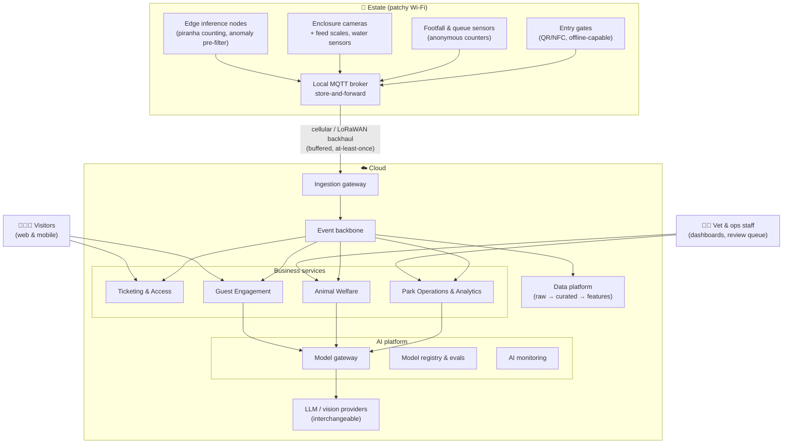

# Architectural Katas 2026: AI-Assisted Software Architecture — Von Digitalis Estates

> Proposal for a modern, AI-assisted architecture that helps the 72nd Countess Von Digitalis turn a sprawling estate — 40 historic rides and 200+ exotic (and poisonous) animals — into a profitable, growing attraction, without going back to the garden gnome business.

**Team:** _<team name>_ · **Submission:** September 2026

---

## Table of Contents

- [How to read this repository](#how-to-read-this-repository)
- [The problem in one paragraph](#the-problem-in-one-paragraph)
- [Our approach: how we used AI](#our-approach-how-we-used-ai)
- [Architecture at a glance](#architecture-at-a-glance)
- [Requirements](#requirements)
- [High Level Design](#high-level-design)
- [AI scenarios](#ai-scenarios)
- [Architecture Decision Records](#architecture-decision-records)
- [Traceability: capability → requirement → decision](#traceability-capability--requirement--decision)
- [Dealing with uncertainty in AI](#dealing-with-uncertainty-in-ai)
- [Does it work? Validation & verification of AI](#does-it-work-validation--verification-of-ai)
- [Risks](#risks)
- [Video](#video)

---

## How to read this repository

| Folder | What is inside | Start here if you are… |
| --- | --- | --- |
| `requirements/` | Business goals, pain points, FRs, NFRs, assumptions, suggested OKRs, risks | …checking whether we understood the problem |
| `hld/core/` | The non-AI foundation: edge, connectivity, ticketing, event backbone, data | …checking whether the AI fits the rest of the system |
| `hld/scenarios/` | One folder per AI use case: why, what, containers, diagram, validation | …judging innovation and suitability |
| `hld/ai-platform/` | Shared AI platform: model gateway, registry, evaluation, monitoring | …judging how we handle uncertainty and verify AI |
| `adrs/` | Architecture Decision Records with alternatives and trade-offs | …looking for the "why" behind any choice |
| `video/` | Semi-final video (if we get there) | |

Every AI scenario links to its ADRs; every ADR links back to the requirements it serves. The [traceability table](#traceability-capability--requirement--decision) is the shortcut.

---

## The problem in one paragraph

The estate receives ~5,000 visitors/day and must reach 15,000/day within three years. Nobody knows which parts of the park are popular, so investment and staffing are guesswork. The animal collection is expensive to run — dramatically more so when animals get sick — and the jumping piranha population needs counting. Visitors rarely come back and the estate does not know why. Wi-Fi is patchy, cloud services are allowed, and there is a budget for MQTT-capable devices. Full statement: [`requirements/`](requirements/).

---

## Our approach: how we used AI

We treated AI as **a layer on top of a sound, event-driven, edge-first system** — not as the system itself. The order of work was deliberate:

1. **Business first.** We rewrote the brief as goals, pain points and [suggested OKRs](requirements/06-suggested-okrs.md) with current and target values, so that every AI scenario can point at a number it is supposed to move.
2. **Foundation second.** Patchy Wi-Fi is the dominant constraint, so the [core architecture](hld/core/README.md) is edge-first: a local MQTT broker with store-and-forward, cellular/LoRaWAN backhaul, and offline ticket validation. Everything that keeps people and animals safe works without the cloud.
3. **AI third — and only where a rule or a query would not do.** Each candidate scenario had to answer: *which OKR does it move, why is deterministic logic insufficient, how will we know it works, and what happens when it is wrong?* Five survived:
   - **Animal welfare monitoring** — computer vision + sensor anomaly detection, with a veterinarian in the loop (our reference scenario, fully worked).
   - **Piranha population counting** — edge computer vision; a counting problem, not a language problem.
   - **Visitor flow forecasting & staffing** — classical ML on anonymous MQTT footfall data.
   - **Guest companion** — a grounded LLM assistant that plans a family's day, cuts queues, and gives them a reason to return.
   - **Dynamic family passes** — demand-aware pricing with hard business guardrails.
4. **Uncertainty and verification as architecture, not as an afterthought.** A [model gateway](hld/ai-platform/README.md) isolates us from any single provider; every AI decision passes through confidence bands, evaluation pipelines and production monitoring described in [ADR-0007](adrs/ADR-0007-human-in-the-loop-confidence-bands.md), [ADR-0008](adrs/ADR-0008-ai-evaluation-and-production-monitoring.md) and [ADR-0005](adrs/ADR-0005-model-gateway-and-provider-independence.md).

We split AI into three kinds and treat them differently: **classical ML** (forecasting, pricing) is deterministic given its inputs and is tested like software; **computer vision** produces probabilities and gets confidence bands and human review; **generative AI** is non-deterministic and is grounded, constrained and continuously evaluated.

---

## Architecture at a glance

**Key:** rectangles are software components; the dashed boundary is a network zone; arrows show the main direction of data flow. A full legend and detailed views are in [`hld/`](hld/README.md).

---

## Requirements

- [01 · Business goals & drivers](requirements/01-business-goals-and-drivers.md)
- [02 · Business challenges & pain points](requirements/02-business-challenges.md)
- [03 · Functional requirements](requirements/03-functional-requirements.md)
- [04 · Non-functional requirements & architectural characteristics](requirements/04-non-functional-requirements.md)
- [05 · Assumptions & constraints](requirements/05-assumptions-and-constraints.md)
- [06 · Suggested OKRs](requirements/06-suggested-okrs.md)
- [07 · Risks & mitigations](requirements/07-risks-and-mitigations.md)

## High Level Design

- [HLD overview & diagram legend](hld/README.md)
- [Core platform: edge, connectivity, ticketing, events, data](hld/core/README.md)
- [Edge & connectivity in detail](hld/core/edge-and-connectivity.md)
- [AI platform: gateway, registry, evaluation, monitoring](hld/ai-platform/README.md)

## AI scenarios

| # | Scenario | AI type | Moves OKR | Human in the loop? |
| --- | --- | --- | --- | --- |
| S1 | [Animal welfare monitoring](hld/scenarios/animal-welfare-monitoring/README.md) *(reference)* | CV + anomaly detection | 3.1, 3.2, 3.3 | Yes — veterinarian decides |
| S2 | [Piranha population counting](hld/scenarios/piranha-population-counting/README.md) | Edge CV | 3.4 | Weekly manual audit |
| S3 | [Visitor flow forecasting & staffing](hld/scenarios/visitor-flow-forecasting/README.md) | Classical ML | 2.1, 2.2, 2.3 | Ops manager approves rosters |
| S4 | [Guest companion](hld/scenarios/guest-companion/README.md) | Grounded LLM | 1.2, 1.3, 2.2 | Escalation to staff |
| S5 | [Dynamic family passes](hld/scenarios/dynamic-family-passes/README.md) | Classical ML + rules | 1.1, 1.4, 4.1 | Pricing guardrails set by Countess |

## Architecture Decision Records

Index with status: [`adrs/README.md`](adrs/README.md)

---

## Traceability: capability → requirement → decision

| Business capability | FR | HLD | ADRs |
| --- | --- | --- | --- |
| **Core** | | | |
| Buy tickets & family passes online and on site | FR-1.x | [Core](hld/core/README.md) | [ADR-0004](adrs/ADR-0004-event-driven-backbone.md), [ADR-0011](adrs/ADR-0011-offline-ticket-validation.md) |
| Validate entry with patchy connectivity | FR-1.4 | [Edge](hld/core/edge-and-connectivity.md) | [ADR-0001](adrs/ADR-0001-edge-first-store-and-forward.md), [ADR-0011](adrs/ADR-0011-offline-ticket-validation.md) |
| Collect telemetry from park & enclosures | FR-2.1, FR-3.1 | [Edge](hld/core/edge-and-connectivity.md) | [ADR-0001](adrs/ADR-0001-edge-first-store-and-forward.md), [ADR-0002](adrs/ADR-0002-mqtt-and-cellular-backhaul.md) |
| Store and analyse estate data | FR-2.x | [Core → Data](hld/core/README.md#data-platform) | [ADR-0003](adrs/ADR-0003-cloud-provider-selection.md), [ADR-0004](adrs/ADR-0004-event-driven-backbone.md) |
| **AI-enabled** | | | |
| Detect animal health & feeding anomalies | FR-3.2, FR-3.3 | [S1](hld/scenarios/animal-welfare-monitoring/README.md) | [ADR-0006](adrs/ADR-0006-edge-vs-cloud-inference.md), [ADR-0007](adrs/ADR-0007-human-in-the-loop-confidence-bands.md), [ADR-0008](adrs/ADR-0008-ai-evaluation-and-production-monitoring.md) |
| Count piranha population | FR-3.4 | [S2](hld/scenarios/piranha-population-counting/README.md) | [ADR-0006](adrs/ADR-0006-edge-vs-cloud-inference.md), [ADR-0008](adrs/ADR-0008-ai-evaluation-and-production-monitoring.md) |
| Understand zone popularity, forecast flows, plan staff | FR-2.2, FR-2.3 | [S3](hld/scenarios/visitor-flow-forecasting/README.md) | [ADR-0009](adrs/ADR-0009-visitor-privacy-anonymous-counting.md), [ADR-0008](adrs/ADR-0008-ai-evaluation-and-production-monitoring.md) |
| Guide visitors, personalise the day, drive return visits | FR-4.1, FR-4.2 | [S4](hld/scenarios/guest-companion/README.md) | [ADR-0005](adrs/ADR-0005-model-gateway-and-provider-independence.md), [ADR-0010](adrs/ADR-0010-grounded-llm-with-guardrails.md) |
| Price family passes to demand | FR-4.3 | [S5](hld/scenarios/dynamic-family-passes/README.md) | [ADR-0008](adrs/ADR-0008-ai-evaluation-and-production-monitoring.md) |
| **AI operations** | | | |
| Swap models/providers without rewriting services | NFR-EVO | [AI platform](hld/ai-platform/README.md) | [ADR-0005](adrs/ADR-0005-model-gateway-and-provider-independence.md) |
| Prove AI works before and after release | NFR-VER | [AI platform](hld/ai-platform/README.md) | [ADR-0008](adrs/ADR-0008-ai-evaluation-and-production-monitoring.md) |

---

## Dealing with uncertainty in AI

The judges asked three questions. Short answers; details in the linked ADRs.

- **Best model today ≠ best model tomorrow.** No business service calls a provider directly. All calls go through the [model gateway](hld/ai-platform/README.md), which resolves a *capability* (`summarise-daily-welfare-report`, `plan-visit`) to a versioned model/prompt bundle. Switching model = a registry change plus passing the capability's evaluation suite. Vision models are our own and portable. → [ADR-0005](adrs/ADR-0005-model-gateway-and-provider-independence.md)
- **Provider changes prices.** Per-capability budgets and cost-per-request telemetry in the gateway; a tiered routing policy (cheap model first, escalate on low confidence); alerts at 70/90% of budget; a documented downgrade path to an open-weight model for every generative capability. → [ADR-0005](adrs/ADR-0005-model-gateway-and-provider-independence.md)
- **Provider shuts down.** Every generative capability has a named fallback provider that passes the same eval suite; prompts, evals and traces are stored on our side; safety-critical paths (animal alerts, gate access) never depend on a generative model at all. → [ADR-0005](adrs/ADR-0005-model-gateway-and-provider-independence.md), [ADR-0006](adrs/ADR-0006-edge-vs-cloud-inference.md)

## Does it work? Validation & verification of AI

- **Before release:** golden datasets per capability (labelled enclosure footage, historical footfall, annotated visitor conversations); a CI gate that blocks a model/prompt version whose eval score regresses; shadow mode against the current version.
- **In production:** confidence bands with human review for medium confidence; drift monitoring on inputs and outputs; LLM-as-judge on a sample plus weekly human spot checks; business-metric guardrails (e.g. vet override rate, forecast MAPE) with automatic rollback to the previous version.
- **When it misbehaves:** every capability has a *deterministic fallback* — static schedules, rule-based alerts, fixed prices — so the estate degrades gracefully rather than failing.

→ [ADR-0008](adrs/ADR-0008-ai-evaluation-and-production-monitoring.md), [ADR-0007](adrs/ADR-0007-human-in-the-loop-confidence-bands.md), [AI platform](hld/ai-platform/README.md)

## Risks

See [requirements/07-risks-and-mitigations.md](requirements/07-risks-and-mitigations.md).

## Video

Semi-final video (5 min): see [`video/`](video/README.md).

---

> Portions of this documentation were drafted with AI-assisted tools under human direction. All architectural decisions, trade-offs and final content were made, reviewed and approved by the team, who take full responsibility for them.
