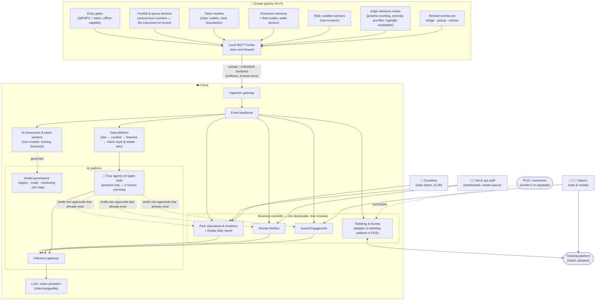

# Architectural Katas 2026: AI-Assisted Software Architecture — Von Digitalis Estates

> Proposal for a modern, AI-assisted architecture that helps the 72nd Countess Von Digitalis turn a sprawling estate — 40 historic rides and 200+ exotic (and poisonous) animals — into a profitable, growing attraction, without going back to the garden gnome business.

**Team:** BONK · **Submission:** September 2026

---

## Table of Contents

- [How to read this repository](#how-to-read-this-repository)
- [The problem in one paragraph](#the-problem-in-one-paragraph)
- [Why this pays back](#why-this-pays-back)
- [Our approach: how we used AI](#our-approach-how-we-used-ai)
- [Where AI sits in the working day](#where-ai-sits-in-the-working-day)
- [Architecture at a glance](#architecture-at-a-glance)
- [Delivery roadmap: what we build when, and what we buy](#delivery-roadmap-what-we-build-when-and-what-we-buy)
- [Requirements](#requirements)
- [High Level Design](#high-level-design)
- [AI scenarios](#ai-scenarios)
- [Architecture Decision Records](#architecture-decision-records)
- [Traceability: capability → requirement → decision](#traceability-capability--requirement--decision)
- [Dealing with uncertainty in AI](#dealing-with-uncertainty-in-ai)
- [Does it work? Validation & verification of AI](#does-it-work-validation--verification-of-ai)
- [What this architecture does not do](#what-this-architecture-does-not-do)
- [Risks](#risks)
- [Appendix](#appendix)
- [Video](#video)

---

## How to read this repository

| Folder | What is inside | Start here if you are… |
| --- | --- | --- |
| `requirements/` | Business goals, pain points, FRs, NFRs, assumptions, OKRs, risks, and the [business case](requirements/08-business-case.md) | …checking whether we understood the problem, and whether it pays |
| `hld/core/` | The non-AI foundation: edge, connectivity, ticketing, event backbone, data, and the game days that verify it | …checking whether the AI fits the rest of the system |
| `hld/scenarios/` | One folder per AI use case — eight of them: why, what, containers, diagram, validation | …judging innovation and suitability |
| [`hld/ai-platform/ai-portfolio.md`](hld/ai-platform/ai-portfolio.md) | The whole AI inventory on one page: twenty-three applications, what each falls back to, and what is deliberately absent | …asking "how much AI is in this, and why *that* AI" |
| [`hld/ai-platform/agents.md`](hld/ai-platform/agents.md) | The four agents: their tools, their invariants, two worked attack chains, and what they cost | …judging whether AI is really inside the business process |
| `hld/ai-platform/` | Inference gateway (adopted) and model governance: registry, evaluation, monitoring, risk classes, cost | …judging how we handle uncertainty and verify AI |
| [`hld/architecture-evaluation.md`](hld/architecture-evaluation.md) | Quality-attribute scenarios, the styles we rejected, sensitivity and trade-off points, risks and non-risks | …asking how the characteristics were evaluated |
| `adrs/` | Architecture Decision Records with alternatives and trade-offs | …looking for the "why" behind any choice |
| [`appendix/`](appendix/README.md) | The work the architecture rests on but does not consist of: business-case model, generative-cost model, daily-report specification, vendor ticketing rules, data-health runbooks, LoRaWAN airtime | …checking a number or a calculation |
| `video/` | Semi-final video (if we get there) | |

Every scenario links to its ADRs; every ADR links back to the requirements it serves. The [traceability table](#traceability-capability--requirement--decision) is the shortcut. `uv run scripts/lint_docs.py` checks links, anchors, ids, traceability, duplicated prose and every number derived from the business-case model; `uv run scripts/check_mermaid.py` renders each diagram with mermaid's own parser. GitHub Actions runs both on every push.

---

## The problem in one paragraph

The estate receives ~5,000 visitors/day and must reach 15,000/day within three years. Nobody knows which parts of the park are popular, so investment and staffing are guesswork. The animal collection is expensive to run — dramatically more so when animals get sick — and the jumping piranha population needs counting. Visitors rarely come back and the estate does not know why. Wi-Fi is patchy, cloud services are allowed, and there is a budget for MQTT-capable devices. Full statement: [`requirements/`](requirements/).

---

## Why this pays back

The platform costs about 3% of today's revenue, and its savings alone never cover it. On the roadmap's own gates it pays back in **years 4–7** — year 4 only if the platform is credited with 36% of the growth between year 2 and year 3, which the roadmap cannot deliver before Phase 3. It is a growth bet, sized accordingly, and conditional on the ticketing-vendor evaluation ([TODOS.md](TODOS.md)): without a capacity API and an upgrade credit, the second growth lever becomes a desk process and the window moves right.

The estate's physical capacity binds before the software does: 15,000 a day is not feasible on the current car park and lunch seating, and those are the Countess's decisions before the first summer. The findings and what the architecture takes from them are in [requirements/08](requirements/08-business-case.md); the arithmetic behind them, and how season 1 replaces its assumptions, is in the [appendix model](appendix/business-case-model.md).

---

## Our approach: how we used AI

**AI sits inside the estate's working day, not beside it.** It belongs to the keeper's morning round, the ops manager's opening plan, the vet's decision at the review queue, a family's afternoon and the Countess's 21:00 review — recurring decisions that already exist and are made badly today for want of information. Twenty-three AI applications across eight scenarios, inventoried on one page: [the portfolio](hld/ai-platform/ai-portfolio.md). Four agents put AI inside the multi-step part of those decisions: [agents](hld/ai-platform/agents.md).

**Embedded in a process is not embedded in the critical path.** Every one of those decisions is still made with the AI switched off. Every read the platform offers is also a dashboard, every draft is also a form, every model alert has a rule standing behind it, and no agent is the only path to any action. That is the difference between AI *in* a business process and a business process that *depends* on AI — and it is why the [degradation ladder](hld/core/README.md#cross-cutting) is a design artefact rather than a disclaimer.

The order of work:

1. **Business first.** The brief rewritten as goals, pain points and [OKRs](requirements/06-suggested-okrs.md) with current and target values, so every scenario points at a number it should move. The revenue arithmetic the portfolio is arranged against — attendance × spend per visitor-day × repeat rate — is in [the portfolio's opening section](hld/ai-platform/ai-portfolio.md#the-lens-where-ai-has-to-earn-its-place).
2. **Foundation second.** Patchy Wi-Fi is the dominant constraint, so the [core architecture](hld/core/README.md) is edge-first: a local MQTT broker with store-and-forward, cellular/LoRaWAN backhaul, offline ticket validation, and a per-class channel choice for the enclosures none of those reach ([ADR-0019](adrs/ADR-0019-reach-for-remote-enclosures.md)). Everything that keeps people and animals safe works without the cloud.
3. **AI where the decision needs a judgement a rule cannot make.** Each candidate answered: which OKR does it move, why is deterministic logic insufficient, how will we know it works, and what happens when it is wrong? Several failed and are rules today — live zone popularity is a counter, ticket validation is a signature, the staffing optimiser is a solver. Eight scenarios survived, and each capability inside them ships as a rule first and is promoted only if the model beats it ([ADR-0023](adrs/ADR-0023-rules-first-model-second.md)).
4. **Uncertainty and verification as architecture.** An adopted [inference gateway](hld/ai-platform/README.md) isolates us from any single provider; one governance loop covers every model, rented or owned; confidence bands derived from what an error costs ([ADR-0016](adrs/ADR-0016-cost-of-error-sets-the-bands.md)), evaluation gates and production monitoring are in [ADR-0007](adrs/ADR-0007-human-in-the-loop-confidence-bands.md), [ADR-0008](adrs/ADR-0008-ai-evaluation-and-production-monitoring.md) and [ADR-0005](adrs/ADR-0005-model-gateway-and-provider-independence.md); and the controls a capability owes follow from its risk class ([ADR-0017](adrs/ADR-0017-ai-risk-classes-and-proportional-controls.md)).

Four kinds of AI, treated differently: **classical ML** (forecasting, pricing, ride condition) is deterministic given its inputs and tested like software; **computer vision** produces probabilities and gets confidence bands and human review; **generative AI** is grounded, constrained and continuously evaluated; and an **agent** is an orchestrator over the other three, evaluated on task success and rolled back separately from the model it runs on.

## Where AI sits in the working day

Six processes, each with an owner and a decision that already happens. The right-hand column is the test of the claim above: someone human commits, and the day survives the AI being gone.

| Process | Owner | Where AI enters the decision | Who commits, and what happens with the AI off |
| --- | --- | --- | --- |
| **P1 · The morning welfare round** | Keeper, then the vet | The round starts from a ranked list with the evidence behind each item rather than 55 equally likely enclosures; `agent:animal` assembles the animal's fortnight, the scale's health and the species protocol before the vet opens a treatment | The vet confirms or dismisses with a reason code. Without AI the round runs in its usual order, and tier-0 rules and feed-scale thresholds still raise alerts |
| **P2 · The opening and staffing plan** | Ops manager | Tomorrow's footfall is forecast per zone; a deterministic optimiser turns it into a roster proposal; `agent:ops-copilot` drafts a one-zone change and what it costs | The ops manager approves or edits. Without AI the heuristic — same weekday last week, adjusted for season — produces the plan |
| **P3 · A family's day in the park** | The visiting family | The companion builds the day around live queues, answers from the knowledge base, and re-plans when a ride closes; the token makes entry and payment a tap | The family chooses; staff take over on escalation. Without AI the cached itinerary, the printed map and the info point |
| **P4 · The 21:00 review, the commercial call, the quarterly capital question** | The Countess and management | Figures inserted verbatim into the daily report and its wording drafted around them; quiet-day price proposals from the elasticity model; `agent:management` answers the follow-up over defined metrics; quarterly, each investment gets a causal estimate with its interval | The ops manager approves the wording; management approves any price outside guardrails. Without AI the report goes out from its template with the same figures and prices stay fixed |
| **P5 · The weekly content slot and the visitor's voice** | Curator, guest team | Highlight candidates found in activity features already computed for welfare; a caption drafted around a verbatim species fact; the week's free-text feedback clustered into named themes with quotes | The curator publishes or discards — there is no automated publish path. Without AI the curator scans the week's clips and the guest team reads the sentences, which is today |
| **P6 · The census, the stock take and the inspection round** | Keeper; certified engineer | Edge counting maintains a population estimate between censuses as an interval; ride condition flags a machine for inspection with its traces | The keeper's count is the census of record; the engineer decides every ride. Without AI the manual count and the statutory schedule, which is the whole safety regime either way |

---

## Architecture at a glance

Notation follows the [HLD legend](hld/README.md#diagram-legend-used-in-every-diagram). This overview does not distinguish synchronous from asynchronous calls; the detailed views in [`hld/`](hld/README.md) do.

---

## Delivery roadmap: what we build when, and what we buy

Five AI scenarios, two radio technologies and an edge tier are a lot for ≤ 5 engineers (NFR-OPS-1, R9), so the scope is sequenced rather than cut: each phase has an entry gate, and no model is promoted before the data it needs exists (A6, R7).

| Phase | Enter when | Foundation delivered | AI delivered | Verified by |
| --- | --- | --- | --- | --- |
| **0 · Foundation** | Day 1 | Edge tier: MQTT broker, LoRaWAN gateway, gate readers, tier-0 safety rules, staff devices. Ticketing platform adopted and integrated (ADR-0012). Visitor token issued at the gate as a second credential form factor (FR-1.8). Site survey settles the remote-site channel mix (A17). Event backbone, business monolith skeleton, data platform, GitOps. | None. Data capture only — every sensor, gate and token tap produces events from day one. | Game days: uplink loss, broker failover, gate offline, revocation after outage, safety alert to a human → [resilience validation](hld/core/resilience-validation.md) |
| **1 · Data & rules** | Phase 0 in production | Anonymous counters in every zone (OKR 2.1). Feature store and the **metric layer** (ADR-0015). Inference gateway and thin model governance. Spend ingestion (`PurchaseRecorded`, FR-2.6) after 14 days in shadow. [Estate daily report](hld/core/README.md#estate-daily-report) as a template (FR-2.7). Ride sensors fitted where the heritage assessment allows, feeding threshold rules only (A19). | **S1** feeding-by-scale and plant-house climate: rules + tabular anomaly. **S3** live occupancy dashboard (no ML). **S4** FAQ answers: small model via the gateway, grounded on the knowledge base. **S8** condition rules on each ride's run-in baseline. | Thresholds table live; golden sets started by domain owners; heuristic staffing rules in place (R7); 7 consecutive green spend reconciliations; OKR 1.6 baseline at month 12 |
| **2 · Models on accumulated data** | ≥ 1 season of footfall and welfare data (A6, R7) | Edge compute sized N+1; visitor-masking gate. Token path weighting validated against counter totals (A16). [requirements/08](requirements/08-business-case.md) re-issued with season-1 measured values. | **S1** per-enclosure activity anomalies, then camera features in shadow. **S3** footfall forecasting + staffing optimiser (must beat the heuristic). **S4** day planning with streaming answers. **S6** `agent:ops-copilot` and the `agent:companion` tool turn. **S7** feedback themes. Daily report phrasing via the S1 drafter, after the numeric-fidelity eval. | Backtests vs. heuristic baseline; 2-week shadow runs; MAPE gate; GD-17 and GD-18 before either agent carries a drafting tool |
| **3 · Optimisation** | Phase 2 live + 1 year of sales and footfall | — | **S2** piranha counting against a census of record. **S5** demand-aware pricing as a year-1 randomised quiet-day experiment. **S4** return-visit nudges, the pass-upgrade prompt and personalisation for token holders. **S1** per-animal vision for solitary or tagged animals, and the plant feeding detector. **S6** `agent:animal`, `agent:management` and investment effect estimation. **S7** highlight mining and caption drafts. **S8** the condition model, if it beats its rule. | Census comparison; A/B by date cohort; nudge control cohort; the four kill gates in [the portfolio](hld/ai-platform/ai-portfolio.md#kill-gates) |
| **4+ · Research** | Open questions in [`TODOS.md`](TODOS.md) | — | Per-animal re-identification in group enclosures; the five preconditions for vehicle autonomy reviewed yearly (ADR-0020 §4). | Spikes with entry thresholds |

**Build vs. adopt.** The team builds what is specific to this estate and adopts the commodities:

| Component | Build or adopt | Why |
| --- | --- | --- |
| Ticketing, family passes, checkout, offline gate validation | **Adopt** an attraction-ticketing platform → [ADR-0012](adrs/ADR-0012-ticketing-platform-adopt-not-build.md) | Commodity with hard edge cases (PCI, refunds, fraud); [ADR-0011](adrs/ADR-0011-offline-ticket-validation.md) becomes our selection criteria |
| Event backbone, databases, object storage, IoT ingestion, model hosting | **Adopt** managed cloud services → [ADR-0003](adrs/ADR-0003-cloud-provider-selection.md) | Nobody on a team of five should run Kafka at 2 a.m. |
| Inference gateway (routing, budgets, fallback, tracing) | **Adopt** an OSS LLM gateway → [ADR-0005](adrs/ADR-0005-model-gateway-and-provider-independence.md) | Solved problem; our routing and budget config is declarative and portable |
| Open-weight fallback model | **Adopt** managed hosting of open weights → [ADR-0005](adrs/ADR-0005-model-gateway-and-provider-independence.md) | Provider independence without a GPU fleet (R9) |
| Model governance: registry, evaluation gate, monitoring | **Build thin**, on managed MLOps primitives → [ADR-0008](adrs/ADR-0008-ai-evaluation-and-production-monitoring.md) | Golden sets and thresholds are ours; the plumbing is not |
| Edge tier: broker, LoRaWAN server, tier-0 rules, gate adapters | **Configure** OSS, build small glue → [ADR-0001](adrs/ADR-0001-edge-first-store-and-forward.md) | Off-the-shelf components; the estate-specific part is the rules and the wiring |
| Business logic of the four contexts | **Build** as a modular monolith → [ADR-0004](adrs/ADR-0004-event-driven-backbone.md) | This *is* the estate's domain |
| Own models: welfare vision and anomaly scoring, piranha counting, footfall forecast, price elasticity | **Build** → [ADR-0006](adrs/ADR-0006-edge-vs-cloud-inference.md) | No API knows what a lethargic cassowary looks like |

Each scenario README states its phase; the phases in `hld/` are summarised in [hld/README.md](hld/README.md#delivery-phases).

---

## Requirements

- [01 · Business goals & drivers](requirements/01-business-goals-and-drivers.md)
- [02 · Business challenges & pain points](requirements/02-business-challenges.md)
- [03 · Functional requirements](requirements/03-functional-requirements.md)
- [04 · Non-functional requirements & architectural characteristics](requirements/04-non-functional-requirements.md)
- [05 · Assumptions & constraints](requirements/05-assumptions-and-constraints.md)
- [06 · Suggested OKRs](requirements/06-suggested-okrs.md)
- [07 · Risks & mitigations](requirements/07-risks-and-mitigations.md)
- [08 · Business case & growth: capacity, ladder, flywheel, payback](requirements/08-business-case.md)

## High Level Design

- [HLD overview & diagram legend](hld/README.md)
- [Core platform: edge, connectivity, ticketing, events, data](hld/core/README.md)
- [Edge & connectivity: traffic classes, store-and-forward, downlink, capacity](hld/core/edge-and-connectivity.md)
- [Resilience validation: the game-day catalogue](hld/core/resilience-validation.md)
- [AI platform: inference gateway, model governance, cost](hld/ai-platform/README.md)
- [Architecture evaluation: utility tree, styles, sensitivity and trade-off points](hld/architecture-evaluation.md)

## AI scenarios

| # | Scenario | AI type | Moves OKR | Human in the loop? |
| --- | --- | --- | --- | --- |
| S1 | [Animal welfare monitoring](hld/scenarios/animal-welfare-monitoring/README.md) *(reference)* | CV + anomaly detection, per animal or per enclosure | 3.1, 3.2, 3.3 | Yes — veterinarian decides |
| S2 | [Piranha population counting](hld/scenarios/piranha-population-counting/README.md) | Edge CV | 3.4 | Census of record at tank maintenance; monthly visual sanity check |
| S3 | [Visitor flow forecasting & staffing](hld/scenarios/visitor-flow-forecasting/README.md) | Classical ML | 2.1, 2.2, 2.3 | Ops manager approves rosters |
| S4 | [Guest companion](hld/scenarios/guest-companion/README.md) | Grounded LLM | 1.2, 1.3, 1.6, 2.2 | Escalation to staff |
| S5 | [Dynamic family passes](hld/scenarios/dynamic-family-passes/README.md) | Classical ML + rules | 1.5, 1.1, 1.4 | Pricing guardrails set by Countess |
| S6 | [Operations copilot and ask-the-estate](hld/scenarios/operations-copilot/README.md) | Agents on typed tools + classical | 2.3, 2.4, 2.6, 3.1, 5.4 | Yes — every agent output is a proposal into an approval that already existed |
| S7 | [Content drafting and visitor voice](hld/scenarios/content-and-visitor-voice/README.md) | Edge CV + generative + clustering | 1.7, 1.4, 1.2 | Yes — the curator publishes or discards; there is no automated publish path |
| S8 | [Ride condition monitoring](hld/scenarios/ride-condition-monitoring/README.md) | Classical ML | 2.5, 2.2 | Yes — a certified engineer decides every flag, and AI never clears a ride |

The whole inventory behind these eight — twenty-three applications, their fallbacks, what was deliberately left out and where each can be killed: [the AI portfolio](hld/ai-platform/ai-portfolio.md).

## Architecture Decision Records

Twenty-five, with alternatives and trade-offs. Index with status: [`adrs/README.md`](adrs/README.md)

---

## Traceability: capability → requirement → decision

| Business capability | FR | HLD | ADRs |
| --- | --- | --- | --- |
| **Core** | | | |
| Buy tickets & family passes online and on site | FR-1.x | [Core](hld/core/README.md) | [ADR-0012](adrs/ADR-0012-ticketing-platform-adopt-not-build.md), [ADR-0004](adrs/ADR-0004-event-driven-backbone.md) |
| Validate entry with patchy connectivity | FR-1.4 | [Edge](hld/core/edge-and-connectivity.md) | [ADR-0011](adrs/ADR-0011-offline-ticket-validation.md), [ADR-0012](adrs/ADR-0012-ticketing-platform-adopt-not-build.md), [ADR-0001](adrs/ADR-0001-edge-first-store-and-forward.md) |
| Collect telemetry from park & enclosures | FR-2.1, FR-3.1 | [Edge](hld/core/edge-and-connectivity.md) | [ADR-0001](adrs/ADR-0001-edge-first-store-and-forward.md), [ADR-0002](adrs/ADR-0002-mqtt-and-cellular-backhaul.md) |
| Store and analyse estate data | FR-2.x | [Core → Data](hld/core/README.md#data-platform) | [ADR-0003](adrs/ADR-0003-cloud-provider-selection.md), [ADR-0004](adrs/ADR-0004-event-driven-backbone.md) |
| Record on-site spend and report the day to the Countess | FR-2.6, FR-2.7 | [Core → Estate daily report](hld/core/README.md#estate-daily-report) | [ADR-0012](adrs/ADR-0012-ticketing-platform-adopt-not-build.md), [ADR-0004](adrs/ADR-0004-event-driven-backbone.md), [ADR-0010](adrs/ADR-0010-grounded-llm-with-guardrails.md) |
| **AI-enabled** | | | |
| Detect animal health & feeding anomalies, and monitor the plant collection on the same pipeline | FR-3.2, FR-3.3, FR-3.8 | [S1](hld/scenarios/animal-welfare-monitoring/README.md) | [ADR-0006](adrs/ADR-0006-edge-vs-cloud-inference.md), [ADR-0007](adrs/ADR-0007-human-in-the-loop-confidence-bands.md), [ADR-0008](adrs/ADR-0008-ai-evaluation-and-production-monitoring.md), [ADR-0024](adrs/ADR-0024-plant-collection-on-the-welfare-pipeline.md) |
| Count piranha population | FR-3.4 | [S2](hld/scenarios/piranha-population-counting/README.md) | [ADR-0006](adrs/ADR-0006-edge-vs-cloud-inference.md), [ADR-0008](adrs/ADR-0008-ai-evaluation-and-production-monitoring.md) |
| Understand zone popularity, forecast flows, plan staff | FR-2.2, FR-2.3 | [S3](hld/scenarios/visitor-flow-forecasting/README.md) | [ADR-0009](adrs/ADR-0009-visitor-privacy-anonymous-counting.md), [ADR-0008](adrs/ADR-0008-ai-evaluation-and-production-monitoring.md), [ADR-0007](adrs/ADR-0007-human-in-the-loop-confidence-bands.md), [ADR-0004](adrs/ADR-0004-event-driven-backbone.md) |
| Guide visitors, personalise the day, drive return visits | FR-4.1, FR-4.2 | [S4](hld/scenarios/guest-companion/README.md) | [ADR-0005](adrs/ADR-0005-model-gateway-and-provider-independence.md), [ADR-0010](adrs/ADR-0010-grounded-llm-with-guardrails.md), [ADR-0007](adrs/ADR-0007-human-in-the-loop-confidence-bands.md) |
| Price family passes to fill quiet days | FR-4.3 | [S5](hld/scenarios/dynamic-family-passes/README.md) | [ADR-0008](adrs/ADR-0008-ai-evaluation-and-production-monitoring.md), [ADR-0007](adrs/ADR-0007-human-in-the-loop-confidence-bands.md), [ADR-0004](adrs/ADR-0004-event-driven-backbone.md), [ADR-0012](adrs/ADR-0012-ticketing-platform-adopt-not-build.md) |
| Recognise a returning household, and pay by tap | FR-1.8, FR-4.6 | [Core](hld/core/README.md#containers) | [ADR-0018](adrs/ADR-0018-visitor-token-and-anonymised-paths.md), [ADR-0011](adrs/ADR-0011-offline-ticket-validation.md), [ADR-0009](adrs/ADR-0009-visitor-privacy-anonymous-counting.md) |
| Answer where families go, and what an investment changed | FR-2.4, FR-2.8, FR-2.10 | [S6](hld/scenarios/operations-copilot/README.md) | [ADR-0013](adrs/ADR-0013-stakeholder-agents-on-typed-tools.md), [ADR-0014](adrs/ADR-0014-two-tier-agent-memory-with-a-write-guard.md), [ADR-0015](adrs/ADR-0015-metric-layer-and-estate-twin.md) |
| Turn the estate's own footage and its visitors' words into something usable | FR-4.4, FR-4.5 | [S7](hld/scenarios/content-and-visitor-voice/README.md) | [ADR-0006](adrs/ADR-0006-edge-vs-cloud-inference.md), [ADR-0021](adrs/ADR-0021-content-drafting-with-a-publish-gate.md), [ADR-0025](adrs/ADR-0025-feedback-themes-not-scores.md) |
| Know how the rides are behaving before one stops | FR-2.5, FR-2.9 | [S8](hld/scenarios/ride-condition-monitoring/README.md) | [ADR-0016](adrs/ADR-0016-cost-of-error-sets-the-bands.md), [ADR-0022](adrs/ADR-0022-ride-condition-monitoring.md), [ADR-0023](adrs/ADR-0023-rules-first-model-second.md) |
| Reach the enclosures nothing else reaches | FR-3.1, FR-1.9 | [Edge](hld/core/edge-and-connectivity.md#reach-at-a-remote-site) | [ADR-0019](adrs/ADR-0019-reach-for-remote-enclosures.md), [ADR-0020](adrs/ADR-0020-internal-transport-and-autonomy.md) |
| **AI operations** | | | |
| Swap models/providers without rewriting services | NFR-EVO | [AI platform](hld/ai-platform/README.md) | [ADR-0005](adrs/ADR-0005-model-gateway-and-provider-independence.md) |
| Prove AI works before and after release | NFR-VER | [AI platform](hld/ai-platform/README.md) | [ADR-0008](adrs/ADR-0008-ai-evaluation-and-production-monitoring.md) |
| Let an agent act without letting it decide | FR-5.4, NFR-AGT-1 | [Agents](hld/ai-platform/agents.md) | [ADR-0013](adrs/ADR-0013-stakeholder-agents-on-typed-tools.md), [ADR-0014](adrs/ADR-0014-two-tier-agent-memory-with-a-write-guard.md) |
| Know which controls a capability owes | OKR 5.3 | [Risk classes](hld/ai-platform/README.md#risk-classes-which-controls-a-capability-owes) | [ADR-0017](adrs/ADR-0017-ai-risk-classes-and-proportional-controls.md), [ADR-0016](adrs/ADR-0016-cost-of-error-sets-the-bands.md) |

---

## Dealing with uncertainty in AI

**The best model today is not the best model tomorrow.** No business service names a model or a provider. A service asks for a *capability* (`summarise-daily-welfare-report`, `plan-visit`); a thin resolver maps it to the versioned model/prompt bundle in the registry. Hosted models are reached through an adopted open-source [inference gateway](hld/ai-platform/README.md); our own vision, counting and forecasting models run on managed endpoints, edge nodes or batch jobs. All of them sit under the same governance: registry, evaluation gate, monitoring. Switching a model is a registry change plus a passing evaluation suite. → [ADR-0005](adrs/ADR-0005-model-gateway-and-provider-independence.md)

**A provider changes prices.** Per-capability budgets and cost-per-request telemetry in the gateway; tiered routing (cheap model first, escalate on low confidence); alerts at 70/90% of budget; a documented downgrade path to an open-weight model on managed hosting. The generative bill is costed per request class in [what the generative capabilities cost](hld/ai-platform/README.md#what-the-generative-capabilities-cost). → [ADR-0005](adrs/ADR-0005-model-gateway-and-provider-independence.md)

**A provider shuts down.** Every generative capability has a named fallback provider that passes the same evaluation suite, exercised monthly rather than assumed. Prompts, evals and traces stay on our side, and safety-critical paths never depend on a generative model at all. → [ADR-0005](adrs/ADR-0005-model-gateway-and-provider-independence.md), [ADR-0006](adrs/ADR-0006-edge-vs-cloud-inference.md)

## Does it work? Validation & verification of AI

- **Before release:** golden datasets per capability (labelled enclosure footage, historical footfall, annotated visitor conversations); a CI gate that blocks a bundle whose score regresses; shadow mode against the current version. Every gated metric names its instrument — [how the gated metrics are defined](hld/ai-platform/README.md#how-the-gated-metrics-are-defined).
- **In production:** confidence bands with human review for medium confidence; drift monitoring on inputs and outputs; LLM-as-judge on a sample plus weekly human spot checks; business-metric guardrails (vet override rate, forecast MAPE) with automatic rollback.
- **For the agents, three more metrics:** task success, tool-error rate and human-override rate — and an **agent rollback** that reverts the prompt, whitelist and step budget without touching the model bundle, because the failure is at least as often in the wiring ([agents](hld/ai-platform/agents.md#evaluation-in-production-and-rolling-back-the-agent-rather-than-the-model)).
- **When it misbehaves:** every capability has a deterministic fallback — static schedules, rule-based alerts, fixed prices — and it is not a designed one: each fallback ran in production as the primary path before its model was promoted ([ADR-0023](adrs/ADR-0023-rules-first-model-second.md)).

→ [ADR-0008](adrs/ADR-0008-ai-evaluation-and-production-monitoring.md), [ADR-0007](adrs/ADR-0007-human-in-the-loop-confidence-bands.md), [ADR-0016](adrs/ADR-0016-cost-of-error-sets-the-bands.md), [AI platform](hld/ai-platform/README.md)

The non-AI foundation gets the same treatment. A [game-day catalogue](hld/core/resilience-validation.md) of twenty scripted faults — from uplink loss and broker failover to an erasure request, a POS webhook carrying a card number and a feed scale wedged at a plausible weight — each with expected behaviour, a metric, a pass threshold, a cadence and an owner. Five are the exit criterion for Phase 0. Four of the twenty aim at what the AI added: a poisoned knowledge-base document, a poisoned batch of agent memory and its rollback, a remote enclosure losing both its bridge and its pickup round, and a token reader going offline on a capacity-managed day.

## What this architecture does not do

The proposal removes the estate's blindness — where people are, how animals are doing, how the rides are behaving, what a Wednesday is worth — and bounds the cost of running it ([cost model](requirements/04-non-functional-requirements.md#cost-model-tco-50): ≈ €0.62 per visitor today, ≈ €0.33 at 15,000/day, most of it ticketing fees and the team). It does **not**:

- **Guarantee the business case.** [requirements/08](requirements/08-business-case.md) shows the arithmetic and its assumptions; the decisions and marketing that make them true, and the parking that makes 15,000 a day physically possible, are the Countess's.
- **Manufacture demand.** The platform measures growth from day one and drives two of its three levers — weekday fill and repeat visits — only from Phase 3. New audiences come from marketing, and the platform claims none of them.
- **Run the rides, or clear one.** Ride control systems and their certification stay out of scope. [S8](hld/scenarios/ride-condition-monitoring/README.md) watches the machinery on non-invasive sensors and flags a ride for inspection with its evidence, on top of an unchanged statutory schedule — and a certified engineer, never a model, decides whether a ride opens ([ADR-0022](adrs/ADR-0022-ride-condition-monitoring.md)).
- **Drive anything.** The land train keeps its driver. Autonomy is a safety case with five stated preconditions, none of which holds today, and we would rather write that down than quietly leave it out ([ADR-0020](adrs/ADR-0020-internal-transport-and-autonomy.md) §4).
- **Replace people.** The vet decides, the keeper identifies the animal, the ops manager approves the roster and the daily report, the curator publishes, the engineer clears the ride, management sets prices; ≈ 17–31 staff hours a week go into that ([who does what](hld/ai-platform/README.md#humans-in-the-loop-who-does-what)). Every agent output is a proposal into one of those decisions.
- **Identify anyone without them choosing it.** No faces, no device tracking, no re-identification across seasons — and no re-identification of meerkats, yet. Footfall and queues are measured by anonymous counters, which remain the instrument of record. The [visitor token](adrs/ADR-0018-visitor-token-and-anonymised-paths.md) is the opposite of covert: a physical thing the visitor can refuse, whose location consent is separate and costs no function, whose taps are aggregated and suppressed below twenty before any analyst sees them, and whose carry rate is published beside every figure it produces.
- **Do HR, payroll or physical security.** Staff data is imported and plans exported (A12); CCTV for theft is not this system.

## Risks

See [requirements/07-risks-and-mitigations.md](requirements/07-risks-and-mitigations.md).

## Appendix

Finance, product specification, vendor rules, radio planning and runbooks are kept out of the architecture and indexed in [`appendix/`](appendix/README.md). Each architectural document quotes the conclusion it needs and links to the calculation behind it.

## Video

Semi-final video (5 min): see [`video/`](video/README.md).

---

> Portions of this documentation were drafted with AI-assisted tools under human direction. All architectural decisions, trade-offs and final content were made, reviewed and approved by the team, who take full responsibility for them.
