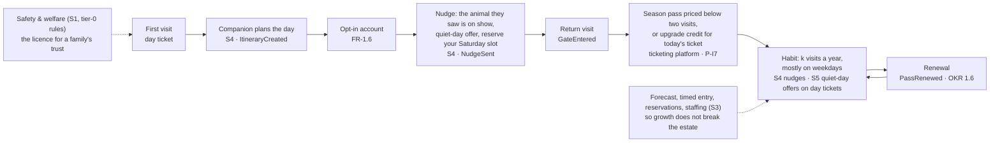

# Appendix · Business-case model

> The full arithmetic behind [requirements/08](../requirements/08-business-case.md): where 15,000 visitors a day come from, and whether the platform that helps get there pays for itself. Every table is generated from one assumptions block, so a reader can substitute their own inputs.

This is a financial model, not an architectural artifact. It reaches the architecture at three points only: the capacity figures that size the estate (NFR-SCL-1), the cost ceiling (NFR-COST-1/2), and the events the growth rates are measured from.

**Headline.** 15,000 visitors a day is not feasible on the estate's current parking and lunch seating. The platform's savings never pay for it alone; on the roadmap's own gates it pays back in years 4–7, and inside three years under no scenario in §4.

**Scope.** This is the platform's business case — what the system in this repository costs, what it can be credited with, when it pays back. It is not an estate P&L: the estate's profitability (G1) rests on decisions taken outside the software (parking, seating, pricing, marketing, staffing), listed with orders of magnitude in §5; the P&L follows when those have prices (§6).

Every number is conditional on the ticketing-vendor evaluation — finding 4 of [requirements/08](../requirements/08-business-case.md#the-four-findings), with the per-criterion cost in the fallback matrix ([TODOS.md](../TODOS.md)).

## 0. How to read the numbers

Every figure is an **assumption until season 1**. Each table carries an "assumption → measured by" column naming the counter, event or survey that replaces it; the first season supplies the measured values and this document is re-issued once (§6).

The tables are generated by [`scripts/business_case.py`](../scripts/business_case.py) from a single assumptions block, and `uv run scripts/lint_docs.py` fails when a table — or any number quoted from the model anywhere in this repository — drifts from it. Substituting your own inputs means editing that block.

**Units and definitions**, used throughout this repository.

| Term | Definition |
| --- | --- |
| **Visitor-day (visit)** | One person entering once on one day: the sum of `GateEntered.persons_admitted`, the group size admitted on one scan ([ADR-0011](../adrs/ADR-0011-offline-ticket-validation.md)). A same-day re-entry carries `persons_admitted = 0`, and the daily total is reconciled against admissions sold. All attendance figures are visitor-days |
| **Household** | The unit of the growth model, *estimated* rather than observed. A credential (ticket, family pass) or an opt-in account proxies for a household, so a family with two day tickets is two credentials; anonymous day-ticket visitors are counted only through the exit survey (A14), a self-report rather than a link across visits. Persons follow from households through the **party size of 3.5** (A9), an assumption until `persons_admitted` per credential is measured |
| **Repeat share p** (OKR 1.2) | Share of households with ≥ 2 visits in 12 months. Repeaters average **k = 3** visits a year (assumption). §3's cohort model counts households — retained, converted, newly acquired — and derives p, unique households H and the pass share from those counts. Measured on identified households, with the survey estimate for the rest and labelled as an estimate |
| **Weekday / weekend ratio r** (OKR 1.5) | Average weekday visitor-days ÷ average weekend-day visitor-days per open day. Weekly visitor-days = W(5r + 2) with W the weekend-day average, so a daily average D gives **W = 7D ÷ (5r + 2)** |
| **Peak day, peak hour** | Peak day = W × 1.4 (seasonal factor, A14). Peak hour = 20% of a day's arrivals (A14, as in NFR-SCL-1). On site at 14:00 ≈ 55% of the day's visitor-days; on site at some point in the lunch window ≈ 80% |
| **Run rate vs. volume** | Ladder values are end-of-year run rates (visitor-days per day); a year's volume is the mean of adjacent run rates × 300 open days. Year 3's volume is therefore ≈ 3.7M, not 4.5M — the target run rate arrives at the end of year 3 |
| **Revenue per visitor-day, gross** | A pass holder's visit €15 = admission €9 (a season pass priced at 1.8 single admissions per person, used k = 3 times) + on-site €6. Every other visit €21 = admission €15 + on-site €6. Pass holders are repeaters × §3's pass-conversion rate, so the revenue mix follows the cohort model rather than a convention |
| **Contribution per visitor-day** | Gross minus the ticketing fee (€0.15 per credential, one per visitor-day assumed), variable operations (€1: cleaning, consumables, casual staff) and 50% cost of goods on on-site sales: ≈ €17 for a single visit, ≈ €11 for a pass visit. **For attribution and break-even the fee is excluded** (€17 / €11 exactly), because it already sits in the platform's OPEX curve and would otherwise be charged twice. Cost of goods, variable operations and the fee are finance-supplied configuration (A15) |
| **OKR revenue is cash** | From `TicketPurchased` + `PurchaseRecorded` (FR-2.6). OKR 1.4's primary line is revenue per visitor-day (cash ÷ Σ `persons_admitted`), its second line revenue per unique household using the model's estimate of H. The €9-per-visit pass allocation is a modelling convention only |
| **Platform cost** | OPEX(V) ≈ €580k fixed (team, cellular, maintenance, base cloud and LLM spend) + €0.165 × V visitor-days/yr (ticketing fee €0.15 + cloud and LLM scaling €0.015). Reproduces the [requirements/04 cost table](../requirements/04-non-functional-requirements.md#cost-model-tco-50) within ≈ 2% at both ends. CAPEX €310k over 5 years |
| **Payback** | Undiscounted |
| **Rounding** | Tables show rounded figures; derived money is computed unrounded, so substituting rounded cells lands a few percent off |
| **Roadmap months** | From the [README roadmap](../README.md#delivery-roadmap-what-we-build-when-and-what-we-buy): Phase 0 months 0–6, Phase 1 months 6–18, Phase 2 months 18–30, Phase 3 from ≈ month 30, S5 readout ≈ month 42 |

## 1. Capacity reality check

**15,000 visitors a day is infeasible on the estate's current parking and lunch seating.** A 15,000 average at a weekday/weekend ratio of 0.6 means a peak summer Saturday near 29,400 people:

- **Parking** as assumed holds 15,000 on a peak day. The estate either roughly doubles it (≈ ×2 spaces, park-and-ride or coach contracts) or brings the car share down to ≤ 41%.
- **Lunch seating** as assumed holds 13,636 on a peak day, barely above today's peaks, so it binds in the same year.

Both are Phase 0–1 decisions, due before the first ladder year's summer. The software adds neither a space nor a seat. It can spread arrivals (timed entry and pass-holder reservations, FR-1.7), shape demand (quiet-day offers, S5), steer lunch times (S4) and show the trend ("days until parking binds" on the [Estate daily report](../hld/core/README.md#estate-daily-report)).

Egress, toilets, kitchens and access roads are not assessed here and may bind earlier; the Phase 0 site survey is the first thing to fund (§5).

What each year of the ladder means on the ground, at the end-of-year run rate:

<!-- business-case:run-rate -->
| End-of-year run rate | Y0 (today) | Y1 | Y2 | Y3 (target) |
|---|---|---|---|---|
| Daily average D (visitor-days) | 5,000 | 6,500 | 9,500 | 15,000 |
| Growth vs. previous year | — | +30% | +46% | +58% |
| Weekday / weekend ratio r (OKR 1.5) | 0.35 | 0.38 | 0.45 | 0.60 |
| Weekend-day average W = 7D ÷ (5r + 2) | 9,333 | 11,667 | 15,647 | 21,000 |
| Weekday average W × r | 3,267 | 4,433 | 7,041 | 12,600 |
| Peak day W × 1.4 | 13,067 | 16,333 | 21,906 | 29,400 |
| Peak-hour arrivals (20% of the peak day) | 2,613 | 3,267 | 4,381 | 5,880 |
| On site at 14:00 (55% of the peak day) | 7,187 | 8,983 | 12,048 | 16,170 |
| Constraints exceeded on the peak day (§1) | none | parking, f&b seating at lunch | parking, f&b seating at lunch | parking, f&b seating at lunch |
<!-- /business-case:run-rate -->

Which constraint binds, at what attendance, and in which year:

<!-- business-case:capacity -->
| Constraint | Assumption (→ measured by) | Holds until (peak-day visitor-days) | First ladder year it binds | Verdict and lever |
|---|---|---|---|---|
| Parking | 2,500 spaces, 1.5 turns/day, 3.2 per car, 80% arrive by car (→ site survey, car counters) | 2,500 × 1.5 × 3.2 ÷ 0.8 = **15,000** | **Y1** (peak ≈ 16,333) | Binds. Target peak ≈ 29,400 needs ≈ ×2 spaces or a car share ≤ 41%: park-and-ride / coach share, plus pass-holder reservations and timed entry on capacity-managed days (FR-1.7) and quiet-day shaping (S5). A cap redistributes arrivals; it adds no space |
| F&B seating at lunch | 1,500 seats × 4 turns 11:30–14:30 = 6,000 meals; 80% of the day's visitor-days are on site at some point in that window × 55% of those take a seated lunch (→ `PurchaseRecorded`, queue counters) | 6,000 ÷ (0.8 × 0.55) = **13,636** | **Y1** (peak ≈ 16,333) | Binds. Companion steers lunch times and under-used outlets (S4); spend per zone shows where; seats or a longer window are the estate's (§5) |
| Gates | 6 lanes × 900 scans/h × 2.0 persons per scan (blended: single tickets 1, family passes up to 3.5); 20% of arrivals in the peak hour (→ `GateEntered.persons_admitted`) | 5,400/h × 2.0 ÷ 0.2 = **54,000** | beyond Y3 | Holds: peak hour ≈ 5,880 persons/h against ≈ 10,800; timed-entry slots (FR-1.7) keep the margin if persons per scan turns out lower |
| Rides | 40 historic rides × 150–300 riders/h × 8 h = 48k–96k rides/day (→ ride cycle counters) | 1.6–3.3 rides per visitor on the target peak day | — | Not a hard limit but the experience constraint: OKR 2.2 (p90 queue ≤ 20 min) breaks first, and on the popular rides long before the average says so; S3/S4 load spreading is the lever |
| Paths and lawns | 3.3 m² per person (Fruin LOS C) for 16,170 on site at 14:00 (→ site plan, zone counters) | 16,170 × 3.3 m² ≈ **5.3 ha** of walkable public area | — | Holds if the estate's public circulation area is at least that (site plan); below it, zone caps decided by ops from live occupancy (S3 read models) |
| Estate systems | broker cluster, LoRaWAN, ingestion sized in hld/core for > 100k visitor-days | peak-hour gate rate ≈ 0.8 scans/s | — | Hold ([capacity table](../hld/core/edge-and-connectivity.md#capacity-check-at-15000-visitorsday-by-traffic-class)) |
| Not assessed | egress and emergency evacuation capacity, toilets, kitchen throughput, access roads and local choke points | no figures in this document | — | Open until the Phase 0 site survey (A14); any of them can bind before the rows above |
<!-- /business-case:capacity -->

**Levers by scenario, and their limits.** A daily cap and timed-entry slots (FR-1.7, [ADR-0012](../adrs/ADR-0012-ticketing-platform-adopt-not-build.md)) are an ops decision applied through the ticketing platform, published as `CapacityCapChanged`, with gate validation unchanged. But a cap acts on **unsold tickets**, and pass holders — two-fifths of visits by year 3 — hold no date-specific ticket, so capacity-managed days need slot reservations for them as well ([mechanics](ticketing-rules.md#timed-entry-and-daily-cap-fr-17)). S4 nudges say "reserve your Saturday slot".

Alongside that: S5's quiet-day offers move day-ticket demand off the peaks, S4 steers lunch times and under-used outlets, and live zone occupancy (S3) lets ops cap a single zone on the day. A cap redistributes arrivals or turns them away; whether displaced demand returns on a quiet day is what the S4/S5 measurements will test, and it is not a number in this model.

## 2. Where the growth comes from

The ladder is **back-loaded** on purpose. The attendance levers the architecture owns — S4 nudges and S5 offers — go live in Phase 3 (≈ month 30). Year-1 growth belongs to the first season under new management: base price, marketing, seasonal events, season passes on sale from day one; the platform only measures it. A front-loaded ladder would credit the platform with growth it cannot cause.

Growth is decomposed two ways, and they are the same ×3 seen from two sides, not multiplied together:

- **By day-type** (run rates): weekend-day volume W ×2.25 (9,333 → 21,000) and the weekly multiplier (5r + 2) ×1.33 (r 0.35 → 0.6). Weekday fill is the lever the platform drives (S4 nudges to pass holders, S5 offers on day tickets); weekend volume comes from new audiences.
- **By people** (annual volumes): unique households ×1.8 and visits per household ×1.4. Repeat visits are the platform's lever; new households are marketing's — and the cohort model makes that number explicit, year by year.

The two overlap — pass-holding repeaters are the main weekday fillers — which is stated as a simplifying assumption rather than corrected for.

<!-- business-case:volume -->
| Over the year | Y0 (today) | Y1 | Y2 | Y3 (target) |
|---|---|---|---|---|
| Visitor-days (mean of adjacent run rates × 300 open days) | 1.5M | 1.7M | 2.4M | 3.7M |
| Repeat share of households p (OKR 1.2) — from the cohort model in §3 | 10% | 10% | 12% | 32% |
| Unique households H (household visits ÷ 3.5 people, k = 3 visits per repeater) | 357k | 409k | 549k | 636k |
| Repeat households R | 36k | 42k | 68k | 207k |
| — of which pass holders (R × pass conversion) | 29k | 31k | 48k | 145k |
| Single-visit households S | 321k | 368k | 481k | 430k |
| **New households marketing must bring** (not visiting last year) | — | **323k** | **432k** | **382k** |
| Pass visitor-days — share of all visits (OKR 1.3 model) | 0.3M — **20%** | 0.3M — **19%** | 0.5M — **21%** | 1.5M — **41%** |
| Repeat visitor-days without a pass (priced as single visits) | 0.1M | 0.1M | 0.2M | 0.7M |
| Single visitor-days | 1.1M | 1.3M | 1.7M | 1.5M |
| Gross revenue (single or no-pass visit €21.00, pass visit €15.00) | €29.7M | €34.3M | €47.4M | €68.1M |
| Revenue per visitor-day (OKR 1.4 primary line) | €19.8 | €19.9 | €19.7 | €18.5 |
| Revenue per unique household per year (OKR 1.4 second line — an estimate, H is modelled) | €83 | €84 (+1%) | €86 (+4%) | €107 (+29%) |
| Contribution (single €16.85, pass €10.85 per visitor-day, fee included) | €23.5M | €27.1M | €37.4M | €52.8M |
<!-- /business-case:volume -->

**Sanity check.** 3.7M visitor-days in year 3 and a 4.5M run rate are theme-park scale (Efteling / Europa-Park class) rather than zoo scale; with 40 rides the comparison is fair, and the brief's target implies it.

The membership trade is explicit: pass visits grow to 41% of visits, revenue per visitor-day falls by design, revenue per unique household rises +28%, total contribution grows ×2.2. So is the dilution: new households arrive faster than the flywheel converts them, so the repeat share climbs slowly until year 3, and the "new households marketing must bring" row is what the ladder costs. §5 says what catchment that implies.

**What the model gives the OKRs.** The 12-month "base" cells of OKRs 1.1, 1.2, 1.3 and 1.5 in [06](../requirements/06-suggested-okrs.md) are the year-1 values below; the original targets stay as "stretch", and the gap is what marketing and a stronger flywheel have to close (OKR 1.2). The 36-month targets are untouched; where the model's year-3 value falls short, 06 says so in a note — it does for 1.2 and 1.3.

<!-- business-case:okr-base -->
| Key result | Current (model) | 12-month base (Y1 run rate / year) | 36-month model (Y3) |
|---|---|---|---|
| 1.1 Average visitors per day | 5,000 | 6,500 | 15,000 |
| 1.2 Repeat share of households | 10% | 10% | 32% |
| 1.3 Passes' share of admissions (visitor-days) | 20% | 19% | 41% |
| 1.4 Revenue per visitor-day (primary) | €19.8 | €19.9 (+0%) | €18.5 (-6%) |
| 1.4 Revenue per unique household per year (estimate) | €83 | €84 (+1%) | €107 (+29%) |
| 1.5 Weekday / weekend ratio | 0.35 | 0.38 | 0.60 |
| 1.6 Season-pass renewal (model) | n/a | 60% | 70% |
<!-- /business-case:okr-base -->

## 3. The membership flywheel

Zoos and family attractions grow on membership, not on ticket price: a pass priced below two visits turns a single-day buyer into a habit, and in 2026 renewal is the test of perceived value. The scenarios were designed one by one; read together the five that touch a visitor are one wheel, with the estate's physical safety as the licence to enter it:

**Three levers, three owners.** (1) **Quiet-day offers on day and family tickets** are S5: an elasticity model inside management's guardrails, run as a randomised experiment in its first year. (2) **Pass economics** — the pass price, the upgrade credit and renewal — are a **management decision plus ticketing policy executed by the vendor**: a pass is not date-specific, so no pricing model touches it; the upgrade credit is a platform invariant (P-I7 in [ADR-0012](../adrs/ADR-0012-ticketing-platform-adopt-not-build.md)), one price for everyone. (3) **Weekday fill from pass holders** is S4's nudges, measured as nudged vs. control weekday visits.

**The cohort we measure.** The repeat share p in §2 is derived, not asserted: eight rates, each with the event that measures it, applied to counts of households. Last year's repeaters are retained (pass holders by pass renewal, the rest by account retention); last year's single-visit households are converted (an organic rate plus the flywheel — adoption × opt-in × nudge reach × return); whatever the year's volume needs beyond that is new households.

The rates ramp because the scenarios that move them arrive by phase — before Phase 3 a "nudge" is the ticketing platform's plain offer e-mail, not a personalised one. Under these assumptions p reaches ≈ 32% in year 3, short of OKR 1.2's 40%, because the ladder brings new households in faster than the wheel turns them. The rates are not tuned to hit the target: if one falls short in season 1, p falls further and the new-households row grows.

<!-- business-case:funnel -->
| Rate | Meaning | Y1 | Y2 | Y3 | Measured by | Why it moves |
|---|---|---|---|---|---|---|
| Companion adoption | households that create an itinerary | 25% | 45% | 60% | `ItineraryCreated` ÷ households admitted | S4 FAQ (Phase 1) → day planning (Phase 2) |
| Opt-in | of those, households opening an account | 40% | 55% | 75% | account opt-in (FR-1.6) ÷ companion households | the companion gives a reason to keep an account |
| Nudge reach | of those, reached by a nudge they act on (click or visit, not e-mail opens — privacy proxies inflate opens) | 30% | 50% | 90% | `NudgeSent` with a click ÷ accounts | plain offer mail from the ticketing platform before Phase 3; S4 personalised nudges from month 30 |
| Return | of those, back within 12 months | 40% | 50% | 70% | `GateEntered` of the household after a nudge | quiet-day offer and season-pass offer in the nudge |
| Pass conversion | of repeaters, holding a season pass (today 80%) | 75% | 70% | 70% | pass `TicketPurchased` or redeemed upgrade credit ÷ repeating households | drives OKR 1.3 and the revenue mix; falls at first because nudge-won repeaters start without a pass |
| Pass renewal | of pass-holding repeaters, renewing (OKR 1.6) | 60% | 65% | 70% | `PassRenewed` ÷ passes expiring | executed by the ticketing platform; the upgrade credit and the nudges feed it |
| Account retention | of repeaters without a pass, repeating again | 40% | 45% | 50% | repeat `GateEntered` across years for accounts; anonymous repeaters by survey (A14) | S4 nudges; an assumption for the anonymous share |
| Single return | of single-visit households not converted, back once next year | 15% | 15% | 15% | accounts across years; exit survey | the once-a-year habit; constant |
| **Flywheel conversion** (adoption × opt-in × reach × return) | share of last year's single-visit households converted this year | 1.2% | 6.2% | 28.3% | derived |  |
| **Organic conversion** | today's steady state: p = 10% with retention 50% | 5.6% | 5.6% | 5.6% | exit survey (A14) | constant |
| **Repeaters R** = retained + converted (households) | Y0 = 36k | **42k** (20k + 22k) | **68k** (25k + 43k) | **207k** (44k + 163k) | identified households with ≥ 2 visits |  |
| **Repeat share p** = R ÷ H | Y0 = 10% | **10%** | **12%** | **32%** | OKR 1.2 | growth dilutes p: new households arrive faster than the flywheel converts them |
<!-- /business-case:funnel -->

The four rates that make up the flywheel conversion are **business guardrails** in the [thresholds table](../hld/ai-platform/README.md#thresholds-and-cadences-source-of-truth) (alert only, no model rollback). **OKR 1.6 season-pass renewal** is new: `PassRenewed` exists from Phase 0, so the first cohort's renewal is measurable at month 12 (the 12-month "baseline"), and the 36-month target of ≥ 70% is labelled ambitious against zoo-membership norms of 50–70%. It measures pass-holding repeaters only; the retention of repeaters without a pass is a separate rate, measured on accounts.

## 4. Does the platform pay back

Cost is the [requirements/04 cost model](../requirements/04-non-functional-requirements.md#cost-model-tco-50) as a curve; benefit is contribution, not gross revenue; the baseline is doing nothing.

<!-- business-case:payback -->
| Line | Value |
|---|---|
| CAPEX (requirements/04), all in year 1 | €310k |
| OPEX(V) = €580k + €0.165 × visitor-days (the €0.15 ticketing fee per visitor-day is inside) | Y1 €865k / Y2 €976k / Y3 €1.19M |
| Cumulative platform cost by month 36 | **€3.34M**, then ≈ €110k/month at the target run rate |
| **Do nothing** (baseline the benefit is measured against) | no CAPEX, no OPEX, no savings; attendance moves only with the base price, marketing and the season — the platform's benefit below is the difference to this line |
| Savings, from month 18 (S1 vet cost −15% → −30% of €300k; S3 idle hours −30% → −50% of 15% of a €1.20M field payroll) | €99k/yr rising to €180k/yr at month 36 — ≈ 14% of OPEX; never pays back alone |
| Contribution per visitor-day, fee included (gross − fee €0.15 × 1.0 credential − variable ops €1.00 − 50% cost of goods on €6.00 on-site) | single visit **€16.85**, pass visit **€10.85** — the figures the OKRs and the S5 guardrail use |
| Contribution per visitor-day **before the fee** (the fee is already in OPEX(V) — counting it here too would charge it twice) | single visit €17.00, pass visit €11.00 — used for attribution and break-even only |
| Net per incremental visitor-day credited to the platform (70% of incremental visits by pass holders at pass contribution minus €6 re-pricing of a converted single visit spread over k − 1 = 2 new visits for the 50% that come via conversion; the rest at single-visit contribution) | **€11.75** |
| Attribution ramp (roadmap gates): 0 until month 30; linear to 50% of the rate at month 42 (S4 nudges live, S5 only on experiment blocks); 100% after the S5 Go | the sensitivity below applies it month by month |
| Break-even at today's volume: annual cost OPEX(1.5M) + CAPEX ÷ 5 | €890k ≈ **80,864 extra visitor-days (+5.4%)** at pass contribution before the fee, 52,324 (+3.5%) at single-visit contribution, or €1.78M more on-site sales (+20%) |
| Platform cost as a share of gross revenue | 2.8% today → 1.6% at the target run rate |
<!-- /business-case:payback -->

**What the platform claims.** Credit goes to **incremental visitor-days on quiet days**: weekday visits by nudged pass holders, quiet-day offers taken up by day-ticket buyers, households that upgraded to a pass and came back. Those visits use capacity the estate already has, which is why the §5 investments are not charged against them — the parking, seating and lanes there serve peak days, whose growth the platform does not claim, and the marketing there brings new households, which it does not claim either. Variable staff already scales inside the contribution figures (€1 per visitor-day). An incremental visit landing on a peak day would need the §5 investments and is not credited.

Timing follows the roadmap: nothing before Phase 3 (≈ month 30), S4 nudges live from month 30, S5 at experiment depth until its month-42 readout, full rate only after a Go there. The re-pricing of the visit a converted household used to make is deducted — its one €21 visit becomes three €15 visits, two new and one cheaper.

The result is stated as a sensitivity in incremental visits rather than shares of attendance, because attribution is not provable (R20). The nudged-vs-control cohort (S4) and the discounted-vs-control blocks (S5) are the only clean measurements.

<!-- business-case:sensitivity -->
| Incremental visitor-days credited to the platform (ramped from month 30, full after month 42) | Annual attributed contribution at full rate | Benefit vs. cost at month 36 | Cumulative break-even |
|---|---|---|---|
| 200,000/yr at full rate (≈ 4% of the year-3 run rate; 12% of the Y2 → Y3 growth) | €2.35M | €392k vs. €3.34M | ≈ month 73 (year 7) |
| 400,000/yr at full rate (≈ 9% of the year-3 run rate; 24% of the Y2 → Y3 growth) | €4.70M | €564k vs. €3.34M | ≈ month 51 (year 5) |
| 600,000/yr at full rate (≈ 13% of the year-3 run rate; 36% of the Y2 → Y3 growth) | €7.05M | €735k vs. €3.34M | ≈ month 46 (year 4) |
| Savings only | €180k | €221k vs. €3.34M | never |
<!-- /business-case:sensitivity -->

**Verdict.** On the roadmap's own gates the platform pays back in **years 4–7** — not inside the brief's three years under any row, and in year 4 only if credited with roughly 600,000 incremental visitor-days a year at full rate, 36% of the year-2-to-year-3 growth.

Savings are real but small: about 14% of running cost, never enough to pay the platform back on their own. Safety is not priced at all, though one prevented incident with a poisonous animal or an 18th-century ride is the business (G6). The two lines a CFO can pull to shorten the window are the ticketing fee, the largest scaling cost, and the team, ≈ 38% of OPEX at the target run rate.

**What must be true** for the middle row, and how we will know:

| Condition | Earliest signal | Where it is measured |
| --- | --- | --- |
| Phase 3 levers (S4 nudges, S5 offers, pass upgrade prompt) live by month 30, and S5's readout at month 42 is a Go | Roadmap gate: Phase 2 live + 1 year of sales and footfall | [README roadmap](../README.md#delivery-roadmap-what-we-build-when-and-what-we-buy) |
| Season-pass renewal ≥ 60% (cohort over cohort) | Month 24 — the first cohort's second renewal window | OKR 1.6; business-guardrail row |
| On-site spend per visitor-day holds at ≈ €6 and the pass share of admissions follows the ladder — together they are the modelled pass contribution | Month 12 of `PurchaseRecorded` | OKR 1.4 primary line; business-guardrail row (A15 parameters) |
| Parking and seating decisions taken before year-1 peaks | Phase 0 | §5, estate |
| Cohort rates within 20% of the table in §3 | Month 18 (companion adoption, opt-in); month 36 (reach, return, renewal) | S4 business guardrails |
| The vendor evaluation confirms the capacity API, reservations and the upgrade credit | Phase 0 prerequisite | [TODOS.md](../TODOS.md), fallback matrix |

## 5. What the estate must fund besides the platform

The platform is ≈ 3% of revenue today and ≈ 1.6% at target. The investments that make 15,000 a day physically possible are larger and are not in this repository's scope. Orders of magnitude, so the Countess can see the whole bill; owners named so nothing falls between the software and the estate:

| Investment or decision | Why (from §1–§3) | Order of magnitude (assumption) | Owner | When |
| --- | --- | --- | --- | --- |
| **Parking**: ≈ 2,500 more spaces, or park-and-ride and coach contracts that bring the car share to ≤ 41% | Binds in year 1 | New spaces ≈ €3–5k each (€8–12M) *or* park-and-ride / coach share ≈ €0.3–0.5M a year | Estate | Decision in Phase 0–1; capacity before the year-1 summer |
| **F&B seating and outlets**: ≈ +1,500 seats or a longer lunch window | Binds in year 1 | ≈ €1–2M; the companion's lunch steering and `PurchaseRecorded` say where | Estate, F&B lead | Before the year-1 summer |
| **Gate lanes**: hold on the model; timed-entry slots and reservations keep the margin | Hold | Slots and reservations are ticketing-platform settings (FR-1.7); +2 lanes ≈ €50–100k if persons per scan comes in low | Estate, ops manager | Year 2–3 |
| **Marketing and catchment plan** for ≈ ×1.8 unique households | The platform does not manufacture demand | At a customer-acquisition cost of €10–20 per new household, ≈ €4–8M a year by year 3; the catchment check below says whether the market is even there | Countess, marketing | From Phase 0 |
| **Base price and pass price** (a pass below two visits) | Pass economics is the second lever, executed by the vendor | Pricing decision; the modelled €9 per pass visit is an assumption | Management | Yearly |
| **Step staffing** as attendance triples | Field staff scale with visitors; S3 optimises within the budget it is given | ≈ +60–100 field FTE by year 3 (order of magnitude) | Estate, HR | Per phase |
| **Site survey** for the capacity assumptions (parking turns, car share, seats, lane throughput and persons per scan, public area, egress, toilets, kitchens, access roads) | Every row of §1 is an assumption and several are not assessed at all | Days of work; the same visit verifies A2 and the LoRaWAN plan | Platform lead with the estate | Phase 0 |

<!-- business-case:catchment -->
| Market sanity check (assumption → measured by) | Value |
|---|---|
| Unique households in year 3 | 636k (×1.8 vs. today) ≈ 2.2M people |
| New households marketing must bring in year 3 (not visiting the year before) | 382k |
| Required catchment at 20% yearly penetration of households with children within ≈ 2 h (→ postcode survey at the gate, ticketing addresses) | ≈ **3.2M households** — the scale of a large metropolitan area or a tourist region, a site fact the estate must confirm (R18) |
<!-- /business-case:catchment -->

Which is the same boundary the README draws in "[What this architecture does not do](../README.md#what-this-architecture-does-not-do)": the parking, the seats, the prices and the marketing are the Countess's.

## 6. Owner, trigger and re-issue

**Owner:** the platform lead, with the ops manager. **Trigger:** at Phase 2 entry (≈ month 18) and yearly thereafter: replace the assumptions block in [`scripts/business_case.py`](../scripts/business_case.py) with measured values (gate counts with `persons_admitted`, `PurchaseRecorded` totals, the cohort events, the exit survey, the site survey), run `--write`, and re-issue this document and [06](../requirements/06-suggested-okrs.md) in one pull request marked "season-1 measured". At the same entry, once the site survey and procurement have turned §5's orders of magnitude into prices, the **estate-level P&L**, which this document does not attempt, follows as a separate table in the same script ([TODOS.md](../TODOS.md)). Until then every number here is a hypothesis with a named test.

Risks that belong to this document: R16 (POS integration and reconciliation), R17 (estate capacity outside the platform), R18 (marketing dependency for new households), R19 (pass cannibalisation of single-visit revenue), R20 (attribution cannot be proven) in [07](../requirements/07-risks-and-mitigations.md).
