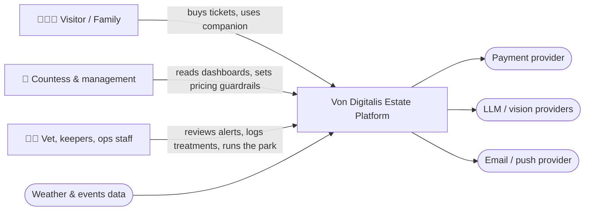

# High Level Design

## How the HLD is organised

- [`core/`](core/README.md) — the foundation every AI scenario stands on: edge devices, MQTT, backhaul, event backbone, business services, data platform.
- [`ai-platform/`](ai-platform/README.md) — shared AI infrastructure: inference gateway (adopted OSS) and model governance — registry, evaluation, monitoring. Read this for "dealing with uncertainty" and "does it work".
- [`scenarios/`](scenarios/) — one folder per AI use case. Each has the same structure: *Problem → Why AI → Solution → Containers → Diagram → Data → Validation → ADRs*.

## Delivery phases

The full roadmap with entry gates and the build-vs-adopt table lives in the [README](../README.md#delivery-roadmap-what-we-build-when-and-what-we-buy). How it maps onto the HLD:

| Phase | `core/` | `ai-platform/` | `scenarios/` |
| --- | --- | --- | --- |
| 0 · Foundation | Everything: edge tier, ticketing platform integration, event backbone, business monolith, data platform, game days | — | — (data capture only) |
| 1 · Data & rules | Anonymous counters complete | Inference gateway (adopted), registry and eval gate (thin) | S1 feeding-by-scale · S3 live dashboard · S4 FAQ |
| 2 · Models on data | Edge compute N+1 | Monitoring, shadow mode, golden sets per capability | S1 activity anomalies + vision in shadow · S3 forecasting · S4 planning |
| 3 · Optimisation | — | — | S2 counting · S5 pricing experiment · S4 nudges · S1 per-animal vision |

Each scenario README carries a **Phase** line in its header.

## Diagram legend (used in every diagram)

| Shape / style | Meaning |
| --- | --- |
| Rectangle | Software component / service we build or configure |
| Rectangle with `☁️` / `🏰` boundary | Deployment zone: cloud vs. on the estate |
| Stadium (rounded) | External system / SaaS provider |
| Cylinder | Data store |
| Dashed arrow | Asynchronous event / message |
| Solid arrow | Synchronous call (HTTP/gRPC) |
| 🤖 | Component that contains AI inference |
| 👤 | Human decision point |

We use Mermaid so the diagrams render in GitHub and stay in version control next to the decisions they illustrate. Where a diagram has custom shapes, its own legend is added below it.

## C4 · Level 1 — System context

## C4 · Level 2 — Containers

See [core/README.md](core/README.md#container-view) for the full container view and [ai-platform/README.md](ai-platform/README.md) for the AI containers.

## Bounded contexts

| Context | Owns | Publishes events | Consumes events |
| --- | --- | --- | --- |
| **Ticketing & Access** | tickets, passes, gate validations, accounts (opt-in) | `TicketPurchased`, `GateEntered`, `GateExited`, `PassRenewed` | `PriceUpdated` |
| **Park Operations** | zones, rides, footfall, queues, staffing plans | `ZoneOccupancyUpdated`, `QueueLengthUpdated`, `RideStatusChanged`, `StaffingPlanProposed` | `GateEntered/Exited`, telemetry |
| **Animal Welfare** | animals, enclosures, feeding, health reviews, population estimates | `FeedingRecorded`, `WelfareAnomalyDetected`, `ReviewDecided`, `PopulationEstimated`, `SafetyAlertRaised` | enclosure telemetry |
| **Guest Engagement** | companion sessions, itineraries, nudges, pricing recommendations | `ItineraryCreated`, `NudgeSent`, `PriceRecommended` | `QueueLengthUpdated`, `TicketPurchased`, `WelfareAnomalyDetected` (e.g. "the sloth is off show today") |

Contexts communicate only through events on the backbone or through published read models — no shared databases. This matters for the AI additions: a scenario can be switched off, replaced or degraded without touching the others.
