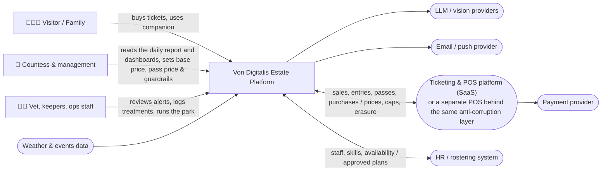

# High Level Design

## How the HLD is organised

- [`core/`](core/README.md) — the foundation every AI scenario stands on: edge devices, MQTT, backhaul, event backbone, business services, data platform.
- [`ai-platform/`](ai-platform/README.md) — shared AI infrastructure: inference gateway (adopted OSS), model governance (registry, evaluation, monitoring) and the risk classes that say which controls a capability owes. Read this for "dealing with uncertainty" and "does it work".
  - [`ai-platform/ai-portfolio.md`](ai-platform/ai-portfolio.md) — the inventory: twenty-three AI applications, their classes, phases, fallbacks and kill gates, plus what is deliberately absent.
  - [`ai-platform/agents.md`](ai-platform/agents.md) — the four agents, their typed tools, their invariants, two worked attack chains and what the layer costs.
- [`../appendix/`](../appendix/README.md) — calculations and specifications the design references but does not contain: business case, generative cost, daily-report spec, ticketing rules, data-health runbooks, LoRaWAN airtime.
- [`architecture-evaluation.md`](architecture-evaluation.md) — the ATAM-style evaluation of the whole thing: quality-attribute scenarios with response measures, the architectural styles we rejected and why, sensitivity points, trade-off points, risks and non-risks.
- [`scenarios/`](scenarios/) — one folder per AI use case. Each has the same structure: *Problem → Why AI → Solution → Containers → Diagram → Data → Validation → ADRs*.

## Delivery phases

The full roadmap with entry gates and the build-vs-adopt table lives in the [README](../README.md#delivery-roadmap-what-we-build-when-and-what-we-buy). How it maps onto the HLD:

| Phase | `core/` | `ai-platform/` | `scenarios/` |
| --- | --- | --- | --- |
| 0 · Foundation | Everything: edge tier, ticketing platform integration, visitor token at the gate, remote-site channel mix, event backbone, business monolith, data platform, game days | — | — (data capture only) |
| 1 · Data & rules | Anonymous counters complete · metric layer · spend ingestion (`PurchaseRecorded`) · ride sensors where the heritage assessment allows · [Estate daily report](core/README.md#estate-daily-report) as a template | Inference gateway (adopted), registry and eval gate (thin), risk class per capability | S1 feeding-by-scale and plant climate · S3 live dashboard · S4 FAQ · S8 condition rules |
| 2 · Models on data | Edge compute N+1 · token path weighting validated against the counters · daily report phrased by the S1 drafter capability · [requirements/08](../requirements/08-business-case.md) re-issued with season-1 values | Monitoring, shadow mode, golden sets per capability, agent runtime and write-guard | S1 activity anomalies + vision in shadow · S3 forecasting · S4 planning · S6 ops-copilot · S7 feedback themes |
| 3 · Optimisation | — | Agent task metrics and per-agent rollback | S2 counting · S5 pricing experiment · S4 nudges, pass-upgrade prompt and personalisation · S1 per-animal vision and the plant detector · S6 animal and management agents · S7 highlight mining and captions · S8 the condition model |

Each scenario README carries a **Phase** line in its header.

## Diagram legend (used in every diagram)

| Shape / style | Meaning |
| --- | --- |
| Rectangle | Software component / service we build or configure |
| Rectangle with `☁️` / `🏰` boundary | Deployment zone: cloud vs. on the estate |
| Stadium (rounded) | External system / SaaS provider |
| Cylinder | Data store |
| Dashed arrow | Asynchronous event / message |
| Solid arrow | Synchronous call (HTTP/gRPC) |
| 🤖 | Component that contains AI inference |
| 👤 | Human decision point |

We use Mermaid so the diagrams render in GitHub and stay in version control next to the decisions they illustrate. Where a diagram has custom shapes, its own legend is added below it.

## C4 · Level 1 — System context

## C4 · Level 2 — Containers

See [core/README.md](core/README.md#container-view) for the full container view and [ai-platform/README.md](ai-platform/README.md) for the AI containers.

## Bounded contexts

| Context | Owns | Publishes events | Consumes events |
| --- | --- | --- | --- |
| **Ticketing & Access** (anti-corruption layer to the ticketing platform, [ADR-0012](../adrs/ADR-0012-ticketing-platform-adopt-not-build.md)) | tickets, passes, **on-site purchases**, gate validations, capacity cap, timed-entry slots and pass-holder reservations, upgrade vouchers, accounts (opt-in) — as our events over the vendor's data | `TicketPurchased`, `GateEntered` (with `persons_admitted`), `GateExited`, `PassRenewed`, `PurchaseRecorded` (an auditable commerce event: transaction id, type, net + tax + currency, category, terminal, time, optional pseudonymous visitor id — FR-2.6), `PriceUpdated`, `CapacityCapChanged` (ops decision with reason code) | `PriceRecommended` (applies it within guardrails), `SubjectErased` |
| **Park Operations** | zones, rides, footfall, queues, **the ride registry with its statutory inspection log and condition flags**, staffing plans, labour rules, the day's programme, **the Estate daily report** (a read model — it publishes no event) | `ZoneOccupancyUpdated`, `QueueLengthUpdated`, `RideStatusChanged` (the engineer's decision — the registry is its only writer), `StaffingPlanApproved`, `StaffingPlanDrafted`, `DemonstrationScheduled` | `GateEntered/Exited`, telemetry, `EnclosureStatusChanged`; for the daily report: `TicketPurchased`, `PassRenewed`, `PurchaseRecorded`, `CapacityCapChanged`, `ReviewDecided`, `TreatmentStarted/Closed` — facts and human decisions, never model output |
| **Animal Welfare** | animals, enclosures, feeding, health reviews, treatments, population ledger and estimates | `FeedingRecorded`, `WelfareAnomalyDetected`, `ReviewDecided`, `TreatmentStarted`, `TreatmentClosed`, `EnclosureStatusChanged` (keeper decision: on/off show), `PopulationEstimated`, `SafetyAlertRaised` | enclosure telemetry |
| **Guest Engagement** | companion sessions, itineraries, nudges, pricing recommendations, **token profiles and the family link**, feedback submissions and their themes, per-subject keys | `ItineraryCreated`, `NudgeSent`, `PriceRecommended`, `TokenLinked`, `FeedbackThemeUpdated`, `SubjectErased` | `QueueLengthUpdated`, `RideStatusChanged`, `TicketPurchased`, `PriceUpdated`, `EnclosureStatusChanged` (e.g. "the sloth is off show today") |

Contexts communicate only through events on the backbone or through published read models — no shared databases. This matters for the AI additions: a scenario can be switched off, replaced or degraded without touching the others.

**Rule: probabilistic events do not cross into visitor-facing contexts.** `WelfareAnomalyDetected` is a model's opinion; what Guest Engagement may act on is `EnclosureStatusChanged`, a keeper's decision. `PriceRecommended` is a model's opinion; what visitors see is `PriceUpdated`, after the policy engine and, where needed, management. A ride condition flag is a model's opinion; what the companion routes around is `RideStatusChanged`, the engineer's decision. The forecast never leaves Park Operations; `StaffingPlanApproved` does. Contract tests fail a visitor-facing context that subscribes to an AI-output topic ([ADR-0004](../adrs/ADR-0004-event-driven-backbone.md) §9).

**The agents do not weaken that rule — they are built on it.** An agent reads across contexts through typed tools and writes to none of them: an effectful tool emits a command, the owning context performs the write, and the event that results is a human's decision, not the agent's ([ADR-0013](../adrs/ADR-0013-stakeholder-agents-on-typed-tools.md) §3–5). `StaffingPlanDrafted` is the visible shape of this: a draft is its own event, distinguishable from the approval that follows it.
