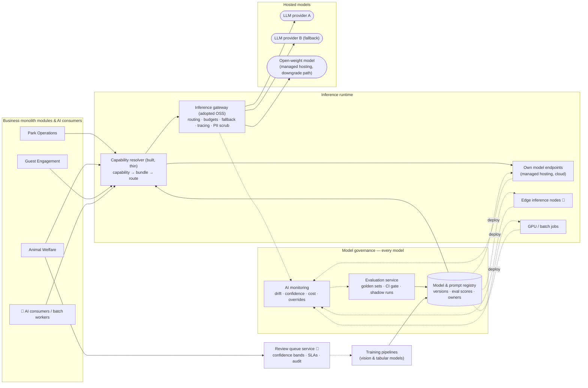

# AI Platform

Shared infrastructure that every AI scenario uses. It exists to answer two of the judges' questions structurally rather than per-scenario: **how do we cope with a fast-changing AI landscape**, and **how do we know the AI works**.

It has two halves that are easy to confuse. **Model governance** (registry, evaluation, monitoring) covers *every* model we run — rented, own, cloud, edge or batch. The **inference gateway** is a runtime proxy for *hosted* models only, and we adopt it rather than build it. → [ADR-0005](../../adrs/ADR-0005-model-gateway-and-provider-independence.md)

## Components

## Inference runtime

### Inference gateway (adopted) and capability resolver (built)
Business services request a **capability** (`detect-feeding-anomaly`, `plan-visit`, `forecast-zone-footfall`), never a model. The **capability resolver** — the only runtime code we write here — looks the capability up in the registry and sends the request down its runtime path. For hosted models that path is the **inference gateway**, an open-source LLM gateway (LiteLLM, Portkey, Kong AI Gateway class) configured from Git. It applies:

- **Routing policy:** tiered (small/cheap model first; escalate to a larger one on low confidence or explicit need), or fixed for capabilities where determinism matters.
- **Budgets:** per-capability monthly budget; alerts at 70/90%; at 100% switch to the downgrade path rather than fail.
- **Fallback chain:** provider A → provider B → open-weight model on **managed hosting** (not self-hosted — R9) → non-AI fallback (returned as a typed "no AI available" response the service knows how to handle: a rule, a template, or a documented human procedure).
- **Tracing:** every call emits `capability`, `model_version`, `latency`, `tokens`, `cost`, `confidence` to OpenTelemetry.
- **Guardrails:** input/output schema validation, PII scrubbing on the way out to external providers, output filters for the companion.

We do not build any of that. Routes, budgets and fallback chains are declarative configuration, portable between gateways of this class.

→ [ADR-0005](../../adrs/ADR-0005-model-gateway-and-provider-independence.md)

### Capability → runtime path

| Capability (examples) | Model kind | Runtime path | Governed by |
| --- | --- | --- | --- |
| `answer-question`, `plan-visit`, `summarise-daily-welfare-report`, nudge wording | Rented generative; open-weight on managed hosting as downgrade | Capability resolver → **inference gateway** → provider or managed endpoint | Registry · eval gate · monitoring |
| `detect-feeding-anomaly`, `score-enclosure-activity` | Own tabular / time-series, cloud | AI consumer on the backbone → **own model endpoint** (managed hosting); no gateway | same |
| `extract-enclosure-features`, `mask-visitors`, `count-piranha`, `flag-aggressive-behaviour` (tier-1 advisory) | Own vision, edge | **Edge inference node**; artifact pulled from the registry over the downlink ([ADR-0006](../../adrs/ADR-0006-edge-vs-cloud-inference.md)); node reports version and confidence stats | same |
| `forecast-zone-footfall`, `estimate-price-elasticity` | Own tabular, batch | **Scheduled batch job** in the GPU/batch workers; results published as events | same |

The gateway is on the path of the first row only. The other three rows never touch a hosted provider and never depend on the gateway — but they cannot be promoted or served without passing through governance.

## Model governance

Applies to every row of the table above, wherever the model runs.

### Model & prompt registry
Versioned bundles: model reference (external model ID, or our own artifact), prompt template, parameters, eval score, owner, status (`candidate` / `shadow` / `production` / `retired`). Declared in Git and reconciled (GitOps), so a model change is a reviewed pull request. Edge nodes and batch jobs read their *desired version* from the registry; the resolver reads the production bundle for hosted capabilities.

### Evaluation service
- **Golden datasets** per capability, maintained by the domain owner (vet for welfare, ops manager for forecasting, guest team for companion).
- **CI gate:** a candidate bundle must meet the capability's thresholds in the [thresholds & cadences table](#thresholds-and-cadences-source-of-truth) or it cannot be promoted; **no regression** against the current production bundle.
- **Invariant suites** for the deterministic components that sit on AI paths (pricing policy engine, staffing optimiser): property-based tests over generated inputs, violations = 0 gate, same invariants checked in production.
- **Shadow mode:** candidate runs alongside production on live traffic, outputs compared, no user impact.
- **LLM-as-judge** with human calibration sample for open-ended outputs.

→ [ADR-0008](../../adrs/ADR-0008-ai-evaluation-and-production-monitoring.md)

### AI monitoring
- Input drift (feature distributions, image statistics), output drift (confidence histograms, class balance), and **business-metric guardrails** (vet override rate, forecast error, companion thumbs-down rate, pricing floor hits) with the thresholds in the table below.
- Automatic rollback to the previous production bundle when a guardrail trips — for hosted bundles via the gateway route, for edge and batch models via the registry's desired version.

### Review queue (human in the loop)
Confidence bands per capability decide auto-act / human review / discard-and-learn. Reviewer decisions are captured with reason codes and become training data.

→ [ADR-0007](../../adrs/ADR-0007-human-in-the-loop-confidence-bands.md)

### Training pipelines
For models we own (enclosure vision, piranha counting, forecasting, pricing): reproducible pipelines from the data platform, producing artifacts registered with lineage. Edge models are exported to a portable format, signed, and pulled by edge nodes through the downlink described in [Edge & connectivity](../core/edge-and-connectivity.md#downlink-cloud--estate).

## Thresholds and cadences (source of truth)

Every number that gates a promotion, trips a guardrail or sets a human cadence lives here. Scenario READMEs, ADR-0008 and the OKRs refer to this table; if two numbers disagree, this one wins and the other is a bug.

| Capability | Promotion gate (pre-release) | Production guardrail → action | Human cadence | Owner |
| --- | --- | --- | --- | --- |
| **S1 feeding anomaly** — `detect-feeding-anomaly` (Phase 1) | Recall ≥ 0.90 on "missed meal" against the feed-scale golden set; precision ≥ 0.60; calibration error ≤ 0.05; 2-week shadow | Vet override rate > 40% (12 mo) / > 25% (36 mo) → alert owner, auto-tighten band; real-world precision/recall from treatments computed monthly | Review-queue SLA 4 h → 1 h. Weekly: 20 low-confidence discards + 10 random *unflagged* hours reviewed by a keeper | Vet |
| **S1 activity / posture / social anomalies** — `score-enclosure-activity` (Phase 2) | Shadow-only for 4 weeks; then recall ≥ 0.90 on "lethargy", precision ≥ 0.60, calibration ≤ 0.05 on the golden set accumulated during Phases 1–2 (≥ 200 clips per class) | As above; **treatments without a prior flag** ≤ 30% by Phase 3 | As above | Vet |
| **S1 visitor masking** — `mask-visitors` | Unmasked person regions = 0 on a 500-frame staged golden set (staff volunteers in frame); over-masking ≤ 10% of animal area | Unmasked frames stored = 0 — any occurrence is a rollback and an incident | Monthly review of 200 sampled stored clips | AI platform |
| **S1 tier-1 advisory** — `flag-aggressive-behaviour` | Recall ≥ 0.80 on staged and archival aggression clips; delivered as advisory only (FR-3.7) | Advisory precision from keeper feedback < 0.30 → retune bands | Weekly review of the week's advisories by the head keeper | Head keeper |
| **S2 piranha count** — `count-piranha` | Detector precision/recall ≥ 0.95 on 50 multi-view frame sets; bias correction seeded from the same set | Census error > 10% (12 mo) / > 5% (36 mo) → retrain; ledger-adjusted drift outside the CI for 7 days → inspection | Census ≥ 2 per year at planned maintenance; visual audit monthly (sanity check only) | Keeper + vet |
| **S3 footfall forecast** — `forecast-zone-footfall` | Rolling-origin next-day MAPE ≤ 25% (12 mo) → ≤ 15% (36 mo) **and** beats the "same weekday last week × seasonal factor" heuristic; one forecasting cycle in shadow | 3-day rolling MAPE > target + 5 points → alert; input drift (new ride, closure) → retrain flag | Weekly retrain; daily forecast-vs-actual per zone | Ops manager |
| **S3 staffing optimiser** (deterministic) | Hard-constraint violations = 0 in property-based tests | Violations = 0 on every proposal, checked by an independent validator before it is shown | Ops manager approves every plan; edits logged as labels | Ops manager |
| **S4 companion** — `answer-question`, `plan-visit` | Factuality ≥ 0.95; constraint violations 0; safety refusals 100%; **indirect prompt-injection resistance 100%** on a 100-case set; **ungrounded-block false positives ≤ 5%** on 300 answerable questions; NFR-PRF-1 latency budgets met in a 500-session load test; offline itinerary end-to-end test passes; 2-week shadow | Thumbs-down > 5%; ungrounded-block rate doubling week-on-week; judge/human disagreement > 10%; any safety-critical wrong statement → rollback + alert | Weekly: 50 sessions reviewed by the guest team; knowledge base curated daily by ops | Guest team |
| **S5 pricing** — `estimate-price-elasticity` + policy engine | Backtest: revenue on held-out weeks ≥ fixed pricing; invariant violations = 0 in property-based tests | Conversion drop > 10% vs. control → revert to fixed price; complaint rate > 0.5% of buyers → review; floor/ceiling hit frequency monitored; invariant violations = 0 | Management approves every out-of-guardrail price; monthly readout vs. fixed-price counterfactual; year-1 experiment readout after one season | Management |
| **Platform** | Every production capability has a passing eval and a named non-AI fallback (OKR 5.3) | Budget alerts at 70% / 90%, downgrade at 100% (NFR-COST-1); model swap ≤ 1 day (OKR 5.2) | Monthly shadow run of the secondary provider and the open-weight bundle; quarterly game days GD-9/GD-10 | AI platform |

## Humans in the loop: who does what

The AI does not run itself, and the estate has no spare team to run it. This table is the answer to "who reviews all this?" — hours per week, by role and phase, all of them roles the estate already has. **Rule: labels are a side-effect of the job.** Every routine decision — confirm/dismiss, roster edit, price approval, thumbs-down triage — is captured as a label with a reason code. The only standalone labelling work is the initial golden set per capability, and it is bounded.

| Role | AI-related task | Phase 1 | Phase 2 | Phase 3 | Where the label comes from |
| --- | --- | --- | --- | --- | --- |
| Veterinarian (A3) | Review queue: confirm / dismiss with reason | 2 h/wk | 5 h/wk | 8 h/wk | The decision is the label |
| Veterinarian | Initial golden-set labelling (per new capability, bounded) | 4 h/wk for 8 weeks | 4 h/wk for 8 weeks | 2 h/wk for 8 weeks | Explicit, one-off |
| Head keeper | Weekly audits (discards, unflagged hours), tier-1 advisory review, escalations | 1 h/wk | 2 h/wk | 2 h/wk | Audit outcome |
| Keepers | Feeding exceptions; census at maintenance (2 × 4 h/yr); monthly visual audit (30 min) | 1 h/wk | 1 h/wk | 2 h/wk | Ledger entries |
| Ops manager | Approve/edit rosters; own forecast thresholds | 1 h/wk (heuristics) | 2 h/wk | 2 h/wk | Roster edits |
| Guest team | Review 50 sessions; curate knowledge base; triage thumbs-down | 3 + 5 h/wk | 4 + 5 h/wk | 4 + 5 h/wk | Reviews, KB fixes |
| Management | Out-of-guardrail price approvals; experiment readout | — | — | 1 h/wk | Approval reason codes |
| Platform engineers (of the 5) | Model promotions, game days, on-call | 1 day/quarter + rota | same | same | — |
| **Total estate-staff hours on AI** | | **≈ 17 h/wk** | **≈ 23 h/wk** | **≈ 24 h/wk** | |

Workload per role is a tracked metric; a phase gate slips before a role is overloaded (R13, NFR-OPS-1).

## The three kinds of AI and how the platform treats them

| Kind | Examples | Determinism | Pre-release check | Production check |
| --- | --- | --- | --- | --- |
| Classical ML | forecasting, pricing | Deterministic given inputs | Backtests, MAPE/RMSE thresholds; invariant suites for the policy around them | Error vs. actuals, drift, invariant violations = 0 |
| Computer vision | welfare anomalies, piranha count | Probabilistic | Precision/recall on golden footage | Confidence bands, override rate, audits per the thresholds table |
| Generative | companion, report summaries | Non-deterministic | Factuality, safety, format evals; adversarial and indirect-injection sets | Sampled judge + human, thumbs-down, escalation rate |

## Answering the judges directly

| Question | Answer |
| --- | --- |
| Best model today isn't best tomorrow | Change the registry entry, pass the eval gate, promote. No service code changes. Target ≤ 1 day (OKR 5.2). |
| Provider changes prices | Budgets + tiered routing + downgrade path already wired in the gateway config; cost per capability visible daily. |
| Provider shuts down | Named fallback provider passing the same evals; open-weight bundle on managed hosting exercised monthly; prompts/evals/traces are ours; safety paths never depend on a generative provider. |
| The gateway itself is a dependency | It is adopted OSS with declarative config; the resolver isolates services; only hosted generative capabilities depend on it — vision, counting and forecasting never do. |
| How do we know it works? | Nothing is promoted without passing its golden set; shadow before live; guardrails with auto-rollback after — all numbers in one table. |
| How do we know it *stopped* working? | Drift monitors + business-metric guardrails + human override rate, alerting the capability owner. |
| Who does all the reviewing? | Existing estate roles, ≈ 17–24 h/week in total, with labels captured as a side-effect of their normal decisions. |
