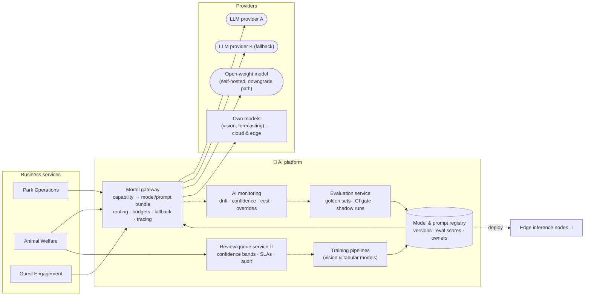

# AI Platform

Shared infrastructure that every AI scenario uses. It exists to answer two of the judges' questions structurally rather than per-scenario: **how do we cope with a fast-changing AI landscape**, and **how do we know the AI works**.

## Components

### Model gateway
The single door to any model. Business services request a **capability** (`detect-feeding-anomaly`, `plan-visit`, `forecast-zone-footfall`), never a model. The gateway resolves the capability against the registry and applies:

- **Routing policy:** tiered (small/cheap model first; escalate to a larger one on low confidence or explicit need), or fixed for capabilities where determinism matters.
- **Budgets:** per-capability monthly budget; alerts at 70/90%; at 100% switch to the downgrade path rather than fail.
- **Fallback chain:** provider A → provider B → open-weight → deterministic fallback (returned as a typed "no AI available" response the service knows how to handle).
- **Tracing:** every call emits `capability`, `model_version`, `latency`, `tokens`, `cost`, `confidence` to OpenTelemetry.
- **Guardrails:** input/output schema validation, PII scrubbing on the way out to external providers, output filters for the companion.

→ [ADR-0005](../../adrs/ADR-0005-model-gateway-and-provider-independence.md)

### Model & prompt registry
Versioned bundles: model reference (external model ID, or our own artifact), prompt template, parameters, eval score, owner, status (`candidate` / `shadow` / `production` / `retired`). Declared in Git and reconciled (GitOps), so a model change is a reviewed pull request.

### Evaluation service
- **Golden datasets** per capability, maintained by the domain owner (vet for welfare, ops manager for forecasting, guest team for companion).
- **CI gate:** a candidate bundle must meet the capability's thresholds (e.g. recall ≥ 0.9 on "missed meal"; MAPE ≤ 20%; companion factuality ≥ 0.95, safety-refusal 100%) or it cannot be promoted.
- **Shadow mode:** candidate runs alongside production on live traffic, outputs compared, no user impact.
- **LLM-as-judge** with human calibration sample for open-ended outputs.

→ [ADR-0008](../../adrs/ADR-0008-ai-evaluation-and-production-monitoring.md)

### AI monitoring
- Input drift (feature distributions, image statistics), output drift (confidence histograms, class balance), and **business-metric guardrails** (vet override rate, forecast error, companion thumbs-down rate, pricing floor hits).
- Automatic rollback to the previous production bundle when a guardrail trips.

### Review queue (human in the loop)
Confidence bands per capability decide auto-act / human review / discard-and-learn. Reviewer decisions are captured with reason codes and become training data.

→ [ADR-0007](../../adrs/ADR-0007-human-in-the-loop-confidence-bands.md)

### Training pipelines
For models we own (enclosure vision, piranha counting, forecasting, pricing): reproducible pipelines from the data platform, producing artifacts registered with lineage. Edge models are exported to a portable format and deployed to edge nodes through the same GitOps flow.

## The three kinds of AI and how the platform treats them

| Kind | Examples | Determinism | Pre-release check | Production check |
| --- | --- | --- | --- | --- |
| Classical ML | forecasting, pricing | Deterministic given inputs | Backtests, MAPE/RMSE thresholds | Error vs. actuals, drift |
| Computer vision | welfare anomalies, piranha count | Probabilistic | Precision/recall on golden footage | Confidence bands, override rate, weekly audit |
| Generative | companion, report summaries | Non-deterministic | Factuality, safety, format evals; adversarial set | Sampled judge + human, thumbs-down, escalation rate |

## Answering the judges directly

| Question | Answer |
| --- | --- |
| Best model today isn't best tomorrow | Change the registry entry, pass the eval gate, promote. No service code changes. Target ≤ 1 day (OKR 5.2). |
| Provider changes prices | Budgets + tiered routing + downgrade path already wired; cost per capability visible daily. |
| Provider shuts down | Named fallback provider passing the same evals; prompts/evals/traces are ours; safety paths never depend on a generative provider. |
| How do we know it works? | Nothing is promoted without passing its golden set; shadow before live; guardrails with auto-rollback after. |
| How do we know it *stopped* working? | Drift monitors + business-metric guardrails + human override rate, alerting the capability owner. |
