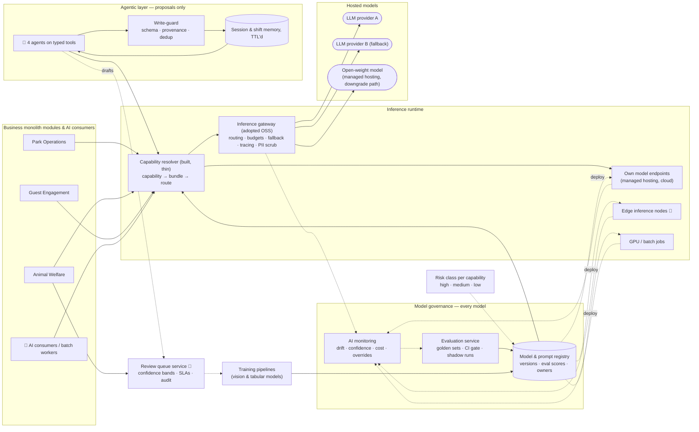

# AI Platform

Shared infrastructure every AI scenario uses. It answers two questions once, rather than per scenario: how we cope with a fast-changing AI landscape, and how we know the AI works.

Two halves, easy to confuse. **Model governance** (registry, evaluation, monitoring) covers *every* model we run — rented, own, cloud, edge or batch. The **inference gateway** is a runtime proxy for *hosted* models only, and we adopt it rather than build it. → [ADR-0005](../../adrs/ADR-0005-model-gateway-and-provider-independence.md)

A third piece sits above both: the **agentic layer**, four agents that compose the capabilities below into the multi-step work the estate cannot staff. It owns no data and is no deployable → [agents.md](agents.md), [ADR-0013](../../adrs/ADR-0013-stakeholder-agents-on-typed-tools.md).

- **What AI is in this proposal, and why each piece earns its place:** [the portfolio](ai-portfolio.md) — twenty-three applications across eight scenarios, with what each falls back to and what is deliberately absent.
- **How the agents work, and how they fail safely:** [agents.md](agents.md).

## Components

## Inference runtime

### Inference gateway (adopted) and capability resolver (built)
Business services request a **capability** (`detect-feeding-anomaly`, `plan-visit`, `forecast-zone-footfall`), never a model. The **capability resolver** — the only runtime code we write here — looks the capability up in the registry and sends the request down its runtime path. For hosted models that path is the **inference gateway**, an open-source LLM gateway (LiteLLM, Portkey, Kong AI Gateway class) configured from Git. It applies:

- **Routing policy:** tiered (small/cheap model first; escalate to a larger one on low confidence or explicit need), or fixed for capabilities where determinism matters.
- **Budgets:** per-capability monthly budget; alerts at 70/90%; at 100% switch to the downgrade path rather than fail. The budget is the *last* line: an anonymous caller is stopped by the BFF's inference quota first (NFR-SEC-3), so abuse cannot degrade the service for paying visitors.
- **Fallback chain:** provider A → provider B → open-weight model on **managed hosting** (not self-hosted — R9) → non-AI fallback (returned as a typed "no AI available" response the service knows how to handle: a rule, a template, or a documented human procedure).
- **Tracing:** every call emits `capability`, `model_version`, `latency`, `tokens`, `cost`, `confidence` to OpenTelemetry.
- **Guardrails:** input/output schema validation, PII scrubbing on the way out to external providers, output filters for the companion.

We do not build any of that. Routes, budgets and fallback chains are declarative configuration, portable between gateways of this class.

→ [ADR-0005](../../adrs/ADR-0005-model-gateway-and-provider-independence.md)

### Capability → runtime path

| Capability (examples) | Model kind | Runtime path | Governed by |
| --- | --- | --- | --- |
| `answer-question`, `plan-visit`, `summarise-daily-welfare-report`, `summarise-estate-day`, nudge wording | Rented generative; open-weight on managed hosting as downgrade | Capability resolver → **inference gateway** → provider or managed endpoint | Registry · eval gate · monitoring |
| `detect-feeding-anomaly`, `score-enclosure-activity` | Own tabular / time-series, cloud | AI consumer on the backbone → **own model endpoint** (managed hosting); no gateway | same |
| `extract-enclosure-features`, `mask-visitors`, `count-piranha`, `flag-aggressive-behaviour` (tier-1 advisory) | Own vision, edge | **Edge inference node**; artifact pulled from the registry over the downlink ([ADR-0006](../../adrs/ADR-0006-edge-vs-cloud-inference.md)); node reports version and confidence stats | same |
| `forecast-zone-footfall`, `estimate-price-elasticity`, `score-ride-condition`, `estimate-investment-effect`, `cluster-feedback-themes` | Own tabular, batch | **Scheduled batch job** in the GPU/batch workers; results published as events | same |
| `agent:ops-copilot`, `agent:animal`, `agent:management`, `agent:companion` | Rented generative, plus the capabilities above as tools | Agent runtime → capability resolver → **inference gateway**; each agent is its own versioned artifact ([agents](agents.md)) | Registry · eval gate · monitoring · risk class · agent-level task metrics |

The gateway is on the path of the first row only. The other three rows never touch a hosted provider and never depend on the gateway — but they cannot be promoted or served without passing through governance.

## What the generative capabilities cost

Generative spend is the one platform cost that grows with success — five-fold between today and the target run rate — so it is budgeted per capability rather than in total.

| Figure | Consequence for the design |
| --- | --- |
| ≈ €34,800 a year at 15,000 visitors/day — ≈ €0.04 per companion household visit, ≈ €0.01 per visitor-day | Inside the €50k line in the [cost model](../../requirements/04-non-functional-requirements.md#cost-model-tco-50) with a 44% overrun absorbed, at ≈ 0.04% of revenue against NFR-COST-1's 2% ceiling. Squeezing AI spend buys nothing; a worst-case price move is caught by the per-capability budget rather than by the line |
| Planning and re-planning ≈ 90% of the bill | Routing is tiered, and a re-plan touches only the affected stops |
| ≈ €67,800 without the FAQ cache and prompt caching | The caches are a design condition, not an optimisation — the same shape as the [ingestion counterfactual](../core/edge-and-connectivity.md#capacity-check-at-15000-visitorsday-by-traffic-class) |
| Peak day 2.0× an average one | Load is bounded by households present, not by concurrency, so the budget is seasonal rather than a flat twelfth |
| The four agents together: **≈ €508 a year, 1.5% of the bill** | Generative cost scales with the audience, not with the ambition — three of the four serve a few dozen staff. A self-test fails the build if the layer passes 5% of generative spend → [why the layer is nearly free](agents.md#cost-and-why-the-layer-is-nearly-free) |

Per-request-class arithmetic, tier prices, the counterfactual and the escalation sensitivity: [appendix · generative-AI cost model](../../appendix/generative-cost.md), generated by [`scripts/business_case.py`](../../scripts/business_case.py) and checked by lint.

## Model governance

Applies to every row of the table above, wherever the model runs.

### Model & prompt registry
Versioned bundles: model reference (external model ID, or our own artifact), prompt template, parameters, eval score, owner, status (`candidate` / `shadow` / `production` / `retired`). Declared in Git and reconciled (GitOps), so a model change is a reviewed pull request. Edge nodes and batch jobs read their *desired version* from the registry; the resolver reads the production bundle for hosted capabilities.

### Evaluation service
- **Golden datasets** per capability, maintained by the domain owner (vet for welfare, ops manager for forecasting, guest team for companion).
- **CI gate:** a candidate bundle must meet the capability's thresholds in the [thresholds & cadences table](#thresholds-and-cadences-source-of-truth) or it cannot be promoted; **no regression** against the current production bundle.
- **Invariant suites** for the deterministic components that sit on AI paths (pricing policy engine, staffing optimiser): property-based tests over generated inputs, violations = 0 gate, same invariants checked in production.
- **Shadow mode:** candidate runs alongside production on live traffic, outputs compared, no user impact.
- **LLM-as-judge** with human calibration sample for open-ended outputs.

→ [ADR-0008](../../adrs/ADR-0008-ai-evaluation-and-production-monitoring.md)

### AI monitoring
- Input drift (feature distributions, image statistics), output drift (confidence histograms, class balance), and **business-metric guardrails** (vet override rate, forecast error, companion thumbs-down rate, pricing floor hits) with the thresholds in the table below.
- Automatic rollback to the previous production bundle when a guardrail trips — for hosted bundles via the gateway route, for edge and batch models via the registry's desired version.

### Review queue (human in the loop)
Confidence bands per capability decide auto-act / human review / discard-and-learn. Reviewer decisions are captured with reason codes and become training data.

→ [ADR-0007](../../adrs/ADR-0007-human-in-the-loop-confidence-bands.md)

### Training pipelines
For models we own (enclosure vision, piranha counting, forecasting, pricing): reproducible pipelines from the data platform, producing artifacts registered with lineage. Edge models are exported to a portable format, signed, and pulled by edge nodes through the downlink described in [Edge & connectivity](../core/edge-and-connectivity.md#downlink-cloud--estate).

## Thresholds and cadences (source of truth)

Every number that gates a promotion, trips a guardrail or sets a human cadence lives here. Scenario READMEs, ADR-0008 and the OKRs refer to it; if two numbers disagree, this table wins.

### How the gated metrics are defined

Each gated number names the instrument that produces it, so a gate and its production monitor measure the same thing.

| Metric | Definition |
| --- | --- |
| `calibration error ≤ 0.05` | **Expected calibration error (ECE)** on the capability's golden set over **10 equal-mass bins** of model confidence: ECE = Σ (nᵦ/N) · \|accuracyᵦ − mean confidenceᵦ\|. Equal-mass rather than equal-width, because confidence piles up at the ends and equal-width bins leave the interesting ones nearly empty. The CI job emits a reliability diagram and per-bin counts as build artifacts |
| Per-band calibration | Each of ADR-0007's three bands is checked on its own: \|accuracy − mean confidence\| ≤ 0.05 **within** the medium band, and the high band's accuracy ≥ its lower confidence bound. An aggregate ECE of 0.03 can hide a medium band 15 points optimistic, which is what the vet acts on |
| Confidence itself | A calibrated quantity, not a raw model score. Post-hoc calibration (temperature scaling, or isotonic where labels allow) is fitted on a held-out split that is **not** the golden set and shipped inside the versioned bundle, so a model swap re-fits it and the gate re-measures it |
| `factuality ≥ 0.95` | Share of factual claims in a sampled answer that map to a cited knowledge-base record or live-data call. Judged by the LLM-as-judge, calibrated weekly against the guest team's 50 human-reviewed sessions; judge-vs-human disagreement above 10% invalidates the measurement (ADR-0008 §5) |
| `MAPE` | Rolling-origin: refitted at each origin, scored on the next day only, never on data available after the origin |

Production re-measures these from sampled human-labelled data on the same definitions (ADR-0008 §4).

| Capability | Promotion gate (pre-release) | Production guardrail → action | Human cadence | Owner |
| --- | --- | --- | --- | --- |
| **S1 feeding anomaly** — `detect-feeding-anomaly` (Phase 1) | Recall ≥ 0.90 on "missed meal" against the feed-scale golden set; precision ≥ 0.60; calibration error ≤ 0.05; 2-week shadow | Vet override rate > 40% (12 mo) / > 25% (36 mo) → alert owner, auto-tighten band; real-world precision/recall from treatments computed monthly | Review-queue SLA 4 h → 1 h. Weekly: 20 low-confidence discards + 10 random *unflagged* hours reviewed by a keeper | Vet |
| **S1 activity / posture / social anomalies** — `score-enclosure-activity` (Phase 2) | Shadow-only for 4 weeks; then recall ≥ 0.90 on "lethargy", precision ≥ 0.60, calibration ≤ 0.05 on the golden set accumulated during Phases 1–2 (≥ 200 clips per class) | As above; **treatments without a prior flag** ≤ 30% by Phase 3 | As above | Vet |
| **S1 visitor masking** — `mask-visitors` | Unmasked person regions = 0 on a 500-frame staged golden set (staff volunteers in frame); over-masking ≤ 10% of animal area | Unmasked frames stored = 0 — any occurrence is a rollback and an incident | Monthly review of 200 sampled stored clips | AI platform |
| **S1 tier-1 advisory** — `flag-aggressive-behaviour` | Recall ≥ 0.80 on staged and archival aggression clips; delivered as advisory only (FR-3.7) | Advisory precision from keeper feedback < 0.30 → retune bands | Weekly review of the week's advisories by the head keeper | Head keeper |
| **S2 piranha count** — `count-piranha` | Detector precision/recall ≥ 0.95 on 50 multi-view frame sets; bias correction seeded from the same set | Census error > 10% (12 mo) / > 5% (36 mo) → retrain; ledger-adjusted drift outside the CI for 7 days → inspection | Census ≥ 2 per year at planned maintenance; visual audit monthly (sanity check only) | Keeper + vet |
| **S3 footfall forecast** — `forecast-zone-footfall` | Rolling-origin next-day MAPE ≤ 25% (12 mo) → ≤ 15% (36 mo) **and** beats the "same weekday last week × seasonal factor" heuristic; one forecasting cycle in shadow | 3-day rolling MAPE > target + 5 points → alert; input drift (new ride, closure) → retrain flag | Weekly retrain; daily forecast-vs-actual per zone | Ops manager |
| **S3 staffing optimiser** (deterministic) | Hard-constraint violations = 0 in property-based tests | Violations = 0 on every proposal, checked by an independent validator before it is shown | Ops manager approves every plan; edits logged as labels | Ops manager |
| **S4 companion** — `answer-question`, `plan-visit` | Factuality ≥ 0.95; constraint violations 0; safety refusals 100%; **indirect prompt-injection resistance 100%** on a 100-case set; **ungrounded-block false positives ≤ 5%** on 300 answerable questions; NFR-PRF-1 latency budgets met in a 500-session load test; offline itinerary end-to-end test passes; **per-language safety-field fidelity 100% and unapproved-language handoff 100%** (NFR-LNG-1); **read-aloud meaning preserved on 20 cases** (NFR-ACC-1); 2-week shadow | Thumbs-down > 5%; ungrounded-block rate doubling week-on-week; judge/human disagreement > 10%; any safety-critical wrong statement → rollback + alert | Weekly: 50 sessions reviewed by the guest team; knowledge base curated daily by ops | Guest team |
| **S5 pricing** — `estimate-price-elasticity` + policy engine | Backtest: contribution on held-out weeks ≥ fixed pricing; invariant violations = 0 in property-based tests, incl. the contribution constraint with the A15 parameters | Conversion drop > 10% vs. control → revert to fixed price; **weekly: contribution per visitor-day on discounted blocks < 0% blocks − 10% → pause that discount level**; complaint rate > 0.5% of buyers → review; floor/ceiling hit frequency monitored; invariant violations = 0 | Management approves every out-of-guardrail price; monthly readout vs. fixed-price counterfactual; year-1 experiment readout after one season | Management |
| **S6 agents** — `agent:ops-copilot`, `agent:animal`, `agent:management`, and the `agent:companion` tool turn | Task success ≥ 0.80 on a 60-task golden set per agent, judged by LLM-as-judge calibrated against the domain expert's labels on the same set; **tool-argument schema violations = 0**; **indirect prompt-injection resistance 100%** on a 50-case set; protocol answers returned verbatim with a correct document version 100%; `agent:management` refuses rather than invents on 30 unanswerable questions at 100%; 2-week shadow on real tasks | Task success below target for two cycles → **agent rollback** (prompt, whitelist, step budget), separate from any model rollback; tool-error rate triaged as integration first; human-override rate read together with queue depth; steps and cost per task against NFR-AGT-1 budgets; copilot-origin review items tracked apart from model-origin ones | Weekly: 20 traces reviewed by the agent's owner. Quarterly: GD-17 and GD-18 | AI platform |
| **S6 agent memory** — the write-back path | Write-guard rejects every malformed, out-of-range and out-of-provenance write in a seeded set, at 100%; a derivative batch is revertible by provenance alone | **Accepted anomalous writes = 0** — any occurrence is an incident; derivative PSI < 0.2; the share of self-generated against human-verified labels flat or falling; write-reject rate monitored as a signal, not a silent drop | Monthly review of the reject log by the AI platform owner | AI platform |
| **S6 investment effect** — `estimate-investment-effect` | Placebo test on pre-investment periods: false effects at the 95% level ≤ 5%; the synthetic control's pre-period fit within its stated band | Any estimate whose interval spans zero is reported as "cannot be told apart from the season", never as a small effect | Quarterly readout with management | Ops manager |
| **S7 content** — `draft-caption` | Facts inserted verbatim = 100% and invented facts = 0 on a 150-draft set; brand-voice eval against the curator's examples; **drafts containing an unmasked person region = 0** on the same staged 500-frame set the masking gate uses | **Unedited acceptance rate** — below 40% at the end of the first season is the capability's kill gate; a published item with a wrong species fact is an incident, not a metric | The curator reviews every draft — there is no automated publish path | Curator |
| **S7 feedback themes** — `cluster-feedback-themes` | Cluster stability on unchanged input ≥ 0.90 (adjusted Rand index); theme names grounded in their own cluster 100% on a 50-cluster review; quotes containing a name or a contact = 0 on an adversarial set | A season with no costed change traceable to a theme is the kill gate; counts always published against submissions, never as a share of opinion | Weekly ops review reads the quotes, which is what makes the clustering self-auditing | Guest team |
| **S8 ride condition** — `score-ride-condition` | 12 months of history and a measured downtime baseline before a model is considered; recall ≥ 0.80 on findings-confirmed events; **must beat the threshold rule on the same window**; lead time ≥ 7 days on at least half of confirmed findings; **flags whose only evidence is an unhealthy sensor = 0**; one full season in shadow | **Rides opened or closed on a model's output = 0**, enforced by a contract test on the registry's writers rather than by policy; inspections that found nothing, as a rate, trending down; unplanned downtime hours per instrumented ride per season (OKR 2.5) | Certified engineer decides every flag; no automatic band at any confidence | Ops + certified engineer |
| **Token path analytics** — the weighting, not a model | Weighting reproduces held-out counter totals within ±10 points on a season of data | Carry rate published with every figure; a zone below 15% reports "paths not representative"; cells below 20 tokens suppressed (NFR-PRV-3) | Quarterly against the exit survey (A14) | Ops manager |
| **LLM drafters** — `summarise-daily-welfare-report`, `summarise-estate-day` | Inserted figures verbatim = 100% and invented numbers = 0 on the "numeric fidelity" set (200 snapshots); format and tone evals; a human approves the wording before anything is sent (for the estate day: the ops manager between 20:30 and 21:00, numbers inserted verbatim at 21:00) | Post-generation verbatim check on the final numbers fails → template-only sent + alert, bundle is a rollback candidate; approval rate and edits per report tracked weekly | Weekly sample of 10 reports by the owner (vet for the welfare briefing, ops manager for the estate day) | Vet · Ops manager |
| **Business guardrails** (alert only — no model is rolled back on a business number; every figure comes from a KPI read model that is itself tested with fixture event streams, [hld/core → Verification](../../appendix/data-health-and-verification.md#verification-purchases-cap-and-the-daily-report)) | — | Season-pass renewal: cohort-over-cohort decline > 10 points before month 36 (earliest signal month 24), below 60% after → alert Guest team and management. On-site spend per visitor-day — all guests, `PurchaseRecorded` ÷ Σ `persons_admitted` — 10% below the modelled €6.00 on-site spend per visitor-day, seasonally adjusted (A6) → alert. Pass share of admissions (credential type on `GateEntered`) more than 5 points below the ladder for a quarter → alert management. Contribution per pass visit is **derived** from those two and the A15 parameters by `business_case.py` and labelled *model* — never a raw metric, because purchases carry no subject without consent ([ADR-0009](../../adrs/ADR-0009-visitor-privacy-anonymous-counting.md) §7). Cohort rates (adoption, opt-in, nudge reach, return, pass conversion, pass renewal, account retention — [08 §3](../../appendix/business-case-model.md#3-the-membership-flywheel)) more than 20% below the table for 2 months → alert Guest team | Monthly readout with the OKRs; yearly re-issue of requirements/08 with measured values | Guest team · Management |
| **Platform** | Every production capability has a passing eval and a named non-AI fallback (OKR 5.3) | Budget alerts at 70% / 90%, downgrade at 100% (NFR-COST-1); model swap ≤ 1 day (OKR 5.2) | Monthly shadow run of the secondary provider and the open-weight bundle; quarterly game days GD-9/GD-10 | AI platform |

## Humans in the loop: who does what

Hours per week by role and phase, all of them roles the estate already has. **Labels are a side-effect of the job:** every routine decision — confirm/dismiss, roster edit, price approval, thumbs-down triage — is captured as a label with a reason code. The only standalone labelling work is the initial golden set per capability, and it is bounded.

| Role | AI-related task | Phase 1 | Phase 2 | Phase 3 | Where the label comes from |
| --- | --- | --- | --- | --- | --- |
| Veterinarian (A3) | Review queue: confirm / dismiss with reason | 2 h/wk | 5 h/wk | 8 h/wk | The decision is the label |
| Veterinarian | Initial golden-set labelling (per new capability, bounded) | 4 h/wk for 8 weeks | 4 h/wk for 8 weeks | 2 h/wk for 8 weeks | Explicit, one-off |
| Head keeper | Weekly audits (discards, unflagged hours), tier-1 advisory review, escalations | 1 h/wk | 2 h/wk | 2 h/wk | Audit outcome |
| Keepers | Feeding exceptions; census at maintenance (2 × 4 h/yr); monthly visual audit (30 min) | 1 h/wk | 1 h/wk | 2 h/wk | Ledger entries |
| Ops manager | Approve/edit rosters; own forecast thresholds; approve the Estate daily report's wording between 20:30 and 21:00 (Phases 2–3, +1 h/wk) | 1 h/wk (heuristics) | 3 h/wk | 3 h/wk | Roster edits; report approve / skip |
| Guest team | Review 50 sessions; curate knowledge base; triage thumbs-down | 3 + 5 h/wk | 4 + 5 h/wk | 4 + 5 h/wk | Reviews, KB fixes |
| Guest team + a contracted translator | **Approve the safety, allergen and price fields per language** (NFR-LNG-1) — a bounded set that changes only when a rule, a price or an animal changes, not a per-answer task | — | 2 h/wk while a language is added, then ≈ 1 h/mo | ≈ 1 h/mo per language | Explicit approval per field and language |
| Management | Out-of-guardrail price approvals; experiment readout | — | — | 1 h/wk | Approval reason codes |
| Guest team | Feedback themes: read the ranked list and its quotes in the weekly ops review (S7) | — | 1 h/wk | 1 h/wk | Disagreement with a cluster is a label |
| Curator (guest team) | Publish or discard every content draft — there is no automated publish path (S7) | — | — | 3 h/wk | Publish, discard, and the edits in between |
| Certified engineer (estate) | Decide every ride condition flag and record the inspection finding (S8) | — | — | 2 h/wk | The finding is the delayed ground truth |
| Agent owners (ops manager, vet, AI platform) | Review 20 agent traces a week per live agent, and the write-guard reject log monthly (S6) | — | 1 h/wk | 2 h/wk | Trace reviews and overrides |
| Platform engineers (of the 5) | Model promotions, game days, on-call; re-issue of [requirements/08](../../requirements/08-business-case.md) with the ops manager (1 day/yr, from Phase 2 entry); the quarterly risk-class control audit ([ADR-0017](../../adrs/ADR-0017-ai-risk-classes-and-proportional-controls.md) §6) | 1 day/quarter + rota | same + 1 day/yr | same + 1 day/yr + 1 day/quarter | — |
| **Total estate-staff hours on AI** | | **≈ 17 h/wk** | **≈ 28 h/wk** | **≈ 31 h/wk** | Phase 2 carries the language-approval spike; Phase 3 carries the merged portfolio's three new human gates — the curator, the engineer and the agent owners. Each is a role the estate already has, and each is what makes its capability safe rather than fast |

Workload per role is a tracked metric; a phase gate slips before a role is overloaded (R13, NFR-OPS-1).

## The three kinds of AI and how the platform treats them

| Kind | Examples | Determinism | Pre-release check | Production check |
| --- | --- | --- | --- | --- |
| Classical ML | forecasting, pricing | Deterministic given inputs | Backtests, MAPE/RMSE thresholds; invariant suites for the policy around them | Error vs. actuals, drift, invariant violations = 0 |
| Computer vision | welfare anomalies, piranha count | Probabilistic | Precision/recall on golden footage | Confidence bands, override rate, audits per the thresholds table |
| Generative | companion, report summaries, captions, theme names | Non-deterministic | Factuality, safety, format evals; adversarial and indirect-injection sets | Sampled judge + human, thumbs-down, escalation rate |
| Agent (an orchestrator over the other three) | ops-copilot, animal, management, companion | Non-deterministic in its *path*, not only its words | Task success on a golden set of recorded tasks; schema violations 0; injection resistance 100% | Task success, tool-error rate, human-override rate — and rollback of the agent, separately from the model ([agents](agents.md)) |

## Risk classes: which controls a capability owes

Every capability and every agent carries a class in the registry, and the class decides its mandatory
controls ([ADR-0017](../../adrs/ADR-0017-ai-risk-classes-and-proportional-controls.md)). The baseline —
a versioned bundle, a passing eval, a named deterministic fallback, an owner, full decision logging —
is not optional at any class.

| Class | Today | On top of the baseline |
| --- | --- | --- |
| **High** | S1 welfare scoring, the tier-1 advisory, S8 ride condition | A named human decides every case, with **no automatic band**; a cost-of-error row; a game day; delayed ground truth joined monthly; a deterministic rule standing behind it. **AI never issues a clearance** |
| **Medium** | S3 forecasting and staffing, S5 pricing, S4 companion, S7 content, the four agents | Human approval on anything effectful; confidence bands; drift and business guardrails with automatic rollback; a per-capability budget |
| **Low** | Report phrasing, S7 theme naming, the companion's FAQ tier, `agent:management` | The baseline only |

A quarterly audit reads the registry and reports any production capability whose class controls are
incomplete — the same job that reports capabilities without a passing eval (OKR 5.3). Autonomy above
the high class — a driverless vehicle, a model that clears a ride — is out of scope in this submission,
and the class exists so that the boundary is stated rather than assumed.

## The uncertainty questions, answered

| Question | Answer |
| --- | --- |
| Best model today isn't best tomorrow | Change the registry entry, pass the eval gate, promote. No service code changes. Target ≤ 1 day (OKR 5.2). |
| Provider changes prices | Budgets + tiered routing + downgrade path already wired in the gateway config; cost per capability visible daily. |
| Provider shuts down | Named fallback provider passing the same evals; open-weight bundle on managed hosting exercised monthly; prompts/evals/traces are ours; safety paths never depend on a generative provider. |
| The gateway itself is a dependency | It is adopted OSS with declarative config; the resolver isolates services; only hosted generative capabilities depend on it — vision, counting and forecasting never do. |
| How do we know it works? | Nothing is promoted without passing its golden set; shadow before live; guardrails with auto-rollback after — all numbers in one table. |
| How do we know it *stopped* working? | Drift monitors + business-metric guardrails + human override rate, alerting the capability owner. |
| Who does all the reviewing? | Existing estate roles, ≈ 17–31 h/week in total, with labels captured as a side-effect of their normal decisions. |
