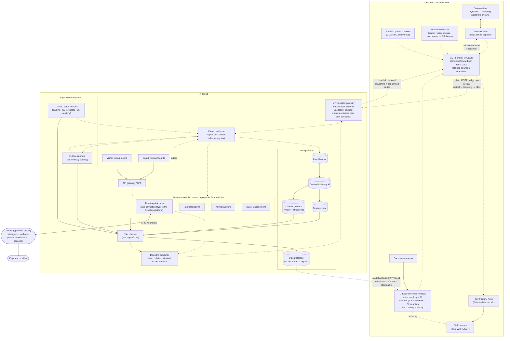

# Core Platform (non-AI foundation)

The AI scenarios are only as good as the data and reliability underneath them. This document describes that foundation.

## Design principles

1. **Edge-first.** Anything that keeps people safe or lets them in works on the estate's local network without the cloud. → [ADR-0001](../../adrs/ADR-0001-edge-first-store-and-forward.md)
2. **Events, not calls.** Contexts exchange facts through an event backbone; consumers can be added (e.g. an AI model) without changing producers. Deployment is a separate question: the four business contexts ship as **one modular monolith**, AI consumers and batch workers as separate deployables. → [ADR-0004](../../adrs/ADR-0004-event-driven-backbone.md)
3. **Managed where it doesn't differentiate — adopted where it is a commodity.** Databases, message brokers, object storage and model hosting are managed services; ticketing is an adopted platform; the team of five builds business logic and models. → [ADR-0003](../../adrs/ADR-0003-cloud-provider-selection.md), [ADR-0012](../../adrs/ADR-0012-ticketing-platform-adopt-not-build.md)
4. **Open protocols at the boundaries.** MQTT, HTTPS, OpenTelemetry, Parquet/Iceberg — so we can leave.
5. **Broken on purpose, on a schedule.** The foundation is verified by a game-day catalogue with metrics and owners, the same way the AI is verified by evaluation gates. → [Resilience validation](resilience-validation.md)

## Container view

Legend: see [hld/README.md](../README.md#diagram-legend-used-in-every-diagram). Both directions of the bridge are designed: uplink (store-and-forward) and downlink (retained snapshots, model pull) are described in [Edge & connectivity](edge-and-connectivity.md#downlink-cloud--estate).

## Containers

| Container | Responsibility | Runs where | Notes |
| --- | --- | --- | --- |
| **Gate validation** | Verifies the ticket signature offline, checks the local used-ledger, applies allow/revocation snapshots arriving over the downlink; records entry/exit; reconciles with the cloud when connected | Estate | Vendor readers/SDK that pass [ADR-0011](../../adrs/ADR-0011-offline-ticket-validation.md), or our readers with the vendor SDK ([ADR-0012](../../adrs/ADR-0012-ticketing-platform-adopt-not-build.md) §3) |
| **MQTT broker (HA pair)** | Local pub/sub for all devices; persists messages per traffic class; bridges uplink when connected; holds retained downlink snapshots for reconnecting consumers | Estate | 72 h buffer sized in [Edge & connectivity](edge-and-connectivity.md#capacity-check-at-15000-visitorsday-by-traffic-class); per-device certs |
| **Edge inference node(s)** | Masks visitors in frame; extracts S1 features and aggregates them to 1-minute windows (raw 1 Hz only around events, with the clip); counts piranhas (S2); raises tier-1 safety advisories | Estate | GPU-class small server; models pulled from object storage, rate-limited and off-hours → [ADR-0006](../../adrs/ADR-0006-edge-vs-cloud-inference.md) |
| **Tier-0 safety rules** | Deterministic, no ML, no cloud: enclosure door contact open without keeper badge; water/climate out of band; PIR/beam motion in a dry zone → staff devices within seconds | Estate | FR-3.6; NFR-AVL-3 is measured on this path only. Tier-1 model advisories (FR-3.7) come from the edge node and only add to it |
| **IoT ingestion gateway** | Terminates the MQTT bridge in both directions: authenticates, validates schemas and de-duplicates uplink; delivers downlink snapshots | Cloud | Managed IoT service |
| **Event backbone** | Durable topics per bounded context; schema registry whose CI check rejects personal-data fields; replayable | Cloud | Managed streaming → [ADR-0004](../../adrs/ADR-0004-event-driven-backbone.md) |
| **Business monolith** | One deployable, four modules with private schemas and a transactional outbox to the backbone. Modules: **Ticketing & Access** (anti-corruption layer: vendor webhooks → our events; `PriceUpdated` and erasure → vendor API; gate list deltas → downlink), **Park Operations** (zone/ride model, occupancy and queue read models, staffing plans), **Animal Welfare** (animal/enclosure registry, feeding log, review queue, treatments, population ledger and estimates), **Guest Engagement** (companion sessions, itineraries, nudges, pricing recommendation orchestration, per-subject key store) | Cloud | Serverless containers; extraction criteria → [ADR-0004](../../adrs/ADR-0004-event-driven-backbone.md) |
| **AI consumers** | Stateless consumers that score events with our own models (S1 anomaly scoring against baselines) and publish results back | Cloud | Separate deployable: scales with event rate, released with model promotions, not with the monolith |
| **GPU / batch workers** | Training pipelines; scheduled S3 forecasts; S5 elasticity estimation | Cloud | Managed batch/GPU; bursty, scheduled |
| **Downlink publisher** | Publishes retained snapshots and sequenced deltas of allow/revocation lists, policy parameters (bands, prices, hours) and desired edge model versions to the bridge | Cloud | [Edge & connectivity → Downlink](edge-and-connectivity.md#downlink-cloud--estate) |
| **API gateway / BFF** | AuthN/Z, rate limiting, aggregation for web/mobile/dashboards | Cloud | |
| **Data platform** | Lakehouse: raw → curated → features; knowledge base for the companion; object storage for signed model artifacts | Cloud | Open table format for portability |
| **Ticketing platform (SaaS)** | External: catalogue, checkout and payments, passes, credentials, opt-in accounts, sales reconciliation | Vendor | [ADR-0012](../../adrs/ADR-0012-ticketing-platform-adopt-not-build.md); PCI scope stays here |

## Deployment units

Deployment unit ≠ bounded context ([ADR-0004](../../adrs/ADR-0004-event-driven-backbone.md)). Six things are deployed:

| Unit | Contains | Why it is separate |
| --- | --- | --- |
| Business monolith | Four context modules, outbox relay, APIs behind the BFF | One thing to deploy and watch for a team of five; transactions stay inside a module; modules talk through events or published interfaces only |
| AI consumers | S1 scoring (more as scenarios arrive) | Scale with event rate; restart and roll back on model promotion without touching the monolith |
| GPU / batch workers | Training, forecasts, elasticity | Different runtime (GPU), bursty and scheduled |
| IoT ingestion + downlink publisher | Bridge termination both ways | Managed IoT service; must keep running while the monolith deploys |
| Edge tier | Broker pair, gate validation, tier-0 rules, edge inference nodes, LoRaWAN gateway | On the estate; reconciled by GitOps from the same repositories |
| Ticketing platform | SaaS | Adopted, not deployed ([ADR-0012](../../adrs/ADR-0012-ticketing-platform-adopt-not-build.md)) |

A module leaves the monolith only when it meets an extraction criterion in ADR-0004 (independent scaling, blocking release cadence, different runtime, different owning team). Nothing at 15,000 visitors/day meets one today.

## Data platform

- **Raw:** every event as received, immutable, partitioned by day — the audit trail and the source for retraining.
- **Curated:** zone occupancy per 5 min, queue lengths, feeding per animal per day, enclosure climate, ticket sales, pass usage.
- **Feature store:** the same features served to training and to online inference (footfall lags, weather, calendar, per-animal baselines) so models are not trained on one thing and served another.
- **Knowledge base:** structured facts (animals, rides, opening hours, safety rules, prices) plus curated narrative content; the *only* source the companion may cite → [ADR-0010](../../adrs/ADR-0010-grounded-llm-with-guardrails.md).
- **Personal data: none here by construction.** Events carry pseudonymous subject ids, never names, contacts or device identifiers; the schema registry's CI check enforces it ([ADR-0004](../../adrs/ADR-0004-event-driven-backbone.md) §6). The few unavoidable personal fields are encrypted with a per-subject key and **crypto-shredded** on erasure; a `SubjectErased` event removes the subject from read models, the feature store and golden sets ([ADR-0009](../../adrs/ADR-0009-visitor-privacy-anonymous-counting.md) §7).

## Cross-cutting

- **Identity:** visitors (optional accounts), staff (SSO, roles: keeper / vet / ops / management), devices (certificates).
- **Observability:** OpenTelemetry everywhere; AI calls carry `capability`, `model_version`, `confidence`, `cost` attributes.
- **Infrastructure as code & GitOps:** everything — including model versions in the registry — is declared in Git and reconciled.
- **Degradation ladder:** (1) cloud + AI, (2) cloud without AI (rules/heuristics), (3) estate-only (gates, safety, buffering). Every scenario names where it sits on this ladder.
- **Resilience validation:** twelve scripted game days with expected behaviour, metric, cadence and owner → [resilience-validation.md](resilience-validation.md).
