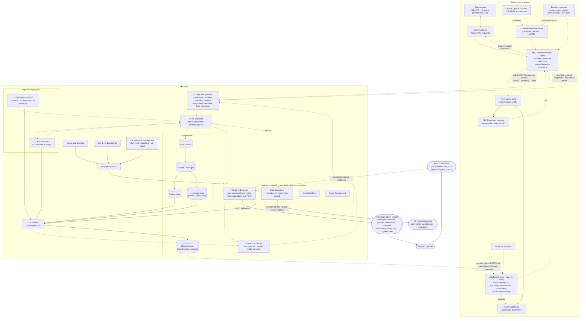

# Core Platform (non-AI foundation)

The AI scenarios are only as good as the data and reliability underneath them. This document describes that foundation.

## Design principles

1. **Edge-first.** Anything that keeps people safe or lets them in works on the estate's local network without the cloud. → [ADR-0001](../../adrs/ADR-0001-edge-first-store-and-forward.md)
2. **Events, not calls.** Contexts exchange facts through an event backbone; consumers can be added (e.g. an AI model) without changing producers. Deployment is a separate question: the four business contexts ship as **one modular monolith**, AI consumers and batch workers as separate deployables. → [ADR-0004](../../adrs/ADR-0004-event-driven-backbone.md)
3. **Managed where it doesn't differentiate — adopted where it is a commodity.** Databases, message brokers, object storage and model hosting are managed services; ticketing is an adopted platform; the team of five builds business logic and models. → [ADR-0003](../../adrs/ADR-0003-cloud-provider-selection.md), [ADR-0012](../../adrs/ADR-0012-ticketing-platform-adopt-not-build.md)
4. **Open protocols at the boundaries.** MQTT, HTTPS, OpenTelemetry, Parquet/Iceberg — so we can leave.
5. **Broken on purpose, on a schedule.** The foundation is verified by a game-day catalogue with metrics and owners, the same way the AI is verified by evaluation gates. → [Resilience validation](resilience-validation.md)

## Container view

Legend: see [hld/README.md](../README.md#diagram-legend-used-in-every-diagram). Both directions of the bridge are designed: uplink (store-and-forward) and downlink (retained snapshots, model pull) are described in [Edge & connectivity](edge-and-connectivity.md#downlink-cloud--estate).

## Containers

| Container | Responsibility | Runs where | Notes |
| --- | --- | --- | --- |
| **Gate validation** | Verifies the ticket signature offline, checks the local used-ledger, applies allow/revocation snapshots arriving over the downlink; records entry/exit; reconciles with the cloud when connected | Estate | Vendor readers/SDK that pass [ADR-0011](../../adrs/ADR-0011-offline-ticket-validation.md), or our readers with the vendor SDK ([ADR-0012](../../adrs/ADR-0012-ticketing-platform-adopt-not-build.md) §3) |
| **MQTT broker cluster** | Local pub/sub for all devices; three nodes with replicated persistent queues, one queue and bridge connection per traffic class; bridges uplink when connected; holds retained downlink snapshots for reconnecting consumers | Estate | Cluster-capable broker class → [ADR-0002](../../adrs/ADR-0002-mqtt-and-cellular-backhaul.md) §3; 72 h buffer sized in [Edge & connectivity](edge-and-connectivity.md#capacity-check-at-15000-visitorsday-by-traffic-class); 32 GB per node |
| **LoRaWAN network server** | Join server and network/application server for battery sensors and counters: OTAA joins, per-device session keys, payload decode, republish into per-device MQTT topics; collects SF histogram and per-gateway loss | Estate | OSS container (ChirpStack class); three gateways → [ADR-0002](../../adrs/ADR-0002-mqtt-and-cellular-backhaul.md) |
| **Edge inference nodes** | Mask visitors in frame; extract S1 features and aggregate them to 1-minute windows (raw 1 Hz only around events, with the clip); count piranhas (S2); raise tier-1 safety advisories | Estate | Two GPU-class servers sized N+1 with a degradation rule ([compute budget](edge-and-connectivity.md#edge-compute-budget)); models pulled from object storage, rate-limited and off-hours → [ADR-0006](../../adrs/ADR-0006-edge-vs-cloud-inference.md) |
| **Tier-0 safety rules** | Deterministic, no ML, no cloud: enclosure door contact open without keeper badge; water/climate out of band; PIR/beam motion in a dry zone → DECT handsets/pagers within seconds, smartphones in parallel; acknowledgement within 60 s or escalation to head keeper, then all staff | Estate | FR-3.6; NFR-AVL-3 is measured on this path, to a human ack ([alert chain](edge-and-connectivity.md#safety-alerts-from-sensor-to-a-human)). Tier-1 model advisories (FR-3.7) come from the edge node, use the secondary channel and only add to it |
| **IoT ingestion gateway** | Terminates the MQTT bridge in both directions: authenticates, validates schemas and de-duplicates uplink; delivers downlink snapshots | Cloud | Managed IoT service |
| **Event backbone** | Durable topics per bounded context; schema registry whose CI check rejects personal-data fields; replayable | Cloud | Managed streaming → [ADR-0004](../../adrs/ADR-0004-event-driven-backbone.md) |
| **Business monolith** | One deployable, four modules with private schemas and a transactional outbox to the backbone. Modules: **Ticketing & Access** (anti-corruption layer: vendor and POS webhooks → our events incl. `PurchaseRecorded`, behind signature, replay and PII checks — see [purchases, cap and upgrade credit](#ticketing--access-additions-purchases-cap-and-upgrade-credit); `PriceUpdated`, cap settings and erasure → vendor API; gate list deltas → downlink), **Park Operations** (zone/ride model, occupancy and queue read models incl. average dwell, staffing plans, labour-rule policy store, adapter to the HR/rostering system — A12, the [Estate daily report](#estate-daily-report) read model), **Animal Welfare** (animal/enclosure registry, feeding log, review queue, treatments — published as `TreatmentStarted` / `TreatmentClosed` — population ledger and estimates), **Guest Engagement** (companion sessions, itineraries, nudges incl. the pass-upgrade prompt, pricing recommendation orchestration, per-subject key store) | Cloud | Serverless containers; extraction criteria → [ADR-0004](../../adrs/ADR-0004-event-driven-backbone.md) |
| **AI consumers** | Stateless consumers that score events with our own models (S1 anomaly scoring against baselines) and publish results back | Cloud | Separate deployable: scales with event rate, released with model promotions, not with the monolith |
| **GPU / batch workers** | Training pipelines; scheduled S3 forecasts; S5 elasticity estimation | Cloud | Managed batch/GPU; bursty, scheduled |
| **Downlink publisher** | Publishes retained snapshots and sequenced deltas of allow/revocation lists, policy parameters (bands, prices, hours) and desired edge model versions to the bridge | Cloud | [Edge & connectivity → Downlink](edge-and-connectivity.md#downlink-cloud--estate) |
| **API gateway / BFF** | AuthN/Z, rate limiting, aggregation for web/mobile/dashboards | Cloud | |
| **Data platform** | Lakehouse: raw → curated → features; knowledge base for the companion; object storage for signed model artifacts | Cloud | Open table format for portability |
| **Ticketing platform (SaaS)** | External: catalogue, checkout and payments, passes, credentials, opt-in accounts, timed-entry slots, daily cap and pass-holder reservations, upgrade credit vouchers, sales reconciliation | Vendor | [ADR-0012](../../adrs/ADR-0012-ticketing-platform-adopt-not-build.md); PCI scope stays here |
| **POS / commerce** | External: F&B, retail and parking sales on the estate; per-transaction webhooks or export with the FR-2.6 fields; end-of-day totals for reconciliation | Vendor (the ticketing platform's own POS, or a separate system — A13) | Behind the same anti-corruption layer; never card data (NFR-SEC-2); R16 |
| **Estate daily report** | Read model inside Park Operations: one screen of "how was today" for the Countess at 21:00, numbers verbatim, one rule-selected recommendation for tomorrow; optional phrasing by the S1 drafter capability after ops-manager approval | Cloud (monolith) | FR-2.7; not an AI scenario — [details below](#estate-daily-report) |

## Deployment units

Deployment unit ≠ bounded context ([ADR-0004](../../adrs/ADR-0004-event-driven-backbone.md)). Six things are deployed:

| Unit | Contains | Why it is separate |
| --- | --- | --- |
| Business monolith | Four context modules, outbox relay, APIs behind the BFF | One thing to deploy and watch for a team of five; transactions stay inside a module; modules talk through events or published interfaces only |
| AI consumers | S1 scoring (more as scenarios arrive) | Scale with event rate; restart and roll back on model promotion without touching the monolith |
| GPU / batch workers | Training, forecasts, elasticity | Different runtime (GPU), bursty and scheduled |
| IoT ingestion + downlink publisher | Bridge termination both ways | Managed IoT service; must keep running while the monolith deploys |
| Edge tier | Broker cluster, gate validation, tier-0 rules, edge inference nodes, LoRaWAN network server and gateways, DECT base stations | On the estate; reconciled by GitOps from the same repositories |
| Ticketing platform | SaaS | Adopted, not deployed ([ADR-0012](../../adrs/ADR-0012-ticketing-platform-adopt-not-build.md)) |

A module leaves the monolith only when it meets an extraction criterion in ADR-0004 (independent scaling, blocking release cadence, different runtime, different owning team). Nothing at 15,000 visitors/day meets one today.

## Data platform

- **Raw:** every event as received, immutable, partitioned by day — the audit trail and the source for retraining.
- **Curated:** zone occupancy per 5 min, queue lengths, feeding per animal per day, enclosure climate, ticket sales, pass usage; **spend per zone per day** — Park Operations maps `pos_terminal_id` → zone in its own policy config, so the `PurchaseRecorded` event never carries another context's zone model; **daily report snapshots**, one per date, kept 3 years.
- **Feature store:** the same features served to training and to online inference (footfall lags, weather, calendar, per-animal baselines) so models are not trained on one thing and served another.
- **Knowledge base:** structured facts (animals, rides, opening hours, safety rules, prices) plus curated narrative content; the *only* source the companion may cite → [ADR-0010](../../adrs/ADR-0010-grounded-llm-with-guardrails.md).
- **Personal data: none here by construction.** Events carry pseudonymous subject ids, never names, contacts or device identifiers; the schema registry's CI check enforces it ([ADR-0004](../../adrs/ADR-0004-event-driven-backbone.md) §6). The few unavoidable personal fields are encrypted with a per-subject key and **crypto-shredded** on erasure; a `SubjectErased` event removes the subject from read models, the feature store and golden sets ([ADR-0009](../../adrs/ADR-0009-visitor-privacy-anonymous-counting.md) §7).

## Consumer-side idempotency: the inbox

The outbox has a transactional guarantee, a fitness function and a risk row ([ADR-0004](../../adrs/ADR-0004-event-driven-backbone.md) §7). The consuming side needs the symmetric artifact, because at-least-once delivery means **every** consumer will see a duplicate eventually — after a broker failover, an ingestion retry, a replay, or a re-signed vendor backlog.

**The invariant.** A consumer applies an event's effect **and** records the event as handled **in one local transaction**. The record is the *inbox*: `(consumer_id, event_id)` with the handled-at timestamp, in the consuming module's own private schema. `event_id` is the one derived id every consumer keys on — UUIDv5 over `(device_id, boot_id, seq)` for device events ([ADR-0001](../../adrs/ADR-0001-edge-first-store-and-forward.md) §4), the transaction id for POS webhooks, the backbone's event id otherwise. Nothing is deduplicated on payload content.

| Consumer | Key it dedupes on | Window | The effect, and why a replay is harmless |
| --- | --- | --- | --- |
| Monolith modules (read models: occupancy, queues, spend, welfare timeline, [daily report](#estate-daily-report)) | `(module, event_id)` in the module's private schema | 7 days, matching the ingestion dedupe window | Effect and inbox row commit in one local transaction. Outside the window the read model is rebuilt by replay, which is idempotent by construction — replay is a full recompute, not an increment |
| AI consumers (S1 anomaly scoring) | `(capability, bundle_version, event_id)` | 7 days | Scoring the same window twice yields the same `WelfareAnomalyDetected`; the bundle version is in the key so a *promoted model* deliberately re-scores rather than being deduplicated away |
| Guest Engagement on `SubjectErased` | `(consumer, subject_id)` — the subject, not the event | Permanent (a tombstone, not a window) | Naturally idempotent: `DELETE` the per-subject key where it exists, then re-key read models, feature store and golden sets by subject id. A second delivery finds no key and no references and is a no-op. The audit query in GD-11 is what proves it, and it is the same query either way |
| Ticketing & Access on vendor and POS webhooks | `transaction_id` (POS), credential id + operation (ticketing) | 7 days | Verified signature, then dedupe *before* the outbox write, so a replay never becomes an event ([purchases](#ticketing--access-additions-purchases-cap-and-upgrade-credit), GD-14) |
| Downlink publisher | Snapshot id + sequence number | Latest snapshot only | Retained snapshots are idempotent by design: a consumer re-applies the snapshot it already has and detects gaps by sequence ([Edge & connectivity → Downlink](edge-and-connectivity.md#downlink-cloud--estate)) |

**Effects that leave the transaction.** A vendor API call, an e-mail or a push cannot join a local transaction, so the sequence is: write the inbox row as *in-flight* with an **idempotency key derived from `event_id`** and commit; make the external call **with that key**; commit *done*. A crash between the call and the second commit re-runs the call with the same key, and the receiver collapses it — which is why "accepts an idempotency key on write operations" is a vendor selection criterion ([ADR-0012](../../adrs/ADR-0012-ticketing-platform-adopt-not-build.md)) and why nudges carry one. The failure this admits is bounded and named: an external side effect can happen twice **only** if the receiver ignores the key, so a receiver that does is a fallback-matrix item, not a surprise.

**How we know it holds.** The fitness function that forbids cross-module schema access also fails a build where a **backbone subscription handler writes without an inbox row in the same transaction** — the consuming mirror of the outbox check. Every consumer's tests replay its fixture stream **twice** and assert identical read-model state and side-effect counts; GD-8 measures `idempotency violations = 0` after a backbone outage and replay, and GD-11 proves the erasure tombstone survives a duplicate.

## Ticketing & Access additions: purchases, cap and upgrade credit

Three things the business case ([requirements/08](../../requirements/08-business-case.md)) asked the foundation to carry. None changes deployment units, safety tiers or gate validation; all three live in the anti-corruption layer and are executed by the adopted platform ([ADR-0012](../../adrs/ADR-0012-ticketing-platform-adopt-not-build.md) criteria).

**On-site spend (FR-2.6).** The POS — the ticketing platform's own or a separate system (A13) — posts each transaction as a **signed webhook**: HMAC-SHA256 over the raw body with a key id, a signed-at timestamp we accept within 5 minutes, re-signed on every retry (mutual TLS is welcome as transport but is not replay protection; keys are short-lived vendor-published ones or a rotatable secret with an overlap window). The layer verifies the signature with a constant-time compare, drops duplicates on transaction id for 7 days — the same window as device events ([ADR-0001](../../adrs/ADR-0001-edge-first-store-and-forward.md)) — so a re-signed backlog after our own outage is accepted while a captured payload is not, runs a **runtime value deny-list** (PAN/Luhn, e-mail, phone) over every field and **rejects the event with an incident** if anything matches (the schema-registry CI check cannot see runtime values), maps `pos_terminal_id` to nothing — the zone mapping is Park Operations' — and writes `PurchaseRecorded` to the outbox: transaction id, type (sale / refund / void / correction), net + tax + currency, category without an admission category, terminal, time, and the pseudonymous `visitor_id` only under the purchase-history consent ([ADR-0009](../../adrs/ADR-0009-visitor-privacy-anonymous-counting.md) §7). An unknown terminal lands in an **"unmapped" bucket** and alerts rather than being dropped. Every night the day's `PurchaseRecorded` totals are **reconciled against the vendor's end-of-day totals**; a difference above 1% marks the day's spend *provisional* on every read model and produces an exceptions report for finance. **Backpressure slows, never drops:** above the rate limit the layer answers HTTP 429 with Retry-After and the vendor retries with backoff (an [ADR-0012](../../adrs/ADR-0012-ticketing-platform-adopt-not-build.md) criterion), so the burst after our own outage drains at our pace with zero loss — the sandbox test replays one hour of backlog in ≤ 10 minutes; the dead-letter queue holds only **invalid** events (signature, schema, PII) and has no quota for valid ones.

**Timed entry and daily cap (FR-1.7).** The default cap is GitOps policy config under the management role; a day-level change by the ops manager — typically proposed by the daily report from the S3 forecast — carries a reason code, is applied through the vendor's cap API, and is published as `CapacityCapChanged` (who / when / why / old / new). The cap applies to **unsold tickets only**; gate validation is untouched. Pass holders hold no date-specific ticket, so on **capacity-managed days they reserve a free timed slot**: the reservation travels as an attribute of the signed credential and is validated offline like the signature ([ADR-0011](../../adrs/ADR-0011-offline-ticket-validation.md)); an unreserved pass is admitted only while the cap snapshot on the downlink has room. Concurrent edits are **last-write-wins** with both events published and a UI warning; the vendor API returns the **effective cap and the sold count**, and *sold > cap* is an alert (oversell), not a gate refusal. A cap and its reservations redistribute arrivals; they add no capacity ([requirements/08 §1](../../requirements/08-business-case.md#1-capacity-reality-check)).

**Upgrade credit voucher (P-I7).** A day ticket scanned in today (`GateEntered`, until the operational day closes) can be turned — **once per ticket id** — into a **credit voucher** for its price, redeemable against a season pass within 7 days, at home or at the desk; the pass then starts on the visit date, so the visit counts as a pass visit. A refund of the ticket voids an unredeemed voucher; once the voucher is redeemed the ticket is not refundable (it is absorbed by the pass). The rules are the vendor's to execute; the prompt is ours: the companion shows it only to day-ticket holders without a pass (from the pass state it already fetches), with the ticket id as idempotency key; offline it says "available at the exit and at the gate POS"; the gate POS makes the same offer, and the next-day nudge reminds about the outstanding voucher — it creates no new eligibility. A pass keeps one price for everyone — the voucher is not a personal price.

## Estate daily report

The one surface where all five scenarios meet the person who pays. **FR-2.7**: at 21:00 the Countess receives one phone screen of "how was today", built by a **read model in Park Operations** over facts and human decisions already on the backbone — `GateEntered` (with `persons_admitted`), `TicketPurchased`, `PassRenewed`, `PurchaseRecorded`, `CapacityCapChanged`, `ReviewDecided`, `TreatmentStarted` / `TreatmentClosed`, `QueueLengthUpdated`, plus the S3 forecast and `StaffingPlanApproved` from inside the module. It publishes no event and is **not an AI scenario**: the numbers are inserted verbatim, the recommendation is chosen by a fixed rule set, and the optional phrasing reuses the S1 daily-summary drafter as the capability `summarise-estate-day` — same verbatim-numbers rule as [ADR-0010](../../adrs/ADR-0010-grounded-llm-with-guardrails.md) §2, same human approval. Promised in [requirements/01](../../requirements/01-business-goals-and-drivers.md).

**Evening timeline.** The numbers are final at 21:00, so what the ops manager approves is **wording, not numbers**: at 20:30 a draft is rendered from the 20:30 snapshot with every figure as a slot; between 20:30 and 21:00 the ops manager approves the wording (offline: button disabled with the reason shown); at 21:00 the final snapshot's numbers are inserted verbatim into the approved slots, the verbatim check runs on the final text, freshness is evaluated, and the report is sent. If the rule set picks a different recommendation at 21:00 than it did at 20:30, the template wording is sent instead of the approved phrase.

**Information architecture** — one screen, top to bottom, no charts (they are one tap away in the ops dashboard); mobile first, with an e-mail copy of the same text:

| # | Block | Lines | Source |
| --- | --- | --- | --- |
| 1 | **Tomorrow's recommendation** and the one number furthest from forecast, large | Chosen by a fixed rule set — *forecast below the quiet-day threshold → quiet-day offer on*; *parking within 10% of its limit → cap proposed*; *rain forecast → staffing to covered zones*; otherwise "no change" — and only phrased by the LLM | S3 forecast, capacity model, weather |
| 2 | **Guests and spend** | Visitor-days vs. forecast; weekday/weekend ratio to date (OKR 1.5); spend per visitor-day and total (FR-2.6); top-3 and bottom-3 zones by spend | `GateEntered`, `PurchaseRecorded`, forecast |
| 3 | **Animals** | Reviews decided today (confirmed / dismissed); animals under treatment (opened / closed) — human decisions, never anomaly scores | `ReviewDecided`, `TreatmentStarted/Closed` |
| 4 | **Passes and queues** | Passes sold, renewals (OKR 1.6); p90 queue on the top-10 rides (OKR 2.2) | `TicketPurchased`, `PassRenewed`, `QueueLengthUpdated` |
| 5 | **Tomorrow** | Forecast visitor-days; approved staffing; **days until parking binds** at the current attendance trend — computed from the A14 parameters and labelled as a model | forecast, `StaffingPlanApproved`, capacity model |
| — | **Footer = freshness** | snapshot id · freshness at 21:00 (p95 ingest delay, uplink buffer state) · provisional flags · template version · phrasing model version or "template" | read model, [edge metrics](edge-and-connectivity.md#capacity-check-at-15000-visitorsday-by-traffic-class) |

**States and rules**

| State | When | What the Countess sees |
| --- | --- | --- |
| SUCCESS | Fresh at 21:00 (below), verbatim check passed on the final numbers, wording approved between 20:30 and 21:00 | Full report, phrased |
| SUCCESS (template) | No wording approved by 21:00, phrasing unavailable, or the recommendation changed between the 20:30 draft and 21:00 | Full report, template wording; approve after 21:00 is logged as "sent as template" and no phrasing is sent later |
| PARTIAL (provisional) | **Not fresh at 21:00** — freshness = p95(ingested_at − event_time) over the day's events ≤ 15 min **and** the broker's uplink buffer empty, both metrics [Edge & connectivity](edge-and-connectivity.md#capacity-check-at-15000-visitorsday-by-traffic-class) already collects (recency of the last event is *not* the measure: the park closes at 18:00) — or the day's spend reconciliation failed | Report marked *provisional* by symbol **and** word (never colour alone) in the header and footer; **re-issued at 07:00** |
| PARTIAL (template only) | Post-generation check finds a number that is not in the read model, or a read-model number missing from the text | Template wording sent; alert to the platform owner; the phrasing bundle is a rollback candidate |
| EMPTY | Closed day | Short variant: animals, treatments, tomorrow |
| FIRST SEASON | No prior-year comparison or no forecast yet | "first season — baseline" / "heuristic" labels instead of blanks |
| ERROR | Not delivered after 3 retries | Dashboard banner and a "report not delivered" alert; the snapshot is still in the archive |

Approval is **idempotent per date**; offline, the approve button is disabled with the reason shown (GD-15). Every report is archived behind SSO with **3-year retention**, snapshot and text together; approve and skip decisions are logged with the snapshot id.

## Business data health

Purchases and the daily report are business data; they get the same health table as the sensors. One dashboard panel exists from day 1 of `purchase_ingestion`; each row is metric → threshold → the one-line runbook.

| Metric | Threshold → alert | Runbook |
| --- | --- | --- |
| Purchase ingestion lag (webhook → read model) | p95 > 5 min | Check the vendor's webhook queue, then the layer's dead-letter queue |
| Dead-letter queue by reason (invalid events only — 429 responses are not DLQ entries) | Any PII rejection; > 0.1% of the day invalid for other reasons | PII → incident and vendor ticket; others → fix, replay from the DLQ |
| Webhook backlog drain time after an outage | > 10 min per hour of backlog | Check the 429 rate and the vendor's retry cadence; never widen the DLQ to "solve" it |
| Visitor-days vs. admissions sold (Σ `persons_admitted` vs. tickets and pass entries) | Δ > 2% | Check re-entry handling (`persons_admitted` must be 0) and the vendor's gate export |
| Report freshness at 21:00 (p95 ingest delay, uplink buffer) | p95 > 15 min, or buffer not empty | Report goes provisional automatically; check the bridge drain, re-issue at 07:00 |
| Unmapped terminals | > 0 for 24 h | Ops maps terminal → zone in Park Operations policy config |
| Reconciliation Δ vs. vendor end-of-day totals | > 1% | Spend marked provisional; exceptions report to finance; compare transaction ids |
| Report generated / approved / sent / provisional | Not generated by 21:05; provisional 3 days running; not sent after 3 retries | Report states above; platform on-call for "not generated" |
| Verbatim-check failures | > 0 | Template-only sent automatically; roll the phrasing bundle back in the registry |
| Cap oversell (sold > effective cap) | > 0 | Alert ops; vendor ticket; check for a last-write-wins race in `CapacityCapChanged` |
| Upgrade credits: duplicates, credit after refund | > 0 | `pass_upgrade_prompt` flag off; reconcile credits with `TicketPurchased` and the vendor |
| Webhook authentication failures | > 10 per hour | Rotate the key via GitOps; check the vendor status page; treat as a possible replay attack |

## Verification: purchases, cap and the daily report

Same discipline as the AI ([ADR-0008](../../adrs/ADR-0008-ai-evaluation-and-production-monitoring.md)) and the foundation ([game days](resilience-validation.md)):

- **Unit:** the deny-list (Luhn, e-mail, phone) on generated payloads; terminal → zone mapping, including an unknown terminal landing in the "unmapped" bucket with an alert; the spend read model on sale / refund / void / correction sequences (a refund reduces the day, a void removes it, a correction replaces it); a purchase without the purchase-history consent carries no subject; the verbatim checker (every read-model number present, no other number in the text); the recommendation rule set, including a change between the 20:30 and the 21:00 snapshot; the freshness computation (p95 ingest delay, buffer state — recency must *not* trigger it); the days-until-parking-binds model against hand-computed cases; prompt eligibility — day-ticket holder scanned in today sees the upgrade prompt, a pass holder does not, offline shows the gate-POS text.
- **Integration, in the vendor sandbox** ([ADR-0012](../../adrs/ADR-0012-ticketing-platform-adopt-not-build.md) criterion): webhook signature and replay rejection; one hour of re-signed backlog delivered in a burst → slowed with 429, drained ≤ 10 min, loss 0; end-of-day reconciliation with an injected 1% gap → the day's spend goes provisional on every read model and the report; cap API — effective cap, sold count, oversell alert; two concurrent cap edits → both `CapacityCapChanged` published with who / when / why / old / new, the last write wins, the UI warns; a pass holder's reservation validated offline on a capacity-managed day and an unreserved pass held below the cap (GD-4); the upgrade voucher end to end — tap in the companion → voucher → redeemed online → credential updated.
- **Consumer-driven contract test** for the report's subscriptions: the fields it reads from `GateEntered` (`persons_admitted`, credential type, reservation), `QueueLengthUpdated`, `TicketPurchased`, `PassRenewed`, `PurchaseRecorded`, `CapacityCapChanged`, `ReviewDecided` and `TreatmentStarted/Closed` are pinned; a producer change that breaks them fails the producer's build.
- **Property tests:** P-I7 — double redemption, refund before and after redemption, expired voucher, a ticket of another day, the pass start date — violations = 0; the S5 policy engine's contribution constraint with the A15 parameters as generated inputs ([S5](../scenarios/dynamic-family-passes/README.md)); Σ `persons_admitted` over a generated day of entries, exits and re-entries equals the admissions sold.
- **End-to-end report day with an injectable clock:** happy path; closed day; first season; wording approved after 21:00 (sent as template); approve tapped twice (one send); reconciliation failed (provisional); delivery fails three times (ERROR state, alert, snapshot archived); recommendation changes between 20:30 and 21:00 (template wording); uplink down at 20:50 (GD-15).
- **KPI read models are tested, not trusted.** Every number that trips a business guardrail or feeds an OKR — the cohort rates (adoption, opt-in, nudge reach, return, pass conversion, pass renewal, account retention), the repeat share on identified households (a household with a pass and an account counted once), the pass share of admissions, spend per visitor-day with its seasonal adjustment, the S5 weekly contribution guardrail — is computed by a read model with **fixture event streams and known answers**, including the empty cases: a cohort with no expiring passes, a month without a prior-year analogue, a week without a 0% block. Same formulas as [requirements/08 §0](../../requirements/08-business-case.md#0-how-to-read-the-numbers); a disagreement between the read model and `business_case.py` on the same fixture is a bug in one of them.
- **Evaluation set "numeric fidelity"** for `summarise-estate-day`: 200 read-model snapshots with expected text; gate = inserted figures verbatim 100%, invented numbers 0 ([thresholds table](../ai-platform/README.md#thresholds-and-cadences-source-of-truth)).
- **Game days** GD-4 (offline gate on a capacity-managed day), GD-14 (POS sends a card number, a replay and a backlog) and GD-15 (uplink down on report day) in the [catalogue](resilience-validation.md).

## Rollout and flags

Feature flags `purchase_ingestion`, `daily_report`, `daily_report_phrasing`, `pass_upgrade_prompt`; the cap is policy config. Order: ingestion runs **≥ 14 days in shadow** (events flow, no read model exposed) with **7 consecutive green reconciliations** → the report goes to the ops manager only for 7 days → to the Countess → phrasing switched on after the numeric-fidelity evaluation passes → the upgrade prompt in Phase 3. **Rollback** = flag off, subscription paused, read model rebuilt by replay ([ADR-0004](../../adrs/ADR-0004-event-driven-backbone.md)). **Smoke test** after every deploy: a sandbox transaction reaches the read model in ≤ 60 s; a report dry-run renders for today's snapshot.

## Cross-cutting

- **Identity:** visitors (optional accounts), staff (SSO, roles: keeper / vet / ops / management), devices by transport class — X.509 + mutual TLS for IP devices, DevEUI/AppKey with OTAA for LoRaWAN devices ([Edge & connectivity → Security](edge-and-connectivity.md#security-identity-by-transport-class)).
- **Audit of human decisions:** the same pattern as AI decisions (FR-5.1). Finance parameters (A15) and the default capacity cap are GitOps policy config under the management role, so their history is the Git log; day-level cap changes by the ops manager carry a reason code and are published as `CapacityCapChanged` (who / when / why / old / new); report approve and skip are logged with the snapshot id; out-of-guardrail price approvals already carry reason codes (S5).
- **Observability:** OpenTelemetry everywhere; AI calls carry `capability`, `model_version`, `confidence`, `cost` attributes.
- **Infrastructure as code & GitOps:** everything — including model versions in the registry — is declared in Git and reconciled.
- **Degradation ladder:** (1) cloud + AI, (2) cloud without AI (rules/heuristics), (3) estate-only (gates, safety, buffering). Every scenario names where it sits on this ladder.
- **Resilience validation:** sixteen scripted game days with expected behaviour, metric, cadence and owner → [resilience-validation.md](resilience-validation.md).
