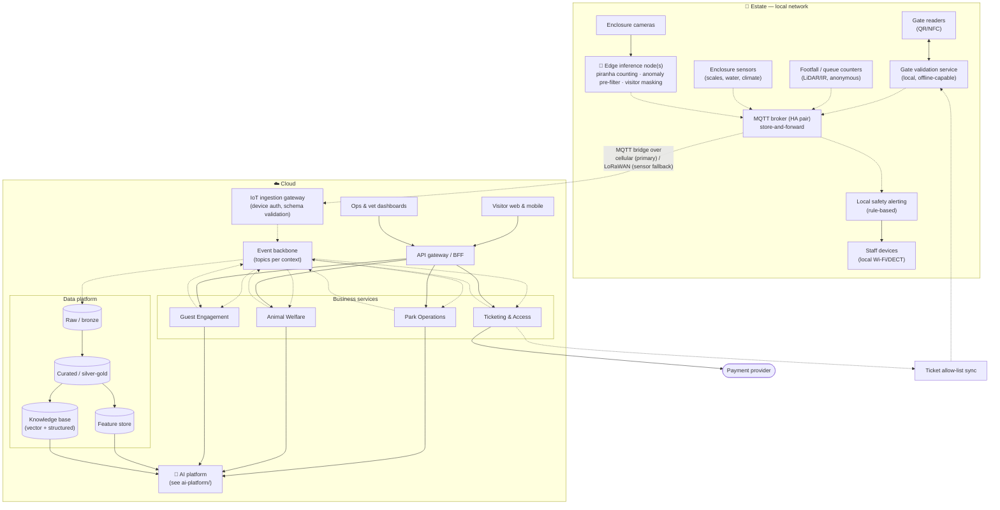

# Core Platform (non-AI foundation)

The AI scenarios are only as good as the data and reliability underneath them. This document describes that foundation.

## Design principles

1. **Edge-first.** Anything that keeps people safe or lets them in works on the estate's local network without the cloud. → [ADR-0001](../../adrs/ADR-0001-edge-first-store-and-forward.md)
2. **Events, not calls.** Contexts exchange facts through an event backbone; consumers can be added (e.g. an AI model) without changing producers. → [ADR-0004](../../adrs/ADR-0004-event-driven-backbone.md)
3. **Managed where it doesn't differentiate.** Databases, message brokers, object storage and model hosting are managed services; the team of five builds business logic. → [ADR-0003](../../adrs/ADR-0003-cloud-provider-selection.md)
4. **Open protocols at the boundaries.** MQTT, HTTPS, OpenTelemetry, Parquet/Iceberg — so we can leave.

## Container view

Legend: see [hld/README.md](../README.md#diagram-legend-used-in-every-diagram).

## Containers

| Container | Responsibility | Runs where | Notes |
| --- | --- | --- | --- |
| **Gate validation service** | Validates QR/NFC against a locally synced allow-list; records entry/exit; reconciles with cloud when connected | Estate | [ADR-0011](../../adrs/ADR-0011-offline-ticket-validation.md) |
| **MQTT broker (HA pair)** | Local pub/sub for all devices; persists messages; bridges to cloud when uplink is up | Estate | ≥ 24 h buffer; per-device certs |
| **Edge inference node(s)** | Runs vision models where sending video to the cloud is impossible or pointless: piranha counting, anomaly pre-filter, masking of visitors in frame | Estate | GPU-class small server; models deployed from registry → [ADR-0006](../../adrs/ADR-0006-edge-vs-cloud-inference.md) |
| **Local safety alerting** | Rule-based (no ML): enclosure door sensor open + no keeper badge = alert; water temperature out of band = alert. Reaches staff devices in seconds | Estate | Deliberately deterministic (FR-3.6) |
| **IoT ingestion gateway** | Terminates the MQTT bridge, authenticates, validates schemas, de-duplicates, publishes to the backbone | Cloud | Managed IoT service |
| **Event backbone** | Durable topics per bounded context; replayable | Cloud | Managed streaming → [ADR-0004](../../adrs/ADR-0004-event-driven-backbone.md) |
| **Ticketing & Access** | Catalogue, pricing (consumes recommendations), checkout via payment provider, passes, accounts | Cloud | Serverless containers |
| **Park Operations** | Zone/ride model, occupancy & queue read models, staffing plans, ride status | Cloud | Hosts S3 consumers |
| **Animal Welfare** | Animal/enclosure registry, feeding log, review queue, treatment records, population estimates | Cloud | Hosts S1/S2 consumers |
| **Guest Engagement** | Companion sessions, itineraries, nudges, pricing recommendation orchestration | Cloud | Hosts S4/S5 |
| **API gateway / BFF** | AuthN/Z, rate limiting, aggregation for web/mobile/dashboards | Cloud | |
| **Data platform** | Lakehouse: raw → curated → features; knowledge base for the companion | Cloud | Open table format for portability |

## Data platform

- **Raw:** every event as received, immutable, partitioned by day — the audit trail and the source for retraining.
- **Curated:** zone occupancy per 5 min, queue lengths, feeding per animal per day, enclosure climate, ticket sales, pass usage.
- **Feature store:** the same features served to training and to online inference (footfall lags, weather, calendar, per-animal baselines) so models are not trained on one thing and served another.
- **Knowledge base:** structured facts (animals, rides, opening hours, safety rules, prices) plus curated narrative content; the *only* source the companion may cite → [ADR-0010](../../adrs/ADR-0010-grounded-llm-with-guardrails.md).

## Cross-cutting

- **Identity:** visitors (optional accounts), staff (SSO, roles: keeper / vet / ops / management), devices (certificates).
- **Observability:** OpenTelemetry everywhere; AI calls carry `capability`, `model_version`, `confidence`, `cost` attributes.
- **Infrastructure as code & GitOps:** everything — including model versions in the registry — is declared in Git and reconciled.
- **Degradation ladder:** (1) cloud + AI, (2) cloud without AI (rules/heuristics), (3) estate-only (gates, safety, buffering). Every scenario names where it sits on this ladder.
