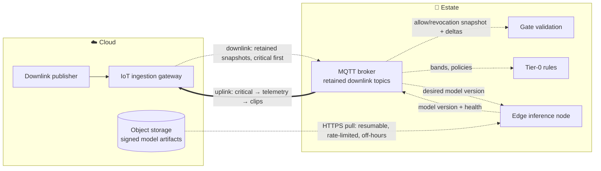

# Edge & Connectivity

Patchy Wi-Fi is the constraint that shapes everything on the estate. This document is the detailed view.

## Device classes and how they talk

| Device class | Examples | Protocol | Volume | Power / link |
| --- | --- | --- | --- | --- |
| **Gate readers** | QR/NFC at 4–6 entry points | MQTT over Wi-Fi/Ethernet to local broker | ~3,000 scans/h at opening | Wired where possible |
| **Anonymous counters** | LiDAR / thermal / IR beam counters at zone boundaries and queue lines | MQTT (small payloads) | 1 msg / 30 s / device, ~150 devices | Battery + LoRaWAN, or PoE |
| **Enclosure sensors** | feed scales, water quality (pH, temp, turbidity), climate, door contacts, PIR/beam dry-zone detectors | MQTT (small payloads) | 1 msg / min / sensor, ~300 sensors | LoRaWAN or Wi-Fi; door contacts and PIR/beam wired |
| **Cameras** | 1–2 per enclosure, IR for nocturnal | RTSP to edge node (never MQTT, never cloud) | 55–110 streams | Wired PoE |
| **Edge inference nodes** | 1–2 small GPU servers in the estate server room | Publish 1-min feature windows, clips, advisories via MQTT; pull model artifacts over HTTPS | ~3 msg/s | Mains + UPS |
| **Staff devices** | phones/rugged handhelds | Local Wi-Fi + push over local broker; DECT/radio as last resort | | |

## Why two link types

- **Wi-Fi/Ethernet** where there is power and coverage (gates, cameras, server room).
- **LoRaWAN** for low-bandwidth sensors and counters spread across a large estate: kilometre-range, years of battery, does not care about Wi-Fi coverage. A LoRaWAN gateway on the main building bridges into the MQTT broker.
- **Cellular** for the backhaul to the cloud (primary); a second SIM from another operator as failover. If cellular is unavailable (assumption A2 wrong), the same bridge runs over fixed line or satellite.

## Traffic classes

Everything on the bridge belongs to one of three classes. The class decides the queue it sits in, the order in which the buffer drains after an outage, and what is dropped if the buffer ever fills.

| Class | Contents | Overflow rule |
| --- | --- | --- |
| **Critical** | Gate entries/exits, tier-0 safety alerts, tier-1 advisories, device health heartbeats. Downlink: allow/revocation lists, tier-0 rule parameters | Never dropped; drained first |
| **Telemetry** | Sensor readings, counters, S1 1-minute feature windows, S2 daily estimates. Downlink: policy parameters, desired model versions | Dropped only after clips, oldest first |
| **Clips** | S1 event clips with ±5 min of raw features, S2 sample frames | Dropped first; regenerated from local recordings on request |

## Store-and-forward (uplink)

```mermaid
sequenceDiagram
    participant D as Device
    participant B as Local MQTT broker
    participant C as Cloud ingestion
    D->>B: publish (QoS 1, persistent, traffic class in topic)
    Note over B: Message stored to disk, one queue per class
    alt Uplink up
        B->>C: bridge forwards (QoS 1), critical → telemetry → clips
        C-->>B: ack → message released
    else Uplink down
        Note over B: Retain ≥ 24 h (sized for 72 h)
        B->>B: keep queuing; local consumers still served
    end
    Note over C: Idempotent ingest: dedupe on (device_id, seq)
```

- Devices number their messages; the cloud de-duplicates on `(device_id, seq)`. Ordering is per device, not global — consumers are written for that.
- Local consumers (gate service, tier-0 rules, dashboards' local cache) subscribe to the same broker, so the estate keeps working while the bridge queues.
- Broker runs as an HA pair; storage sized for 72 h of full telemetry per the [capacity table](#capacity-check-at-15000-visitorsday-by-traffic-class) below — ≈ 3 GB at 15,000 visitors/day, 32 GB provisioned per node.

## Downlink: cloud → estate

The bridge carries state *down* as well, and it shares one cellular link with a buffer that may be draining after an outage. Three things need to reach the estate:

| Downlink class | Content | Size / rate | Mechanism |
| --- | --- | --- | --- |
| **Critical** | Ticket allow/revocation list deltas (sold, refunded, used at another gate); tier-0 rule parameters (bands, badge lists) | KB; on change, full snapshot hourly | Retained MQTT messages on `downlink/critical/…`: sequence-numbered deltas plus a periodic full snapshot; delivered before the uplink drain starts |
| **Policy** | Confidence bands, gate-POS price schedule, opening hours, *desired* edge model version | KB; on change | Retained MQTT messages on `downlink/policy/…` |
| **Model artifacts** | Edge model bundles | 100 MB – 2 GB; weekly at most | **Never through MQTT.** The edge node pulls the signed artifact from object storage over HTTPS: resumable, rate-limited to ≤ 30% of backhaul, scheduled off-hours, paused while the uplink buffer is draining; verified, swapped atomically, version reported back |



Rules:

1. **Retained and sequenced.** Every downlink topic holds the latest full snapshot as a retained message; deltas carry a sequence number and the snapshot id they apply to. A consumer that reconnects gets the snapshot immediately, detects any gap, and re-applies. No polling and no request/response over the bridge.
2. **Critical first on reconnect.** The bridge runs one connection per direction. After an outage the downlink critical snapshot reaches the gates within a minute while the uplink starts draining critical events, then telemetry, then clips. Model pulls stay paused until the uplink buffer is below 10%.
3. **Gates never wait.** Until the revocation snapshot lands, a gate admits on signature plus local ledger — the bounded window [ADR-0011](../../adrs/ADR-0011-offline-ticket-validation.md) accepts; any admission of a since-revoked ticket shows up in the reconciliation report.
4. **Artifacts are pulled, verified, staged.** Rollout goes to one edge node, then the rest; the previous artifact stays on disk so a rollback is a re-publish of the old desired version ([ADR-0006](../../adrs/ADR-0006-edge-vs-cloud-inference.md)).
5. Game days GD-5 (revocation after outage) and GD-12 (model pull under a saturated uplink) verify this → [resilience validation](resilience-validation.md).

## What stays local, always

| Function | Why local | Depends on cloud? |
| --- | --- | --- |
| Gate validation | Visitors must get in | No — allow-list synced over the downlink when possible ([ADR-0011](../../adrs/ADR-0011-offline-ticket-validation.md)) |
| Tier-0 safety alerts (door open without badge, water out of band, PIR/beam motion in a dry zone) | Seconds matter; poisonous animals | No — deterministic rules on the broker (FR-3.6) |
| Tier-1 safety advisories (aggressive behaviour, animal outside its zone) | Camera-based; an advisory to staff must not wait for the cloud | No for detection and delivery (edge node → staff devices); the review-queue copy syncs later (FR-3.7) |
| Piranha counting | 24/7 video, no bandwidth to ship it | No — edge model; results synced later |
| Feature extraction & visitor masking | Reduce video to 1-minute feature windows and event clips; privacy | No |
| Live local dashboard for ops | Staff need to see the park while uplink is down | No (read-only cache) |

## Security

- Per-device X.509 certificates; mutual TLS to the broker; topic ACLs per device class.
- Bridge to cloud over TLS with certificate pinning, both directions; downlink topics writable only by the cloud publisher.
- Model artifacts signed in the registry; the edge node verifies the signature before swapping.
- Cameras on an isolated VLAN reachable only by the edge nodes.
- Firmware/OTA through the same GitOps pipeline as software.

## Capacity check at 15,000 visitors/day, by traffic class

Assumptions: 450 sensors and counters at 2 msg/min; S1 feature windows for 200 animals (per-animal mode — we size for the larger of 200 animals or 55 enclosures); 100 S1 candidate events/day; ~500 devices sending an hourly heartbeat; payload sizes from a prototype; managed IoT ingestion at ≈ $1 per million messages (typical list price, ±50%).

| Class | Source | Rate | Msg size | Volume / day | 72 h buffer | Ingestion msgs / month | Ingestion cost / month |
| --- | --- | --- | --- | --- | --- | --- | --- |
| Critical | 30,000 gate scans, ~100 alerts and advisories, 12,000 heartbeats | avg 0.5/s, peak 1/s at opening | 0.5 KB | 21 MB | 63 MB | 1.3 M | ≈ $1 |
| Telemetry — sensors & counters | 450 × 2/min | 15/s | 0.2 KB | 260 MB | 0.8 GB | 39 M | ≈ $40 |
| Telemetry — S1 feature windows (1-min) | 200 × 1/min | 3.3/s | 2 KB | 576 MB | 1.7 GB | 8.6 M | ≈ $9 |
| Clips | 100 events × (10 s clip ≈ 1.25 MB + ±5 min raw features ≈ 120 KB) | 100/day | 1.4 MB | 140 MB | 0.4 GB | 0.003 M | ≈ $0 (stored as objects) |
| **Total** | | **≈ 19 msg/s** | | **≈ 1.0 GB** | **≈ 3.0 GB** | **≈ 49 M** | **≈ $50** |
| *Counterfactual: raw 1 Hz features per animal, no aggregation* | *200 × 1/s* | *200/s* | *0.2 KB* | *3.5 GB* | *10 GB* | *520 M* | *≈ $520* |

The counterfactual row is an order of magnitude worse on every column, which is why edge aggregation is a design decision in S1, not an optimisation to be done later.

- Gate scans: ~15,000 in + 15,000 out; peak 3,000/h → 1/s. Trivial for the broker.
- Video: 110 streams × 2 Mbps ≈ 220 Mbps on the camera VLAN, processed locally. Never crosses the backhaul.
- Backhaul: ≈ 1.0 GB/day ≈ 0.1 Mbps average uplink; clip bursts of a few Mbps; downlink model pulls capped at 30% of link. Fits cellular with margin.
- Buffer: ≈ 3 GB per 72 h. Provision 32 GB SSD per broker node — ten times headroom, covering a full week and growth in enclosures.

The system is not bandwidth- or throughput-bound; it is **connectivity-reliability-bound**, which is exactly what store-and-forward solves — provided features are aggregated at the edge.
