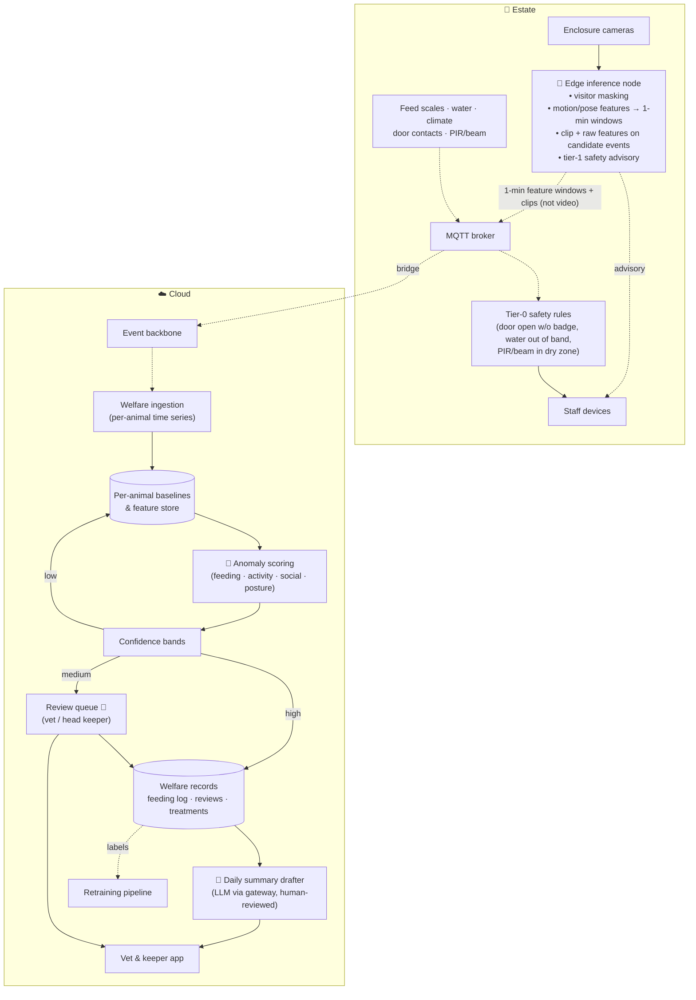

# S1 · Animal Welfare Monitoring (reference scenario)

> 200+ exotic animals across 55 enclosures. Problems are noticed late; treatment is expensive; nobody records how much each animal actually eats. We want AI to notice earlier — and a veterinarian to decide.

**Moves:** OKR 3.1 (anomaly → vet review ≤ 4 h), 3.2 (vet cost −15%), 3.3 (feeding auto-logged 90%), 3.5 (override rate ≤ 40%)
**Phase:** 1 (feeding-by-scale rules + tabular anomaly) → 2 (per-enclosure activity, camera features in shadow) → 3 (per-animal vision for solitary/tagged animals) — see [roadmap](../../../README.md#delivery-roadmap-what-we-build-when-and-what-we-buy)
**Requirements:** FR-3.1, FR-3.2, FR-3.3, FR-3.5, FR-3.6, FR-3.7, FR-5.1
**ADRs:** [ADR-0006](../../../adrs/ADR-0006-edge-vs-cloud-inference.md), [ADR-0007](../../../adrs/ADR-0007-human-in-the-loop-confidence-bands.md), [ADR-0008](../../../adrs/ADR-0008-ai-evaluation-and-production-monitoring.md)

## Why AI, and why not just rules?

Rules handle the easy part and we use them: *feed scale unchanged 2 h after feeding time → missed meal*; *water temperature outside band → alert*. Rules cannot tell that a snake has moved 40% less than its own two-week baseline, that a bird is isolating from the group, or that a lizard's posture has changed. Those are pattern-recognition problems over video and time series — computer vision plus per-animal anomaly detection. **Generative AI plays no role in detection**; it is used only to draft the daily welfare summary for humans.

Safety is split the same way. **Tier-0 safety alerts** (FR-3.6) — door open without a badge, water out of band, motion in a dry zone — are deterministic rules on local sensors and never involve a model. **Tier-1 safety advisories** (FR-3.7) — aggressive behaviour near visitors, an animal outside its normal zone — come from the edge vision model, are delivered as *advisory*, and are governed like every other model output. A model may add an alert; it never replaces or delays a rule.

## What the vet gets

A review queue on a tablet: for each flagged animal, the clip, the sensor trace, the model's confidence and *what kind* of anomaly it suspects, the animal's baseline, and two buttons — *Confirm (with finding)* / *Dismiss (with reason)*. Everything they decide trains the next model.

## Solution

**Legend:** 🤖 = contains ML inference; 👤 = human decision; dashed = async event; solid = call.

## Containers

| Container | Where | Responsibility | AI? |
| --- | --- | --- | --- |
| Edge inference node | Estate | Masks any visitor region in frame (privacy); extracts motion/pose/position features from video at ~1 Hz — per animal where animals are solitary or tagged, per enclosure for groups — and **aggregates them to 1-minute windows** before publishing; keeps the raw 1 Hz features in a ±5 min ring buffer and ships them with a short clip when a candidate event fires. Raw video never leaves the estate. | Yes — own vision models |
| Tier-0 safety rules | Estate | Deterministic: door contact open without keeper badge; water temperature/pH out of band; PIR/beam motion in a "no animal should be here" dry zone → alert to staff devices within seconds. No cloud, no ML (FR-3.6). | No |
| Tier-1 safety advisory | Estate (edge node) | Vision model flags aggressive behaviour near visitor areas or an animal outside its normal zone; sends an *advisory* to staff devices and a clip to the review queue. Advisory only — never the sole alert path (FR-3.7); bands and evals per ADR-0007/0008. | Yes — own vision model |
| Welfare ingestion | Cloud | Builds per-animal time series (feeding weight deltas, activity minutes, zone occupancy inside enclosure, social distance) from the 1-minute windows | No |
| Per-animal baselines | Cloud | Rolling baselines per animal & season; species-level priors for new arrivals | No |
| Anomaly scoring | Cloud | Scores each animal per hour against its baseline across four dimensions; outputs anomaly type + confidence | Yes — own tabular/time-series models |
| Confidence bands | Cloud | Policy per species/anomaly type: high → auto-record as observation; medium → vet review with SLA; low → discard but keep for learning | No (policy) |
| Review queue | Cloud | Prioritised by species risk and confidence; SLA 4 h (target 1 h); reason codes; full audit | Human |
| Welfare records | Cloud | Feeding log (automatic + manual), reviews, treatments — the system of record | No |
| Daily summary drafter | Cloud | Drafts the morning welfare briefing from structured records via the inference gateway; a keeper approves before it is shown to management | Yes — LLM (non-critical) |
| Retraining pipeline | Cloud | Vet decisions + clips → labelled dataset → new candidate model → eval gate → registry | — |

## Data

- **Inputs:** camera features computed at ~1 Hz on the edge node and published as **1-minute windows** (activity minutes, motion mean/variance, zone-occupancy shares, social-distance statistics — ≈ 2 KB per animal or enclosure per minute); raw 1 Hz features only for ±5 min around a candidate event, shipped with the clip; feed-scale weights per feeding; water/climate per minute; door contacts and PIR/beam; keeper manual logs.
- **Baselines:** per animal, per time-of-day, per season; species prior until 14 days of data exist.
- **Labels:** vet confirmations/dismissals with reason codes; treatment outcomes as delayed ground truth ("we flagged lethargy on Monday; vet diagnosed infection on Wednesday" = true positive).
- **Retention:** clips 90 days unless attached to a review; features 3 years; video never stored centrally.

## Degradation ladder
1. Full: edge features + cloud scoring + vet queue + LLM summary.
2. No LLM provider: summary is a templated report from structured data.
3. No cloud: edge keeps extracting features and buffering; **tier-0 rules, tier-1 advisories and daily keeper rounds continue unchanged**.
4. No edge node: sensors + tier-0 rules still work; cameras record locally; vision features and advisories resume when node is back.

## Validation & verification

**Before release**
- Golden footage set per species group (≥ 200 labelled clips each: normal, feeding, lethargy, abnormal posture, social isolation), labelled by the vet.
- Promotion thresholds: recall ≥ 0.90 on "missed meal" and "lethargy"; precision ≥ 0.60 (we accept false positives, the vet filters); calibration error ≤ 0.05 so confidence bands mean what they say.
- Shadow run for 2 weeks alongside the current model; disagreements reviewed by the vet.

**In production**
- **Vet override rate** per anomaly type (OKR 3.5) — rising override rate = drifting model or mis-set band → alert model owner, auto-tighten band.
- **Time-to-review** SLA adherence.
- **Delayed ground truth:** treatments logged within 7 days of a flag are joined back to compute real-world precision/recall monthly.
- **Drift:** camera image statistics (lighting, occlusion), feature distributions per animal; seasonal recalibration of baselines.
- **Weekly audit:** 20 random *low-confidence discarded* events reviewed by a keeper to catch false negatives.

**Kill switch:** the capability owner can set any anomaly type to "review everything" (band = 0) or switch off scoring entirely; rules and rounds continue.

## Trade-offs we accepted
- **Features at edge, scoring in cloud** — adds a hop and a dependency, but keeps 110 video streams off the backhaul and lets us improve scoring models without touching edge hardware. **Aggregating to 1-minute windows** cuts feature traffic from ~200 to ~3 messages per second across the estate and the 72 h buffer from ~10 GB to ~3 GB ([capacity table](../../core/edge-and-connectivity.md#capacity-check-at-15000-visitorsday-by-traffic-class)); hourly anomaly scoring does not need sub-minute resolution, and the raw 1 Hz trace is still shipped around events. Safety-critical detections that must be instant are rules, not models, and run locally.
- **Precision sacrificed for recall** — a missed sick animal costs more than a dismissed alert. We manage the vet's load with bands, not by hiding alerts.
- **Own models, not a vision API** — enclosure footage is unusual; general-purpose APIs are weak on "is this cassowary lethargic". Costs us training effort; buys us portability (edge deployment, no provider dependency).
