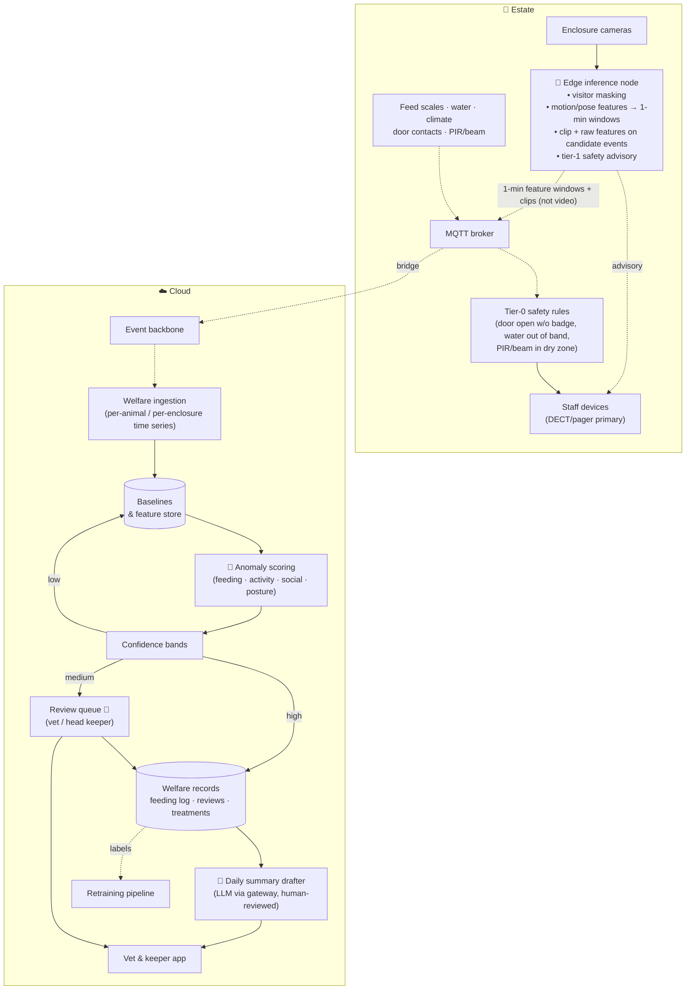

# S1 · Animal Welfare Monitoring (reference scenario)

> 200+ exotic animals across 55 enclosures. Problems are noticed late; treatment is expensive; nobody records how much each animal actually eats. We want AI to notice earlier — and a veterinarian to decide.

**Moves:** OKR 3.1 (anomaly → vet review ≤ 4 h), 3.2 (vet cost −15%), 3.3 (feeding auto-logged 90%), 3.5 (override rate ≤ 40%)
**Process:** [P1 · the morning welfare round](../../../README.md#where-ai-sits-in-the-working-day)
**Phase:** 1 (feeding-by-scale rules + tabular anomaly) → 2 (per-enclosure activity, camera features in shadow) → 3 (per-animal vision for solitary/tagged animals) — see [roadmap](../../../README.md#delivery-roadmap-what-we-build-when-and-what-we-buy)
**Requirements:** FR-3.1, FR-3.2, FR-3.3, FR-3.5, FR-3.6, FR-3.7, FR-5.1
**ADRs:** [ADR-0006](../../../adrs/ADR-0006-edge-vs-cloud-inference.md), [ADR-0007](../../../adrs/ADR-0007-human-in-the-loop-confidence-bands.md), [ADR-0008](../../../adrs/ADR-0008-ai-evaluation-and-production-monitoring.md)

## Why AI, and why not just rules?

Rules handle the easy part, and we use them: *feed scale unchanged 2 h after feeding time → missed meal*; *water temperature outside band → alert*.

Rules cannot tell that a snake has moved 40% less than its own two-week baseline, that a bird is isolating from the group, or that a lizard's posture has changed — pattern recognition over video and time series, so computer vision plus per-animal anomaly detection. **Generative AI plays no role in detection**; it only drafts the daily welfare summary for humans.

Safety splits the same way:

- **Tier-0 alerts** are the deterministic rules of FR-3.6 on local sensors, with no model involved.
- **Tier-1 advisories** (FR-3.7) — aggressive behaviour near visitors, an animal outside its normal zone — come from the edge vision model, arrive as advisories, and are governed like every other model output.

A model may add an alert; it never replaces or delays a rule.

## Per animal or per enclosure

"Per-animal baselines" assume we know which animal we are looking at. For a python, a cassowary or a big cat that is trivially true; for twelve meerkats it is an open research problem (assumption A11). So the scenario runs in two modes, and every enclosure is assigned one:

| Mode | Applies to | Features and baselines | Feed scale | Anomaly is raised for |
| --- | --- | --- | --- | --- |
| **Per animal** | Solitary animals; animals with rings, tags or RFID collars — about 35 of 55 enclosures | Per individual: activity minutes, zone occupancy, posture, social distance to others if any | Attributed to the individual (one animal per feeding station, or tag read at the scale) | The animal |
| **Per enclosure** | Groups without reliable identity — meerkats, aviary, fish, insects | Per enclosure: group activity, dispersion, count-in-view, feeding-station activity, share of animals visible | Attributed to the enclosure: total intake vs. the enclosure's baseline | The enclosure; the keeper identifies the animal on the round |

Both modes use the same pipeline, bands and review queue; only the feature extractor and the baseline key differ. Per-animal identity in groups is a Phase 3+ research spike ([`TODOS.md`](../../../TODOS.md)); if it works, group enclosures move to the first row without an architecture change.

## What the vet gets

A review queue on a tablet: for each flagged animal or enclosure, the clip, the sensor trace, the model's confidence and *what kind* of anomaly it suspects, the baseline, and two buttons — *Confirm (with finding)* / *Dismiss (with reason)*. Everything they decide trains the next model.

## Solution

**Legend:** 🤖 = contains ML inference; 👤 = human decision; dashed = async event; solid = call.

## Containers

| Container | Where | Responsibility | AI? |
| --- | --- | --- | --- |
| Edge inference node | Estate | Masks any visitor region in frame (privacy); extracts motion/pose/position features from video at ~1 Hz — per animal or per enclosure according to the mode table — and **aggregates them to 1-minute windows** before publishing; keeps the raw 1 Hz features in a ±5 min ring buffer and ships them with a short clip when a candidate event fires. Raw video never leaves the estate. Two nodes sized N+1 ([compute budget](../../core/edge-and-connectivity.md#edge-compute-budget)). | Yes — own vision models |
| Tier-0 safety rules | Estate | Deterministic: door contact open without keeper badge; water temperature/pH out of band; PIR/beam motion in a "no animal should be here" dry zone → DECT/pager within seconds, acknowledged or escalated. No cloud, no ML (FR-3.6). | No |
| Tier-1 safety advisory | Estate (edge node) | Vision model flags aggressive behaviour near visitor areas or an animal outside its normal zone; sends an *advisory* to staff smartphones and a clip to the review queue. Advisory only — never the sole alert path (FR-3.7); bands and evals per ADR-0007/0008. | Yes — own vision model |
| Welfare ingestion | Cloud | Builds per-animal or per-enclosure time series (feeding weight deltas, activity minutes, zone occupancy inside enclosure, social distance) from the 1-minute windows | No |
| Baselines | Cloud | Rolling baselines per animal or enclosure & season; species-level priors for new arrivals | No |
| Anomaly scoring | Cloud | Scores each animal or enclosure per hour against its baseline across four dimensions; outputs anomaly type + confidence | Yes — own tabular/time-series models |
| Confidence bands | Cloud | Policy per species/anomaly type: high → auto-record as observation; medium → vet review with SLA; low → discard but keep for learning | No (policy) |
| Review queue | Cloud | Prioritised by species risk and confidence; SLA 4 h (target 1 h); reason codes; full audit | Human |
| Welfare records | Cloud | Feeding log (automatic + manual), reviews, treatments — the system of record; treatments are published as `TreatmentStarted` / `TreatmentClosed` so the Estate daily report can count animals under treatment without seeing anomaly scores | No |
| Daily summary drafter | Cloud | Drafts the morning welfare briefing from structured records via the inference gateway; a keeper approves before it is shown to management. The same capability, as `summarise-estate-day`, phrases the [Estate daily report](../../core/README.md#estate-daily-report) (FR-2.7) under the same rules: numbers inserted verbatim, a human approves before it is sent | Yes — LLM (non-critical) |
| Retraining pipeline | Cloud | Vet decisions + clips → labelled dataset → new candidate model → eval gate → registry | — |

## Data

- **Inputs:** camera features computed at ~1 Hz on the edge node and published as **1-minute windows** (activity minutes, motion mean/variance, zone-occupancy shares, social-distance statistics — ≈ 2 KB per animal or enclosure per minute); raw 1 Hz features only for ±5 min around a candidate event, shipped with the clip; feed-scale weights per feeding; water/climate per minute; door contacts and PIR/beam; keeper manual logs.
- **Baselines:** per animal or enclosure, per time-of-day, per season; species prior until 14 days of data exist.
- **Labels:** vet confirmations/dismissals with reason codes; treatment outcomes as delayed ground truth ("we flagged lethargy on Monday; vet diagnosed infection on Wednesday" = true positive).
- **Retention:** clips 90 days unless attached to a review; features 3 years; video never stored centrally.

## Degradation ladder
1. Full: edge features + cloud scoring + vet queue + LLM summary.
2. No LLM provider: summary is a templated report from structured data.
3. No cloud: edge keeps extracting features and buffering; **tier-0 rules, tier-1 advisories and daily keeper rounds continue unchanged**.
4. No edge node: the second node takes all streams at reduced frame rate; if both are down, sensors + tier-0 rules still work, cameras record locally, vision features and advisories resume when a node is back.

## Validation & verification

All numbers below are copies of the [thresholds & cadences table](../../ai-platform/README.md#thresholds-and-cadences-source-of-truth); that table wins if they ever disagree.

**Promotion gates, by phase.** A gate that needs "≥ 200 labelled lethargy clips" cannot be met before there are cameras. So the gates are staged, and each phase's golden set is built during the previous one:

| Phase | Capability promoted | Golden set — and when it exists | Gate |
| --- | --- | --- | --- |
| 1 | `detect-feeding-anomaly` (rules + tabular on feed scales and sensors) | 3 months of scale logs with keeper labels — collectable in Phase 0, since scales are foundation | Recall ≥ 0.90 on "missed meal"; precision ≥ 0.60; calibration error ≤ 0.05; 2-week shadow against the rules |
| 2a | `score-enclosure-activity`, **shadow-only** | Camera features and clips accumulate from the first day of Phase 2; keepers label candidate events as they occur (label as side-effect) | 4 weeks in shadow; agreement with keeper observations reviewed weekly; no vet-queue traffic yet |
| 2b | `score-enclosure-activity` to the vet queue | ≥ 200 labelled clips per class (normal, feeding, lethargy, abnormal posture, social isolation) per species group, accumulated in 2a | Recall ≥ 0.90 on "lethargy"; precision ≥ 0.60; calibration ≤ 0.05; 2-week shadow |
| 3 | Per-animal vision for solitary/tagged animals | Per-animal identity labels added to the Phase 2 set | Same thresholds per animal; identity accuracy ≥ 0.95 where tags are read |

**Masking is its own capability**, gated before anything else: `mask-visitors` must show **zero unmasked person regions** on a 500-frame staged golden set (staff volunteers walking past enclosures) with over-masking ≤ 10% of animal area, and in production **zero unmasked frames stored** — any occurrence is a rollback and an incident. A monthly sample of 200 stored clips is reviewed.

**In production**
- **Vet override rate** per anomaly type (OKR 3.5) — rising override rate = drifting model or mis-set band → alert model owner, auto-tighten band.
- **Time-to-review** SLA adherence.
- **Delayed ground truth:** treatments logged within 7 days of a flag are joined back to compute real-world precision/recall monthly.
- **Recall audit, three ways:** weekly review of 20 random *low-confidence discarded* events (misses the model almost caught); weekly review of 10 random *unflagged hours* of footage by a keeper (misses the model never saw); monthly count of **treatments without any prior flag** (misses that cost money) — target ≤ 30% of treatments by Phase 3.
- **Drift:** camera image statistics (lighting, occlusion), feature distributions per animal or enclosure; seasonal recalibration of baselines.

**Kill switch:** the capability owner can set any anomaly type to "review everything" (band = 0) or switch off scoring entirely; rules and rounds continue.

## Two capabilities the feeding data pays for twice

The feed scales were installed to answer "did this animal eat" (FR-3.3). Having them produces two more
answers at no extra hardware cost, and both sit in this scenario because they are this scenario's data.

**Protocol answers for staff (FR-3.9).** A keeper's question at 07:00 — quarantine steps for a new
arrival, the procedure for a suspected bite — is answered from the estate's **approved protocol set**,
with the actionable steps inserted **verbatim** and the document and version cited; no approved document
produces a refusal and a name to call, never a composed answer. It is the companion's safety-fact
mechanism with the stakes raised, decided in [ADR-0010](../../../adrs/ADR-0010-grounded-llm-with-guardrails.md) §7
and reached as a copilot tool ([agents](../../ai-platform/agents.md#ops-copilot)). The protocol documents
already exist for regulatory reasons; the platform indexes them and authors none. Verified by GD-24, whose
interesting case is the document mid-revision — it must read as absent, not as current.

**Feed consumption forecast (FR-3.10).** `FeedingRecorded` and the scale deltas are a consumption series
per store and species, so ordering can start from a forecast rather than last month's average — seasonal
appetite, a changed roster and growth included. The keeper approves the order; the deterministic fallback
is the trailing four-week average, which is what happens today and which the model **must beat** on MAPE
before promotion.

Two honesties about it. The saving is the **estate's, not the platform's**: feed is estate operating cost
and there is no feed line in our [cost model](../../../appendix/cost-model.md), so the payback case is
credited with none of it — the same rule applied to every other benefit here. And the number that matters
is not forecast error but **stockouts**, because running out of food for a venomous collection is not a
rounding error (OKR 3.7).

## The carnivorous plant collection, on the same pipeline

The brief names the plant collection as the asset the Countess would have to **sell** if the estate does
not become profitable ([G1](../../../requirements/01-business-goals-and-drivers.md)). It is the one asset
this proposal had said nothing about, which is a gap rather than a decision. It closes here, and it needs
**no new context, no new component and no new scenario** — a plant house is an enclosure whose occupants
do not move:

| What it needs | What it reuses |
| --- | --- |
| Light, humidity, temperature, soil moisture and watering telemetry | The IoT classes and transport rule already specified ([ADR-0002](../../../adrs/ADR-0002-mqtt-and-cellular-backhaul.md) §2) — these are ≤ 20-byte, 1-per-minute devices, so LoRaWAN carries them |
| "This specimen is deteriorating" | `score-enclosure-activity` generalised to `score-exhibit-condition`: the same tabular anomaly capability against a per-specimen baseline, the same bands, the same review queue — with the head gardener as the reviewer instead of the vet |
| "The plant caught something" | An existing edge node publishing an ordinary fact, `ExhibitEventDetected`. It is not a welfare alert and carries no tier-0 weight |
| Turning that into money | Park Operations schedules a demonstration feeding; the companion announces it as an event like any other; the zone's popularity is measured by the counters that already exist (FR-2.4) |

Two things worth being explicit about. The **capability is the same one**, so it inherits the promotion
trigger, the golden set discipline and the kill gate rather than starting a second governance track; the
only new artefacts are a baseline per specimen and a gardener as a named owner. And the **conclusion is
commercial, not architectural**: an asset that was on the disposal list becomes an exhibit the platform
serves, at the cost of configuring components that are already there. OKR 3.6 is the number, and it is
deliberately modest — this is asset preservation plus content, not a growth lever.

## Trade-offs we accepted
- **Features at edge, scoring in cloud** — one more hop and one more dependency, in exchange for keeping 110 video streams off the backhaul and improving scoring models without touching edge hardware. Aggregating to 1-minute windows cuts feature traffic from ~200 to ~3 messages per second and the 72 h buffer from ~10 GB to ~3 GB ([capacity table](../../core/edge-and-connectivity.md#capacity-check-at-15000-visitorsday-by-traffic-class)); hourly anomaly scoring needs no sub-minute resolution, and the raw 1 Hz trace still ships around events. Detections that must be instant are rules running locally, not models.
- **Per-enclosure for groups** — we lose "this meerkat ate less" for group species and gain a scenario that works on day one for every enclosure. Identity in groups is research, not roadmap.
- **Precision sacrificed for recall** — a missed sick animal costs more than a dismissed alert. We manage the vet's load with bands, not by hiding alerts.
- **Own models, not a vision API** — enclosure footage is unusual; general-purpose APIs are weak on "is this cassowary lethargic". Costs us training effort; buys us portability (edge deployment, no provider dependency).
