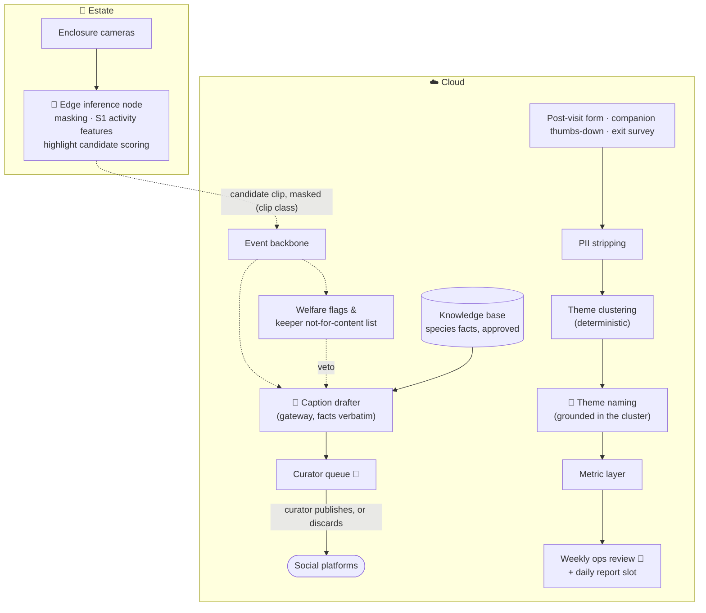

# S7 · Content drafting and visitor voice

> The estate's cameras see a piranha feeding frenzy every day and discard it. Its visitors write a few hundred sentences a month explaining why they will not come back, and nobody reads them. Both are assets the estate already owns and currently throws away.

**Moves:** OKR 1.7 (published items per week, and reach), 1.4 (revenue per visitor-day, through fixes that come from themes), 1.2 (returning households)
**Phase:** 2 (feedback themes) → 3 (highlight mining and caption drafts) — see [roadmap](../../../README.md#delivery-roadmap-what-we-build-when-and-what-we-buy)
**Requirements:** FR-4.4, FR-4.5, FR-2.7, FR-5.1
**ADRs:** [ADR-0006](../../../adrs/ADR-0006-edge-vs-cloud-inference.md), [ADR-0021](../../../adrs/ADR-0021-content-drafting-with-a-publish-gate.md), [ADR-0025](../../../adrs/ADR-0025-feedback-themes-not-scores.md)

Two capabilities in one scenario because they are the same loop in two directions: what the estate says
about itself, and what visitors say back. Both are owned by the guest team, both are generative with a
deterministic core, and neither may act without a human.

## Why AI, and why not just rules?

**Finding a highlight** is a judgement nobody can write down. "Interesting" is not a threshold on a
motion feature; it is an unusual excursion in a feature whose normal range differs per species, per
enclosure and per time of day — which is precisely the model S1 already fits for welfare. The rule
version of this capability exists and is in use: the curator scrolls the day's clips. It does not
scale, and it is why the estate's social presence is currently whatever someone happened to
photograph.

**Grouping feedback** is the same shape. A keyword rule finds "queue" and misses "we stood in the sun
for forty minutes"; it cannot tell that those are one complaint about shade. Clustering can, and the
clustering itself is deterministic — only the theme's *name* is generated, from the cluster's own
sentences.

What is emphatically **not** AI here: the decision to publish, and the decision to act on a theme.

## Highlight mining and caption drafting

The pipeline is a branch off S1, not a new one. The edge node already computes activity features on
every enclosure stream for welfare; a highlight candidate is an excursion in those features, scored on
the same node. The clip travels on the existing clip traffic class, and it has already passed the
masking gate — a candidate whose masking confidence is below threshold is discarded, not queued
([ADR-0006](../../../adrs/ADR-0006-edge-vs-cloud-inference.md)).

Three rules make this safe enough to run at all:

1. **Welfare outranks content, structurally.** No candidate is produced from an enclosure currently
   flagged for welfare review, and the keeper can mark any animal or enclosure as not for content — a
   flag the pipeline reads rather than a policy someone remembers.
2. **Facts are inserted verbatim** from the knowledge base's approved fields in the language of the
   post; the model composes around a species fact and never restates one.
3. **There is no automated publish path.** Not for low-risk formats, not on a schedule, not ever
   ([ADR-0021](../../../adrs/ADR-0021-content-drafting-with-a-publish-gate.md) §2).

## Themes, not a score

The output of the feedback capability is a **ranked list of themes, each with its count, its trend and
three verbatim quotes**. It is never a number between minus one and one. "Sentiment fell four points"
cannot be acted on; "forty-one people said the piranha queue has no shade" costs an awning and can be
done this week.

Themes keep their identity across runs, so the trend means something, and they resolve to zones and
rides through the metric layer, so a theme lands next to that queue's wait times. They appear in the
weekly ops review and — when one crosses its threshold — in the daily report's recommendation slot.
They get no dashboard of their own, which is how the sentiment score everybody built before this one
came to be ignored.

## Solution

**Legend:** 🤖 = contains model inference · 👤 = human decision · dashed = asynchronous event.

## Containers

| Container | Where | Responsibility | AI? |
| --- | --- | --- | --- |
| Highlight candidate scorer | Estate, on the existing edge node | Scores S1 activity features for excursions worth a clip; runs inside the node's spare GPU share | Yes — reuses the S1 extractor |
| Welfare veto | Cloud | Holds the current welfare flags and the keeper's not-for-content list; a candidate from a vetoed subject is dropped before drafting | No |
| Caption drafter | Cloud, via the gateway | Drafts a caption around verbatim species facts, in the post's language | Yes — generative |
| Curator queue | Cloud | Clip, draft, the source records the facts came from, and the masking version that produced the clip; publish and discard are the only actions | Human |
| Feedback intake | Cloud | Collects free text from the form, the companion's thumbs-down reason and the exit survey | No |
| PII stripping | Cloud | Removes names, contacts and staff identifiers before anything is clustered; a quote that cannot be anonymised is never shown | No |
| Theme clustering | Cloud, batch weekly | Deterministic clustering with stable theme identity across runs | Yes — classical |
| Theme naming | Cloud, via the gateway | Names and summarises a cluster from its own sentences only | Yes — generative |

## Data

- **Inputs:** S1 activity features and masked candidate clips; free-text feedback (a few hundred items
  a month, seasonal); the knowledge base's approved species fields; welfare flags.
- **Outputs:** queued drafts with provenance; named themes with counts, trends and quotes, published as
  metrics.
- **Retention:** candidate clips 90 days unless published; feedback text is a subject under
  [ADR-0009](../../../adrs/ADR-0009-visitor-privacy-anonymous-counting.md) §7 and is erased with its
  submitter; published items are kept indefinitely, as published material is.
- **Privacy:** no unmasked frame can reach a candidate; no individual is scored; no feedback is
  answered by a model — a submission needing a reply is routed to a human who writes it.

## Degradation ladder

1. Full: candidates mined, captions drafted, themes named weekly.
2. No provider: clips still queue with their facts and no caption; clusters still form and are shown
   with their quotes and no name. Both are usable — the expensive half is finding, not phrasing.
3. No edge capacity: highlight scoring is the first thing dropped under the GD-7 degradation rule,
   ahead of everything welfare needs. Content never competes with masking or with S1.
4. No pipeline at all: the curator watches footage and the guest team reads sentences, which is today.

## Validation & verification

**Caption drafts.** Facts inserted verbatim = 100% and invented facts = 0 on a 150-draft golden set;
brand-voice evaluation against the curator's examples; **zero drafts containing an unmasked person
region** on the same staged 500-frame set S1's masking gate uses. In production: **unedited acceptance
rate**, which is both the quality metric and the kill gate; published items with a wrong species fact
must be zero, and one is an incident.

**Themes.** Cluster stability across runs on unchanged input ≥ 0.90 by adjusted Rand index; theme names
grounded in their cluster at 100% on a 50-cluster review; zero quotes containing a name or a contact on
an adversarial set seeded with them. In production: the guest team reads the quotes, which makes the
clustering self-auditing, and disagreement with the clustering is logged as a label.

**Kill gates, both explicit.** Caption drafting is switched off if unedited acceptance is below 40% at
the end of its first season. Themes are switched off if a season passes with no costed change traceable
to one. Both gates are in the roadmap, with a date, rather than in a retrospective.

## Trade-offs we accepted

- **The curator is the throughput limit, on purpose.** We automate finding and drafting and leave
  publishing entirely human, which caps the volume at whatever the curator can review. A reputational
  error costs more than the volume is worth ([ADR-0016](../../../adrs/ADR-0016-cost-of-error-sets-the-bands.md) §3).
- **Two capabilities in one scenario.** They share an owner, a risk profile and a review meeting, but
  they share no code. A judge may reasonably read this as two scenarios stapled together; we kept them
  together because the estate runs them as one weekly slot.
- **Content earns no attributable revenue.** Reach is measurable, visits caused by reach are not
  (R20). That is why this is the portfolio's cheapest scenario and carries its earliest kill gate.
- **Themes measure the visitors who write.** They are not the average visitor, and the quarterly exit
  survey (A14) is the only correction. We publish counts against submissions, never as a share of
  opinion.
