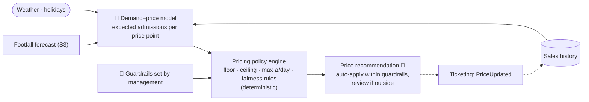

# S5 · Dynamic Family Passes

> Fixed prices cannot fill quiet Wednesdays or capture the value of a sunny Sunday. The Countess needs a pricing lever with guardrails she controls.

**Moves:** OKR 1.1 (visitors/day), 1.4 (revenue/visitor +15%), 1.5 (weekday/weekend ratio 0.35 → 0.5)
**Requirements:** FR-4.3, FR-1.1, FR-1.2, FR-5.1
**ADRs:** [ADR-0008](../../../adrs/ADR-0008-ai-evaluation-and-production-monitoring.md)

## Why ML, and where it stops
Predicting how demand for a family pass on a given date responds to price is a tabular ML problem (elasticity estimation from history, forecast, weather, holidays). **Deciding the price is a policy decision** encoded in deterministic rules the Countess sets: floor, ceiling, maximum daily change, never raise after checkout starts, always show the "quiet-day discount" framing. The model recommends; the policy decides; a human can override.

## Solution

## Containers
| Container | Responsibility | AI? |
| --- | --- | --- |
| Demand–price model | For each date/pass type, expected admissions and revenue at candidate price points | Yes — own tabular model |
| Pricing policy engine | Applies hard constraints; chooses the price maximising the configured objective (revenue, or attendance on quiet days) within them | No |
| Price recommendation | Auto-applies if within guardrails; otherwise queued for management approval | Human on exceptions |
| Ticketing | Publishes prices; a price shown at checkout is locked for that session | No |

## Fairness & trust rules (non-negotiable, in policy not model)
- Price never changes during a checkout session.
- Same price for everyone at the same moment — no per-person pricing.
- Discounts are framed as quiet-day offers; standard price is the ceiling.
- Full log of every price and the recommendation behind it (FR-5.1).

## Validation & verification
- **Offline:** elasticity model backtested on history; promote only if revenue-uplift estimate beats fixed pricing on held-out weeks.
- **Live:** A/B by date cohorts for the first season; guardrails on conversion drop, complaint rate, and floor/ceiling hit frequency; automatic revert to fixed price if conversion drops > X%.
- **Business:** OKR 1.4 and 1.5 measured monthly against the fixed-price counterfactual.

## Degradation ladder
Model unavailable → last approved price schedule → fixed price list. No external provider dependency.
