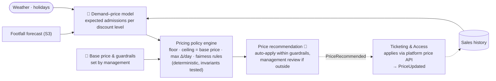

# S5 · Dynamic Family Passes

> Fixed prices cannot fill quiet Wednesdays or capture the value of a sunny Sunday. The Countess needs a pricing lever with guardrails she controls.

**Moves:** OKR 1.5 (weekday/weekend ratio 0.35 → 0.38 base / 0.5 stretch → 0.60 — the primary objective), 1.1 (visitors/day), 1.4 (revenue per visitor-day — must not fall)
**Process:** [P4 · the 21:00 review and the weekly commercial call](../../../README.md#where-ai-sits-in-the-working-day)
**Phase:** 3 — needs one year of sales and footfall history; year 1 runs as a randomised quiet-day discount experiment — see [roadmap](../../../README.md#delivery-roadmap-what-we-build-when-and-what-we-buy)
**Requirements:** FR-4.3, FR-1.1, FR-1.2, FR-5.1
**ADRs:** [ADR-0008](../../../adrs/ADR-0008-ai-evaluation-and-production-monitoring.md), [ADR-0007](../../../adrs/ADR-0007-human-in-the-loop-confidence-bands.md) (management approves out-of-guardrail prices), [ADR-0004](../../../adrs/ADR-0004-event-driven-backbone.md) (`PriceRecommended` → `PriceUpdated`), [ADR-0012](../../../adrs/ADR-0012-ticketing-platform-adopt-not-build.md) (price API with checkout lock)

## The goal: fill quiet days

The estate's problem is not that Sundays are underpriced; it is that Wednesdays are empty. So the objective is **attendance on quiet days**, subject to **no loss of contribution per visitor-day below the finance-supplied floor (A15), and revenue per visitor-day (OKR 1.4) not falling**. Two decisions are deliberately *not* the model's:

- **The base price** (the standard day and family-ticket price, which is also the ceiling) is set by management once a year from costs and the market. The model never proposes a price above it; "dynamic" here means *discount depth on quiet days*, never surcharges.
- **The guardrails** — floor, ceiling, maximum daily change, fairness rules — are management policy.

## Pricing's place in the flywheel

Pricing's job in the [flywheel](../../../appendix/business-case-model.md#3-the-membership-flywheel) is the second turn: a season pass priced below two visits, plus an upgrade voucher for today's ticket, so the family that liked Wednesday comes back in March. The quiet-day experiment fills the calendar; the pass fills the year.

The two stay apart by design. **S5 prices day and family tickets for specific quiet dates.** A season pass is not date-specific, so its price is management's yearly decision like the base price, and the upgrade voucher is a ticketing-platform invariant — **P-I7** in [ADR-0012](../../../adrs/ADR-0012-ticketing-platform-adopt-not-build.md), executed by the vendor. S5 references P-I7 and never prices a pass. Weekday fill by pass holders belongs to S4's nudges; S5 fills weekdays with day-ticket buyers.

## Why ML, and where it stops
Predicting how demand for a family pass on a given date responds to a discount is a tabular ML problem (elasticity estimation from history, forecast, weather, holidays). **Deciding the price is a policy decision** encoded in deterministic rules the Countess sets. The model recommends; the policy decides; a human approves anything outside the guardrails.

## Solution

## Containers
| Container | Responsibility | AI? |
| --- | --- | --- |
| Demand–price model | For each date/pass type, expected admissions and revenue at candidate discount levels | Yes — own tabular model |
| Pricing policy engine | Applies hard constraints; chooses the discount maximising quiet-day attendance subject to the **contribution constraint**, evaluated with the finance-supplied cost of goods, variable cost and ticketing fee (A15, GitOps policy config); every invariant below is checked before a recommendation leaves | No |
| Price recommendation | Auto-applies if within guardrails; otherwise queued for management approval (ADR-0007 mechanism) | Human on exceptions |
| Ticketing & Access | Consumes `PriceRecommended`, applies it through the ticketing platform's price API, publishes `PriceUpdated`; a price shown at checkout is locked for that session | No |

## Deterministic invariants (tested, not trusted)

The fairness rules are the reason a family trusts the price. They live in policy, not in the model — and they are **tested as invariants**, not read as promises:

| Invariant | Meaning |
| --- | --- |
| P-I1 Checkout freeze | A price shown at checkout does not change for that session (lock ≥ 30 min) — including when guardrails are edited mid-session |
| P-I2 One price for all | At any moment, one price per pass type and date; no per-person or per-device pricing |
| P-I3 Bounded | floor ≤ price ≤ ceiling, where ceiling = the management-set base price |
| P-I4 Smooth | ∣Δ price∣ per day ≤ the configured maximum |
| P-I5 Framed as a discount | Every price below base is shown as a quiet-day offer; the base price is never shown as a surcharge |
| P-I6 Explainable | Every published price has a logged recommendation, model version and policy decision behind it (FR-5.1) |
| P-I7 Upgrade credit — *a platform invariant owned by Ticketing & Access ([ADR-0012](../../../adrs/ADR-0012-ticketing-platform-adopt-not-build.md)), referenced here* | A season pass has one price for everyone (P-I2 holds for passes too), and today's ticket converts into a credit voucher against it under rules the ticketing platform executes ([appendix · ticketing rules](../../../appendix/ticketing-rules.md)) — never a personal price. S5 only reads pass state; it never prices a pass |

**Property-based tests** generate random sequences of recommendations, guardrail edits and concurrent checkouts and assert zero violations; **violations = 0** is a CI gate for every policy-engine change and a production monitor (any violation = revert to fixed price + incident). The contribution constraint is tested the same way with the A15 parameters as generated inputs. P-I7's own cases run in Ticketing & Access against the vendor sandbox ([test plan](../../../appendix/data-health-and-verification.md#verification-purchases-cap-and-the-daily-report)).

## Year 1: a randomised experiment, not a pricing engine

There is no elasticity to estimate before there is variation in price. So year 1 is designed as an experiment the model later learns from:

- **Units:** quiet days (forecast < 60% of capacity), grouped into week blocks.
- **Treatment:** each block is randomly assigned a discount level — 0%, 10%, 20% or 30% — announced as the "quiet-day family offer" for that week.
- **Measures:** admissions, **contribution per visitor-day** (gross from `TicketPurchased` + `PurchaseRecorded`, minus the A15 parameters), revenue per day, share of first-time visitors, complaint rate — each vs. the 0% blocks.
- **Weekly guardrail:** OKR 1.4 is an annual figure and cannot steer a weekly experiment, so the operational guardrail is **the weekly contribution guardrail on discounted blocks**; a discount level that breaks it is paused for the next block ([thresholds table](../../ai-platform/README.md#thresholds-and-cadences-source-of-truth)).
- **Readout** after one season, by the Countess and management.
- **Go:** attendance uplift on discounted blocks ≥ 15% with the weekly guardrail held throughout → the model is trained on this data and promoted through the normal gate. **Stop:** otherwise → fixed pricing with a single standing quiet-day offer; the model stays in the registry as `retired`.

## Validation & verification
- **Offline:** elasticity model backtested on the experiment's history; promote only if revenue on held-out weeks ≥ fixed pricing.
- **Live:** guardrails on conversion drop (> 10% vs. control → automatic revert to fixed price), the weekly contribution guardrail (discounted blocks below the 0% blocks − 10% → pause that discount level), complaint rate (> 0.5% of buyers → review), floor/ceiling hit frequency; invariant violations = 0.
- **Business:** OKR 1.5 measured monthly against the fixed-price counterfactual; OKR 1.4 (revenue per visitor-day) yearly, with the pass share of admissions beside it — the weekly guardrail is its operational proxy ("OKR = year, guardrail = week", [06](../../../requirements/06-suggested-okrs.md)).
- Thresholds: [thresholds & cadences table](../../ai-platform/README.md#thresholds-and-cadences-source-of-truth).

## Degradation ladder
Model unavailable → last approved price schedule → fixed base price. No external provider dependency.
