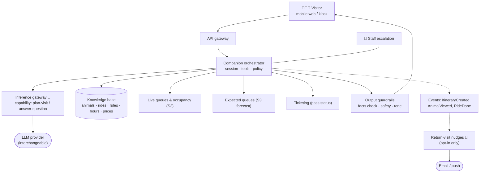

# S4 · Guest Companion

> Families wander, queue, leave early, and don't come back. We want a companion that plans their day, steers them to short queues and interesting animals, and gives them a reason to return.

**Moves:** OKR 1.2 (returning share 10% → 25%), 1.3 (family passes 40%), 2.2 (queue time via load spreading)
**Phase:** 1 (FAQ answers via the gateway) → 2 (day planning with live queues and forecast) → 3 (return-visit nudges) — see [roadmap](../../../README.md#delivery-roadmap-what-we-build-when-and-what-we-buy)
**Requirements:** FR-4.1, FR-4.2, FR-1.6, FR-5.1, FR-5.3
**ADRs:** [ADR-0005](../../../adrs/ADR-0005-model-gateway-and-provider-independence.md), [ADR-0010](../../../adrs/ADR-0010-grounded-llm-with-guardrails.md), [ADR-0007](../../../adrs/ADR-0007-human-in-the-loop-confidence-bands.md) (staff escalation)

## Why generative AI here (and only here)
This is a language problem: a parent typing "we have a 3-year-old who's scared of loud rides and we need lunch by 12" needs an answer, not a filter form. An LLM turns that into a plan — but **every fact it uses comes from our structured knowledge base and live queue data**, not from the model's memory. Safety facts ("can we touch it?") are never generated; they are looked up.

## Solution

## What it does
- **Plan the day:** builds an itinerary from constraints (children's ages, interests, time, accessibility) using forecast and live queues; re-plans when a ride closes or a queue spikes.
- **Answer questions:** grounded on the knowledge base — "Where is the axolotl?", "Is the Ferris wheel OK for a 4-year-old?", "When is the piranha feeding?" — with citations to the source fact.
- **Offline-tolerant:** the itinerary and map are cached on the device; when Wi-Fi is patchy the visitor still has their plan; live re-planning resumes on reconnect.
- **Return nudges (opt-in):** "The cassowary chick you saw is on show from Saturday", "You saw 31 of 55 enclosures — finish your collection", "Quiet-day family pass this Wednesday". Content templates are curated; the LLM personalises within them.

## Containers
| Container | Responsibility | AI? |
| --- | --- | --- |
| Companion orchestrator | Session state, tool calls (KB, live data, ticketing), policy (what may be generated vs. looked up), escalation | No (orchestration) |
| Inference gateway | Resolves `plan-visit` / `answer-question` to the current model bundle; tiered routing (small model for FAQ, larger for planning); budget; fallback. Adopted OSS, see [AI platform](../../ai-platform/README.md) | — |
| Knowledge base | Structured facts + curated narrative; the only citable source | No |
| Output guardrails | Verifies every factual claim is traceable to a KB record or live-data call; blocks unsafe content; enforces tone and length; treats retrieved text and live data as data, never instructions (indirect injection); runs **progressively on the stream** so a failed claim replaces the partial answer | Partly (classifier) |
| FAQ cache | Daily cache of the top questions and their grounded answers, keyed by knowledge-base version; served by the orchestrator without a model call | No |
| Return-visit nudges | Segments opted-in visitors by behaviour; personalises curated templates; respects frequency caps | Yes — LLM for wording, rules for targeting |
| Staff escalation | Hand-off to a human at an info point for anything the companion cannot answer | Human |

## Latency budget by request class

"p95 ≤ 3 s" means different things for "when is the piranha feeding?" and "plan our day around a 3-year-old's nap". NFR-PRF-1 is therefore split, and the design follows the split:

| Request class | Budget (p95) | How we meet it |
| --- | --- | --- |
| FAQ answer | ≤ 3 s, complete | Small model via tiered routing; **FAQ cache** for the day's top questions (no model call); grounded lookup for safety and price facts |
| Day planning | First token ≤ 2 s · first stop suggestion ≤ 5 s · full plan ≤ 15 s | Larger model with **streaming**; the plan is emitted stop by stop; guardrails check each claim as it streams |
| Re-plan after a closure or a queue spike | ≤ 5 s | Only the affected stops are re-planned; live data comes from events, not from a KB query |

Every promotion runs a **load test at 500 concurrent sessions** (a Saturday peak with 30% of visitors using the companion) against these budgets.

## Validation & verification
- **Eval suite:** 300+ question/answer pairs with expected facts; 100 planning scenarios with hard constraints (must not include closed rides, must respect age limits); 100 adversarial prompts (jailbreaks, "can I feed the piranhas", medical questions) requiring refusal/escalation; **100 indirect-injection cases** where the instruction hides in a ride description, a live-status field or text the visitor pastes — resistance must be 100%; an **ungrounded-block false-positive gate**: on 300 questions the KB can answer, the guardrail may block ≤ 5%, otherwise the companion is safe but useless; an **offline itinerary end-to-end test** (device goes offline → cached plan and map still work → re-plan on reconnect); the load test above. Promotion: factuality ≥ 0.95, constraint violations 0, safety refusals 100%, injection resistance 100%, false positives ≤ 5%, latency budgets met.
- **Production:** sampled LLM-as-judge on factuality + weekly human review of 50 sessions; thumbs-down rate; escalation rate; "answer not grounded" blocks by guardrails (each one is a KB gap or a model regression); latency per request class.
- **Business signal:** itinerary adherence (did they go where suggested?), queue time for companion users vs. non-users, return rate of nudged vs. control cohort (A/B).
- All thresholds: [thresholds & cadences table](../../ai-platform/README.md#thresholds-and-cadences-source-of-truth).

## Degradation ladder
LLM provider A down → provider B via gateway → open-weight model → **static FAQ + map + "ask at the info point"**. The park never depends on the companion.
