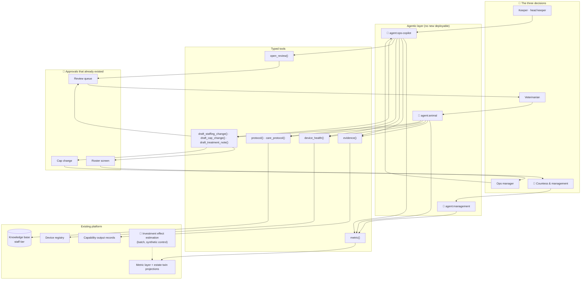

# S6 · Operations copilot and ask-the-estate

> The estate's three decision-makers each spend more time assembling a question than answering it. The keeper opens four screens before deciding whether an enclosure needs a visit, the ops manager reads a forecast and a labour rule and a roster to move one shift, and the Countess reads a report that answers yesterday's question rather than today's.

**Moves:** OKR 2.3 (forecast used rather than read), 2.4 (staff hours in empty zones), 2.6 (investments with a measured effect and a stated interval), 3.1 (anomaly → vet review), 5.4 (agent task success)
**Phase:** 2 (`agent:ops-copilot`) → 3 (`agent:animal`, `agent:management`) — see [roadmap](../../../README.md#delivery-roadmap-what-we-build-when-and-what-we-buy)
**Requirements:** FR-2.8, FR-2.4, FR-3.5, FR-5.1, FR-5.4
**ADRs:** [ADR-0013](../../../adrs/ADR-0013-stakeholder-agents-on-typed-tools.md), [ADR-0014](../../../adrs/ADR-0014-two-tier-agent-memory-with-a-write-guard.md), [ADR-0015](../../../adrs/ADR-0015-metric-layer-and-estate-twin.md)

## Why AI, and why not just rules?

Every individual step in this scenario is already a query. "What is enclosure 12's activity this
fortnight" is a metric. "Is feed scale FS-19 healthy" is a device-registry lookup. "What does the
protocol say about a lethargic cassowary" is a document. None of them needs a model.

What needs a model is the **composition**: turning "why is 12 flagged, and can I trust it" into the
right four lookups, in the right order, with the right window, and a summary that puts the answer next
to the evidence. Writing that composition down as a rule means enumerating the questions in advance,
and the entire complaint is that nobody knows tomorrow's question. This is the one place in the
portfolio where the value is orchestration rather than prediction
([ADR-0013](../../../adrs/ADR-0013-stakeholder-agents-on-typed-tools.md)).

Two things follow. The agent **proposes into an approval that already exists** — the review queue, the
roster screen — rather than creating a new surface, and every lookup it performs is one a human can
perform without it.

## The three agents in this scenario

Tool inventories, invariants and the trust boundary are in
[agents.md](../../ai-platform/agents.md); this is what each is *for*.

| Agent | The moment it is used | What it hands back |
| --- | --- | --- |
| `agent:ops-copilot` | The keeper's round, and the ops manager moving a shift | A ranked round with evidence per item, or a drafted staffing change with what it costs |
| `agent:animal` | The vet, opening a review-queue item | The animal's fortnight, the device's health, the species protocol verbatim, and a treatment note draft |
| `agent:management` | The Countess, after reading the 21:00 report | A number with its definition and window, or a refusal naming the metric it looked for |

## Investment effect, the question the copilot cannot answer alone

FR-2.4 asks whether an investment changed anything, and it is the question the Countess actually spends
money on. A before-and-after comparison answers it wrongly: the new enclosure opened in May, and May is
busier than April whatever you do.

So the estimate is a batch capability, not a chat answer. Each recorded investment gets an effect
estimate against a synthetic control built from comparable zones that did not change, with a confidence
interval — and, where the interval spans zero, the verdict that the change **cannot be told apart from
the season**. `agent:management` reads the estimate through the metric layer like any other number; it
does not compute one on the fly, because a causal claim invented in a conversation is exactly the
failure this scenario exists to avoid.

## Solution

**Legend:** 🤖 = contains model inference · 👤 = human decision · dashed = asynchronous.

## Containers

| Container | Where | Responsibility | AI? |
| --- | --- | --- | --- |
| Agent runtime | Cloud, inside the business monolith | Holds each agent's prompt, tool whitelist and step budget as a versioned artifact; runs the turn; emits one trace per task | Orchestration |
| Tool layer | Cloud, monolith | Typed tool implementations: schema validation, entitlement check, call, span. No tool reaches another context's store | No |
| Metric layer | Cloud | Named metrics with one owner and one formula, plus the twin projections agents read for current state → [ADR-0015](../../../adrs/ADR-0015-metric-layer-and-estate-twin.md) | No |
| Knowledge base, staff tier | Cloud | Approved protocols and SOPs, separate from the visitor tier; answers are returned verbatim with document id and version | No |
| Working memory | Cloud | Session and shift context, TTL'd → [ADR-0014](../../../adrs/ADR-0014-two-tier-agent-memory-with-a-write-guard.md) | No |
| Write-guard | Cloud | Validates every derivative written back: schema, range, provenance, dedup | No |
| Investment effect job | Cloud, batch | Synthetic-control estimate per recorded investment, with interval, published as a metric | Yes — classical |
| Inference gateway | Cloud | The hosted model behind every agent turn → [ADR-0005](../../../adrs/ADR-0005-model-gateway-and-provider-independence.md) | — |

## Data

- **Reads:** metrics and twin projections, capability output records with their telemetry window, the
  device registry, the staff tier of the knowledge base, and the session's own history. No ad-hoc SQL
  and no operational store.
- **Writes:** typed derivatives only — an outcome, a feedback flag, a label — through the write-guard,
  with provenance. Before Phase 3 the only derivatives are human decisions the platform already
  records.
- **Retention:** traces 90 days, which is what makes a chain reconstructable; session context expires
  at end of shift; derivatives live with the lineage of the tier they land in.
- **Personal data:** staff identities are already processed under the employment basis
  ([ADR-0009](../../../adrs/ADR-0009-visitor-privacy-anonymous-counting.md) §8); no visitor subject
  enters these three agents at all.

## Degradation ladder

1. Full: agent turns with tools, drafts into the existing approvals.
2. No provider: the gateway's fallback chain, then the open-weight bundle. A turn that still cannot be
   served returns the tool results without a synthesis — the lookups are the valuable half.
3. No agent: the dashboards, the review queue, the roster screen and the protocol folder, which is
   today's process and which none of these agents replaced.
4. No cloud: the estate-local read-only dashboard and the printed protocol, as everywhere else.

## Validation & verification

Numbers are copies of the [thresholds & cadences table](../../ai-platform/README.md#thresholds-and-cadences-source-of-truth),
which wins on any disagreement.

**Before promotion.** Each agent has a golden set of **60 recorded tasks** with the tool sequence a
domain expert would have used and the answer they would have accepted. Gates: task success ≥ 0.80
judged by LLM-as-judge calibrated against the expert's labels on the same set; **tool-argument schema
violations = 0**; **indirect prompt-injection resistance 100%** on a 50-case set of poisoned documents
and hostile session text; protocol answers returned verbatim 100% with a correct document version;
`agent:management` refusing rather than inventing on 30 questions with no matching metric, at 100%. Two
weeks in shadow on real tasks, with the human's own path recorded alongside.

**In production.** Task success, tool-error rate and human-override rate, read as described in
[agents.md](../../ai-platform/agents.md#evaluation-in-production-and-rolling-back-the-agent-rather-than-the-model).
Copilot-origin review items are tracked separately from model-origin ones, so a copilot that wastes the
vet's time is visible in the queue metrics rather than blamed on the welfare model. Steps per task and
cost per task against their budgets (NFR-AGT-1). Write-guard rejections counted, and accepted anomalous
writes must be zero.

**Game days.** GD-17 injects a poisoned knowledge-base document; GD-18 injects a batch of anomalous
derivatives and requires the rollback by provenance to complete inside the window.

**Kill switch.** Each agent can be disabled independently, and disabling it removes a convenience, not
a capability — every tool's effect stays reachable through the surface it drafts into (GD-10).

## Trade-offs we accepted

- **Four agents on a team of five.** This is the largest operability cost in the proposal (R25). We
  took it because the alternative — one agent with the union of every tool — is least-privilege for
  nobody, and because the phase gates let us stop after two.
- **Refusal over invention.** `agent:management` refusing a question the catalogue cannot answer will
  be experienced as the system being unhelpful. We preferred it to a confident wrong number in a
  meeting, and we log every refusal so the catalogue fills where it is actually asked.
- **Orchestration, not prediction.** These agents add no new model and no new data. A judge looking for
  novel modelling will not find it here; what is here is the difference between information existing
  and information being used.
- **A drafted roster is still the ops manager's roster.** We gain minutes per change, not the change
  itself, and the labour rules stay in a deterministic solver where they can be proven.
