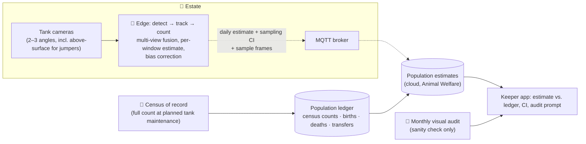

# S2 · Piranha Population Counting

> The jumping piranha collection needs population checks. Manual counting is slow, stressful for the fish and wrong by ±30%.

**Moves:** OKR 3.4 (estimate error ±10% → ±5%)
**Process:** [P6 · the census and the stock take](../../../README.md#where-ai-sits-in-the-working-day)
**Phase:** 3 — after S1 vision has proven the edge pipeline; needs a census of record as ground truth — see [roadmap](../../../README.md#delivery-roadmap-what-we-build-when-and-what-we-buy)
**Requirements:** FR-3.4, FR-5.1
**ADRs:** [ADR-0006](../../../adrs/ADR-0006-edge-vs-cloud-inference.md), [ADR-0008](../../../adrs/ADR-0008-ai-evaluation-and-production-monitoring.md)

## Why AI, and why at the edge
Counting fast-moving, overlapping, occasionally airborne fish across a tank is a detection-and-tracking problem — classical computer vision. It needs continuous video, so it runs on the **edge inference node**; only the estimate leaves the estate. No generative AI is involved.

## Solution

## How the estimate is made
- Detector + tracker on each camera; tracks fused across views to avoid double counting.
- Counts are taken in many short windows across the day; the **daily estimate is the median with a bootstrap confidence interval**. A single frame is never the answer.
- The raw count is **bias-corrected**: detector recall (fish missed in occlusion or glare) and the double-count rate are measured on the golden set and re-measured at every census; the estimate is the raw median divided by the measured recall, minus the measured double-count share.
- The **confidence interval covers sampling variation only** and is labelled as such in the app. Systematic error (a camera drifting, turbidity, a new hiding place) is not in the CI; it is bounded separately by the census comparison below.
- Feeding time excluded (fish cluster; counts are unreliable).
- Sudden drops beyond CI → welfare review (S1 queue) — a jump out of the tank is also a tier-0 safety event handled by rules (PIR/beam motion in the "dry" zone, FR-3.6).

## Containers
| Container | Where | Responsibility |
| --- | --- | --- |
| Tank cameras | Estate | Continuous video, wired; one above-surface angle |
| Edge counting model | Estate | Detection, tracking, fusion, windowed estimate, bias correction; publishes estimate, sampling CI, and a handful of sample frames for audit |
| Population estimates | Cloud (Animal Welfare) | Time series per tank; trend & anomaly (feeds S1) |
| Population ledger | Cloud (Animal Welfare) | Census counts with dates; births, deaths and transfers logged by keepers; yields the **expected population on any day** — the ground truth the estimator is scored against |
| Keeper app | Cloud | Shows estimate vs. ledger-expected population and CI; prompts the monthly visual audit and the census at planned maintenance; captures both |

## Validation & verification
- **Golden set:** 50 manually counted, multi-view frame sets (vet + keeper double-counted) → detector precision/recall ≥ 0.95 at promotion; recall and double-count rate from this set seed the bias correction.
- **Ground truth in production = census of record.** A full count when the tank is drained or netted for **planned maintenance** (≥ 2 per year, scheduled with the keepers, never done for the count alone), plus the **births/deaths/transfers ledger** between censuses, gives the expected population for any day. OKR 3.4 is measured as |estimate − expected| / expected on census days and on ledger-adjusted days in between.
- **Monthly visual audit is a sanity check, not ground truth.** A keeper's count from the viewing window and the sample frames is itself about ±30% — it cannot score a ±10% target. A disagreement beyond the audit's own error band triggers a look at the cameras and the ledger, not a retrain.
- **Retrain trigger:** census error > 10%, or ledger-adjusted drift outside the CI for 7 consecutive days with no recorded event. Recall and double-count rate are re-measured at every census and the correction updated before the next estimate.
- **Consistency check:** day-to-day change beyond CI without a recorded event (birth, death, transfer) = alert.
- **Drift:** water turbidity and lighting stats monitored; detector confidence histogram tracked.

## Degradation ladder
Edge node down → cameras record; count resumes; keeper does a visual estimate. Cloud down → estimates buffer at the broker. No path depends on an external provider.
