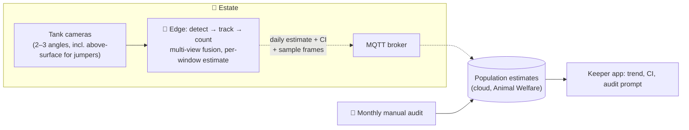

# S2 · Piranha Population Counting

> The jumping piranha collection needs population checks. Manual counting is slow, stressful for the fish and wrong by ±30%.

**Moves:** OKR 3.4 (estimate error ±10% → ±5%)
**Requirements:** FR-3.4, FR-5.1
**ADRs:** [ADR-0006](../../../adrs/ADR-0006-edge-vs-cloud-inference.md), [ADR-0008](../../../adrs/ADR-0008-ai-evaluation-and-production-monitoring.md)

## Why AI, and why at the edge
Counting fast-moving, overlapping, occasionally airborne fish across a tank is a detection-and-tracking problem — classical computer vision. It needs continuous video, so it runs on the **edge inference node**; only the estimate leaves the estate. No generative AI is involved.

## Solution

## How the estimate is made
- Detector + tracker on each camera; tracks fused across views to avoid double counting.
- Counts are taken in many short windows across the day; the **daily estimate is the median with a bootstrap confidence interval**. A single frame is never the answer.
- Feeding time excluded (fish cluster; counts are unreliable).
- Sudden drops beyond CI → welfare review (S1 queue) — a jump out of the tank is also a safety event handled by local rules (motion in the "dry" zone).

## Containers
| Container | Where | Responsibility |
| --- | --- | --- |
| Tank cameras | Estate | Continuous video, wired; one above-surface angle |
| Edge counting model | Estate | Detection, tracking, fusion, windowed estimate; publishes estimate, CI, and a handful of sample frames for audit |
| Population estimates | Cloud | Time series per tank; trend & anomaly (feeds S1) |
| Keeper app | Cloud | Shows estimate and CI; prompts monthly manual audit; captures audit result |

## Validation & verification
- **Golden set:** 50 manually counted, multi-view frame sets (vet + keeper double-counted) → detector precision/recall ≥ 0.95 at promotion.
- **Ground truth in production:** monthly manual audit (net count or tank drain when it happens anyway). Estimate error vs. audit is the OKR; error > 10% → retrain trigger.
- **Consistency check:** day-to-day change beyond CI without a recorded event (birth, death, transfer) = alert.
- **Drift:** water turbidity and lighting stats monitored; detector confidence histogram tracked.

## Degradation ladder
Edge node down → cameras record; count resumes; keeper does a visual estimate. Cloud down → estimates buffer at the broker. No path depends on an external provider.
