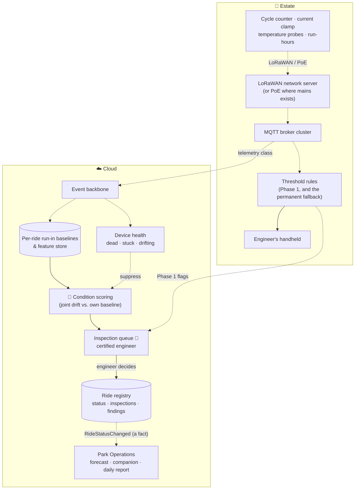

# S8 · Ride condition monitoring

> Forty rides from the eighteenth century, and the estate's entire knowledge of how they behave is a maintenance calendar and whatever the engineer noticed. An unplanned closure on a peak day is a repair bill, a queue pushed onto its neighbours, and the most visible thing that can go wrong in front of fifteen thousand people.

**Moves:** OKR 2.5 (unplanned downtime hours per instrumented ride), 2.2 (p90 queue time, through closures that do not surprise the forecast)
**Phase:** 1 (threshold rules on run-in baselines) → 3 (condition model, after twelve months of history) — see [roadmap](../../../README.md#delivery-roadmap-what-we-build-when-and-what-we-buy)
**Requirements:** FR-2.5, FR-2.9, FR-5.1
**ADRs:** [ADR-0016](../../../adrs/ADR-0016-cost-of-error-sets-the-bands.md), [ADR-0022](../../../adrs/ADR-0022-ride-condition-monitoring.md), [ADR-0023](../../../adrs/ADR-0023-rules-first-model-second.md)

## The one thing to read first

**This capability never clears a ride for operation, and its absence never clears one either.** It
flags a ride for inspection and hands the engineer the traces behind the flag. The statutory inspection
schedule is untouched: condition monitoring adds inspections, and removes, delays and re-times none.
A ride the model thinks is fine is inspected exactly as often as it is today
([ADR-0022](../../../adrs/ADR-0022-ride-condition-monitoring.md) §3–4).

That is the 100:1 row of the cost-of-error matrix and the reason this capability has **no automatic
band at any confidence** ([ADR-0016](../../../adrs/ADR-0016-cost-of-error-sets-the-bands.md) §3).

## Why AI, and why not just rules?

Rules do most of the job, and they ship first. A current draw above the ride's run-in band is a rule. A
bearing surface above its temperature band is a rule. Both are in Phase 1, both stay as the fallback,
and on a heritage ride they will catch the obvious failures.

What a rule cannot catch is the *joint* drift — current up four percent, bearing temperature up two
degrees, cycle time lengthening by a fraction, none of them outside its own band, all of them moving
together over three weeks. That is a pattern across correlated series measured against the ride's own
history, which is what the model is for, and it is also why the model cannot exist before a season of
history does ([ADR-0023](../../../adrs/ADR-0023-rules-first-model-second.md)).

We do **not** estimate remaining useful life. There is no fleet of eighteenth-century carousels to fit
a distribution against, and a number of days until failure is exactly the output that gets mistaken for
a safety claim.

## What can be instrumented, and what cannot

A10 says heritage machinery mostly cannot take the instrumentation predictive maintenance wants, and
that remains true: vibration spectra at rate need mounting to structure, and a heritage assessment will
refuse on most of the forty. So the sensor set is deliberately the non-invasive one, and coverage is
per ride rather than per estate (A19).

| Sensor | How it attaches | What it sees |
| --- | --- | --- |
| Cycle counter | Optical or reed switch on an existing moving part | Load in cycles, and the cycle time itself |
| Clamp-on current transformer | Around the supply cable, no electrical work | Motor effort, which rises as something binds |
| Surface temperature probes | Magnetic or strapped at bearings and motor housings | Friction, well before it is audible |
| Run-hours clock | From the controller, where one exists | Exposure, for anything time-based |

A ride that cannot take even these keeps its `RideStatusChanged` event and its queue counter, and this
scenario simply does not cover it. **The metric is per instrumented ride**, never per estate, because
an average over partial coverage is a number that means nothing.

## Solution

**Legend:** as elsewhere — 🤖 is model inference, 👤 a human decision, a dashed arrow an asynchronous
event. Note what does *not* connect: condition scoring has no edge into the ride registry. Only the
engineer's decision changes a ride's status.

## Containers

| Container | Where | Responsibility | AI? |
| --- | --- | --- | --- |
| Ride sensors | Estate | Non-invasive telemetry per instrumented ride, 1 msg/min on the telemetry class | No |
| Threshold rules | Estate, in the tier-0 rule runtime | Per-ride bands on current and temperature from run-in data; fires with the uplink down | No |
| Device health | Estate and cloud | The dead, stuck and drifting detectors already built for enclosure sensors → [sensor health](../../core/edge-and-connectivity.md#sensor-health-dead-stuck-and-drifting) | No |
| Run-in baselines | Cloud | Per ride, per season, per operating mode; built during the ride's first months of instrumented running | No |
| Condition scoring | Cloud | Scores the joint drift of a ride's series against its own baseline; outputs a flag, its evidence and a confidence | Yes — classical |
| Inspection queue | Cloud | The engineer's list: flag, the traces behind it, the ride's inspection history, and the device-health state of every sensor involved | Human |
| Ride registry | Cloud, Park Operations | Ride status, statutory inspection log and findings; the **only** writer of `RideStatusChanged` | No |

## Data

- **Inputs:** ~1 message per minute per sensor across the instrumented rides, on the existing telemetry
  traffic class. The whole scenario adds well under one message per second to a ≈ 21 msg/s estate.
- **Baselines:** per ride, per season, per operating mode, from the ride's own run-in period. There is
  no cross-ride model; a carousel's normal is not a Ferris wheel's.
- **Labels:** the engineer's inspection finding against each flag — confirmed, nothing found, or
  something else found — which is the delayed ground truth this capability is scored on.
- **Retention:** series 3 years, so that a ride's second season can be compared with its first; findings
  indefinitely, as the inspection log already is.

## Degradation ladder

1. Full: condition scoring with threshold rules underneath.
2. No model: the threshold rules, which are Phase 1 and never removed.
3. No cloud: the rules run on the broker and reach the engineer's handheld locally; the flag syncs
   later.
4. No sensors on a ride: the statutory inspection schedule, which was the entire regime before any of
   this and remains sufficient for safety.

## Validation & verification

**Promotion gates.** Twelve months of `RideStatusChanged` and cycle counts before a model is
considered, and a measured baseline of unplanned downtime hours per ride per season to beat. Then:
recall ≥ 0.80 on findings-confirmed events in the accumulated history; **the model must beat the
threshold rule on the same window** ([ADR-0023](../../../adrs/ADR-0023-rules-first-model-second.md) §3);
lead time ≥ 7 days on at least half of confirmed findings, since a flag the morning of a failure buys
nothing; **flags whose only evidence is an unhealthy sensor = 0**; one full season in shadow, because
nothing else here is seasonal enough to trust with less.

**In production.** Inspections found nothing, as a rate, trending down as baselines mature — this is
the alert-fatigue metric and it is the engineer's, not the platform's. Unplanned downtime hours per
instrumented ride per season against the first season. Lead-time distribution on confirmed findings.
Device-health suppression rate per sensor class.

**The metric that must stay at zero.** Rides opened or closed on a model's output: zero, structurally
rather than by policy — the ride registry accepts a status change from the engineer's decision and from
no other producer, and a contract test fails the build if another writer appears.

**Game days.** GD-16 already wedges a sensor at a plausible value; the ride current clamp joins its
device list, and the pass condition is that no condition flag is raised on the wedged sensor alone.

## Trade-offs we accepted

- **Partial coverage, honestly reported.** Perhaps half the forty will take sensors after their
  heritage assessment. We report per instrumented ride rather than averaging over the estate, which
  makes the metric less impressive and more true.
- **A year of nothing.** This capability is worthless in season one by construction — it has no
  baseline to compare against. We ship the sensors and the rules anyway, because the baseline is the
  product of that year.
- **A weaker signal than a fleet operator would accept.** No vibration spectra, no RUL, no cross-ride
  learning. We took the constraint (A10) rather than arguing with it, and the capability is sized
  accordingly.
- **The most conservative row in the portfolio.** A model that could narrow the scope of a statutory
  inspection would save real money, and we decline it: a model influencing a certification is a model
  influencing safety, and a ride has no tier-1 equivalent to fall back on.
