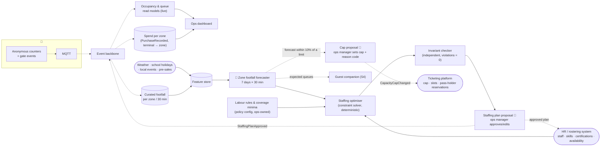

# S3 · Visitor Flow Forecasting & Staffing

> "We have no real idea what parts of the estate are most popular, so it's difficult to know where to invest & deploy staff."

**Moves:** OKR 2.2 (p90 queue ≤ 20 min), 2.3 (next-day MAPE ≤ 25%), 2.4 (idle staff hours −30%), 1.5 (fill weekdays)
**Phase:** 1 (live occupancy dashboard, heuristic staffing) → 2 (forecasting + optimiser, after ≥ 1 season of data per A6/R7) — see [roadmap](../../../README.md#delivery-roadmap-what-we-build-when-and-what-we-buy)
**Requirements:** FR-2.1, FR-2.2, FR-2.3, FR-2.10, FR-5.3; feeds FR-1.7 (timed-entry cap) and shows FR-2.6 (spend per zone); FR-2.4's estimate is worked in [S6](../operations-copilot/README.md)
**ADRs:** [ADR-0009](../../../adrs/ADR-0009-visitor-privacy-anonymous-counting.md), [ADR-0008](../../../adrs/ADR-0008-ai-evaluation-and-production-monitoring.md), [ADR-0007](../../../adrs/ADR-0007-human-in-the-loop-confidence-bands.md) (manager approves plans), [ADR-0004](../../../adrs/ADR-0004-event-driven-backbone.md) (`StaffingPlanApproved`, not the forecast, crosses contexts), [ADR-0018](../../../adrs/ADR-0018-visitor-token-and-anonymised-paths.md) (token taps, aggregated and weighted, for the order of a visit)

## Two problems, two tools
1. **Knowing what is popular now** is *not* an AI problem. Anonymous counters at zone boundaries and queue lines, gate events, and a dashboard solve it on day one (OKR 2.1). This is the foundation and it is deliberately boring.
2. **Knowing what will be popular next Saturday at 14:00** — and where to put 40 staff — is a forecasting and optimisation problem. Classical ML (gradient-boosted / temporal models on footfall, calendar, weather, ticket pre-sales, events) plus a constraint solver for rosters. No generative AI.

## Solution

## Containers
| Container | Responsibility | AI? |
| --- | --- | --- |
| Occupancy & queue read models | Live per-zone occupancy (in − out), queue length from queue-line counters, **average dwell per zone = occupancy ÷ throughput (Little's law)**; occupancy reset to zero at closing and reconciled hourly against gate totals, counters flagged when zones disagree with the park total by > 10% ([ADR-0009](../../../adrs/ADR-0009-visitor-privacy-anonymous-counting.md)); dashboard source | No |
| Curated footfall | 30-min aggregates per zone/ride; the training and evaluation dataset | No |
| Zone footfall forecaster | Per-zone forecast for 7 days at 30-min resolution with prediction intervals; retrained weekly | Yes — own model |
| Labour rules & coverage minima | Policy configuration owned by the ops manager, versioned like pricing guardrails: max hours and breaks per contract type, required certifications per zone (venomous-handling at venomous enclosures), minimum coverage per zone, no double booking | No (policy) |
| HR / rostering system (external, A12) | Source of staff, skills, certifications, contracts and availability; receives approved plans; payroll stays there | External |
| Staffing optimiser | Given forecast, staff data and labour rules → roster proposal | No — deterministic solver |
| Invariant checker | Independent re-check of every proposal against the hard constraints before it is shown; violations = 0 or the proposal is rejected | No |
| Staffing plan proposal | Human approves; edits captured as feedback; `StaffingPlanApproved` published — the forecast itself never leaves Park Operations | Human |

## Investment analytics (FR-2.4)
Curated footfall + a register of changes (new ride opened, enclosure refurbished, price change) is the input; the estimate itself — a synthetic control over comparable zones, with an interval, and the verdict "cannot be told apart from the season" when that interval spans zero — is worked in [S6](../operations-copilot/README.md#investment-effect-the-question-the-copilot-cannot-answer-alone). It lives there because it is the question `agent:management` is most often asked and the one most easily answered wrongly.

## The order of a visit, from token taps (FR-2.10)
The counters above answer *how many*. They cannot answer *in what order*, and "where do families go after the piranha tank" is behind half the investment decisions the register records.

Taps from the [visitor token](../../../adrs/ADR-0018-visitor-token-and-anonymised-paths.md) answer it for the cohort that carries one, and the honesty is in the weighting rather than in the map:

- **Counters stay the instrument of record.** Per zone and hour, the tap cohort is weighted to the counter total, so the carry rate is *measured* — published beside every figure, with its error.
- **A zone below a 15% carry rate is reported as "paths not representative"** and no flow is drawn for it. A missing answer beats a confident wrong one.
- **Aggregation happens before anything analytical sees the data:** zone-to-zone flows and dwell distributions only, suppressed below 20 tokens in a cell, no path shorter than a zone. Park Operations never receives an individual sequence.
- The quarterly exit survey (A14) is the independent check on *who* carries a token, which is the assumption (A16) the whole weighting rests on.

## Capacity and spend on the dashboard (FR-1.7, FR-2.6)
Two lines the ops dashboard gains from the [business case](../../../requirements/08-business-case.md):

- **Spend per zone and per visitor-day** from `PurchaseRecorded`, shown next to popularity so "popular" and "profitable" can be compared zone by zone. The terminal → zone mapping lives here in Park Operations.
- **The timed-entry cap as an ops decision.** When a day's forecast comes within 10% of the parking or gate limit ([08 §1](../../../appendix/business-case-model.md#1-capacity-reality-check)), the dashboard and the Estate daily report *propose* a cap; the ops manager sets it through the ticketing platform with a reason code, published as `CapacityCapChanged`. As with the roster, the forecast never sets it.

## Validation & verification
- **Backtesting:** rolling-origin evaluation on history; promote only when MAPE ≤ target for the horizon that matters (next day, next weekend).
- **Baseline to beat:** "same weekday last week × seasonal factor". If the model does not beat it, the heuristic stays in production (year 1 reality, R7).
- **Production:** daily forecast-vs-actual per zone; alert when 3-day rolling MAPE exceeds threshold; drift on inputs (a new ride changes everything → flag for retrain).
- **Human feedback:** manager edits to rosters are logged; systematic edits = optimiser constraints missing.
- Thresholds (MAPE ≤ 25% → 15%, alert at target + 5 points) are in the [thresholds & cadences table](../../ai-platform/README.md#thresholds-and-cadences-source-of-truth).

## Deterministic invariants (roster)

The optimiser is not AI, but it sits on an AI path and its output puts people next to venomous animals. Its hard constraints are **tested, not trusted**:

| Invariant | Meaning |
| --- | --- |
| R-I1 Coverage | Every zone has at least its minimum staff in every 30-min slot it is open |
| R-I2 Certification | Nobody is rostered to a venomous enclosure or a ride without the required certification |
| R-I3 Labour law | No shift exceeds max hours; breaks are scheduled; rest between shifts respected per contract type |
| R-I4 Availability | Nobody is rostered when the HR system says they are unavailable |
| R-I5 No double booking | One person, one place, one time |

**Property-based tests** generate random forecasts, staff pools and rule sets and assert zero violations across thousands of runs; **violations = 0** is a CI gate for every optimiser change. In production the independent invariant checker validates every proposal before the ops manager sees it; a violation is a P1 bug, not a warning.

## Degradation ladder
No model → heuristic forecast → same roster template as last week. Live occupancy dashboard has no AI dependency at all.
