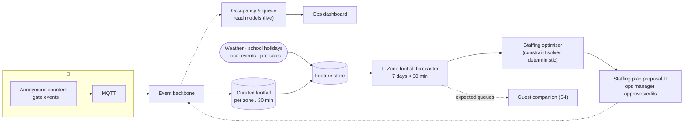

# S3 · Visitor Flow Forecasting & Staffing

> "We have no real idea what parts of the estate are most popular, so it's difficult to know where to invest & deploy staff."

**Moves:** OKR 2.2 (p90 queue ≤ 20 min), 2.3 (next-day MAPE ≤ 25%), 2.4 (idle staff hours −30%), 1.5 (fill weekdays)
**Requirements:** FR-2.1, FR-2.2, FR-2.3, FR-2.4, FR-5.3
**ADRs:** [ADR-0009](../../../adrs/ADR-0009-visitor-privacy-anonymous-counting.md), [ADR-0008](../../../adrs/ADR-0008-ai-evaluation-and-production-monitoring.md)

## Two problems, two tools
1. **Knowing what is popular now** is *not* an AI problem. Anonymous counters at zone boundaries and queue lines, gate events, and a dashboard solve it on day one (OKR 2.1). This is the foundation and it is deliberately boring.
2. **Knowing what will be popular next Saturday at 14:00** — and where to put 40 staff — is a forecasting and optimisation problem. Classical ML (gradient-boosted / temporal models on footfall, calendar, weather, ticket pre-sales, events) plus a constraint solver for rosters. No generative AI.

## Solution

## Containers
| Container | Responsibility | AI? |
| --- | --- | --- |
| Occupancy & queue read models | Live per-zone occupancy (in − out), queue length from queue-line counters; dashboard source | No |
| Curated footfall | 30-min aggregates per zone/ride; the training and evaluation dataset | No |
| Zone footfall forecaster | Per-zone forecast for 7 days at 30-min resolution with prediction intervals; retrained weekly | Yes — own model |
| Staffing optimiser | Given forecast, staff skills, shifts, legal breaks, minimum coverage per zone (safety) → roster proposal | No — deterministic solver |
| Staffing plan proposal | Human approves; edits captured as feedback | Human |

## Investment analytics (FR-2.4)
Curated footfall + a register of changes (new ride opened, enclosure refurbished, price change) → before/after comparison with seasonally matched controls. Simple, transparent, and what the Countess actually needs to decide where money goes.

## Validation & verification
- **Backtesting:** rolling-origin evaluation on history; promote only when MAPE ≤ target for the horizon that matters (next day, next weekend).
- **Baseline to beat:** "same weekday last week × seasonal factor". If the model does not beat it, the heuristic stays in production (year 1 reality, R7).
- **Production:** daily forecast-vs-actual per zone; alert when 3-day rolling MAPE exceeds threshold; drift on inputs (a new ride changes everything → flag for retrain).
- **Human feedback:** manager edits to rosters are logged; systematic edits = optimiser constraints missing.

## Degradation ladder
No model → heuristic forecast → same roster template as last week. Live occupancy dashboard has no AI dependency at all.
