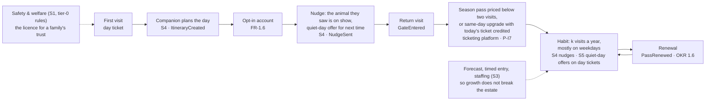

# 08 · Business Case & Growth

> The brief's first question — where do 15,000 visitors a day come from, and does the platform that helps get there pay for itself — was left open by the architecture. This document answers it with arithmetic a reader can redo with their own numbers.

**What this is, and is not.** It is the **platform's** business case: what the system in this repository costs, what it can be credited with, and when it pays back. It is **not an estate P&L**: the estate's profitability (G1) depends on decisions the Countess takes outside the software — parking, pricing, marketing, staffing — and §5 lists them with their order of magnitude. The headline is stated up front so nobody has to hunt for it: **15,000 visitors a day is not feasible on the estate's current parking; the platform's savings never pay for it alone; on the roadmap's own gates it pays back in years 4–6, and inside three years only if it is credited with a large share of year-3 growth.**

## 0. How to read the numbers

Every figure below is an **assumption until season 1**. Each table carries an "assumption → measured by" column naming the counter, event or survey that replaces it; the first season under new management supplies the measured values, and this document is re-issued once (§6). The arithmetic is shown, so a reader who disagrees with an input can substitute their own — the tables are generated by [`scripts/business_case.py`](../scripts/business_case.py) from a single assumptions block, and `uv run scripts/lint_docs.py` fails when a table or a cross-referenced number in [06](06-suggested-okrs.md) or the [README](../README.md) drifts from the model.

**Units and definitions**, used everywhere in this repository:

- **Visitor-day (visit):** one person entering once on one day, counted from `GateEntered.persons_admitted` — the group size admitted on one scan ([ADR-0011](../adrs/ADR-0011-offline-ticket-validation.md)). All attendance numbers are visitor-days.
- **Household:** the identified unit — one credential (ticket, family pass) or one opt-in account. Persons are derived from households only through the **party size of 3.5** (A9), an assumption until measured.
- **Repeat share p (OKR 1.2):** share of identified households with ≥ 2 visits in 12 months. Repeaters average **k = 3** visits a year (assumption). Unique households = household visits ÷ (pk + 1 − p); share of visits made by repeaters = pk ÷ (pk + 1 − p). For anonymous day tickets p is estimated from a quarterly exit survey and labelled as an estimate (A14).
- **Weekday / weekend ratio r (OKR 1.5):** average weekday visitor-days ÷ average weekend-day visitor-days, per open day. Weekly visitor-days = W(5r + 2) with W the weekend-day average, so the daily average D gives **W = 7D ÷ (5r + 2)**.
- **Peak day** = W × 1.4 (seasonal factor, A14). **Peak hour** = 20% of a day's arrivals (A14, as in NFR-SCL-1). **On site at 14:00** ≈ 55% of the day's visitor-days (A14).
- **Run rate vs. volume.** Ladder values are **end-of-year run rates** (visitor-days per day); a year's volume is the mean of adjacent run rates × 300 open days. Year 3's volume is therefore ≈ 3.7M, not 4.5M — the target run rate is reached at the end of year 3.
- **Revenue per visitor-day, gross:** single visit €21 = admission €15 + on-site €6; pass visit €15 = admission €9 (a season pass priced at 1.8 single admissions per person, used k = 3 times) + on-site €6. **Modelling assumption, lower bound:** every repeat visit is priced as a pass visit. It understates revenue where repeaters buy day tickets (today's estimated pass share of admissions, ~20%, is below the model's 25% for exactly that reason) and it is what makes OKR 1.3's modelled value an upper bound.
- **Contribution per visitor-day** (what a CFO counts): gross minus the ticketing fee (€0.15 per credential, one credential per visitor-day assumed — conservative), variable operations (€1: cleaning, consumables, casual staff) and 50% cost of goods on on-site sales. Single visit ≈ €17, pass visit ≈ €11 (exact values in §4). Marginal visits credited to the platform are mostly repeat and weekday visits, so the **pass contribution** is used for break-even. Cost of goods, variable operations and the fee are **finance-supplied configuration** (A15): no event carries them; the S5 policy engine and the business-guardrail row of the [thresholds table](../hld/ai-platform/README.md#thresholds-and-cadences-source-of-truth) read them from there.
- **OKR revenue is cash**, from `TicketPurchased` + `PurchaseRecorded` (FR-2.6); the €9-per-visit pass allocation above is a modelling convention only.
- **Platform cost as a function of volume V (visitor-days/yr):** OPEX(V) ≈ €580k fixed (team, cellular, maintenance, base cloud and LLM spend) + €0.165 × V (ticketing fee €0.15 + cloud and LLM scaling €0.015). It reproduces the [requirements/04 cost table](04-non-functional-requirements.md#cost-model-tco-50) within ≈ 2% at both ends and is used for every cumulative figure here. CAPEX €310k, depreciated over 5 years.
- **Payback is undiscounted** — acceptable for a kata, stated once.
- **Rounding:** tables show rounded figures; derived money is computed from unrounded values, so a reader substituting rounded cells lands a few percent off.
- **Roadmap months** (from the [README roadmap](../README.md#delivery-roadmap-what-we-build-when-and-what-we-buy)): Phase 0 months 0–6; Phase 1 months 6–18; Phase 2 months 18–30; Phase 3 from ≈ month 30; S5 experiment readout ≈ month 42.

## 1. Capacity reality check

**Verdict first: 15,000 visitors a day is infeasible on the estate's current parking.** A 15,000 average with a weekday/weekend ratio of 0.6 means a peak summer Saturday near 29,400 people; the car park as assumed holds 15,000 on a peak day. Either the estate roughly doubles its parking (≈ ×2 spaces, park-and-ride or coach contracts) or the share arriving by car falls to ≤ 41% — a decision for Phase 0–1, before the first ladder year's peaks. Nothing in the software changes that; the software can spread arrivals (timed entry, FR-1.7), shape demand (quiet-day offers, S5) and show the trend ("days until parking binds" on the [Estate daily report](../hld/core/README.md#estate-daily-report)).

What each year of the ladder means on the ground, at the end-of-year run rate:

<!-- business-case:run-rate -->
| End-of-year run rate | Y0 (today) | Y1 | Y2 | Y3 (target) |
|---|---|---|---|---|
| Daily average D (visitor-days) | 5,000 | 6,500 | 9,500 | 15,000 |
| Growth vs. previous year | — | +30% | +46% | +58% |
| Weekday / weekend ratio r (OKR 1.5) | 0.35 | 0.38 | 0.45 | 0.6 |
| Weekend-day average W = 7D ÷ (5r + 2) | 9,333 | 11,667 | 15,647 | 21,000 |
| Weekday average W × r | 3,267 | 4,433 | 7,041 | 12,600 |
| Peak day W × 1.4 | 13,067 | 16,333 | 21,906 | 29,400 |
| Peak-hour arrivals (20% of the peak day) | 2,613 | 3,267 | 4,381 | 5,880 |
| On site at 14:00 (55% of the peak day) | 7,187 | 8,983 | 12,048 | 16,170 |
| Constraints exceeded on the peak day (§1) | none | parking | parking, f&b seating at lunch | parking, f&b seating at lunch, gates |
<!-- /business-case:run-rate -->

Which constraint binds, at what attendance, and in which year:

<!-- business-case:capacity -->
| Constraint | Assumption (→ measured by) | Holds until (peak-day visitor-days) | First ladder year it binds | Verdict and lever |
|---|---|---|---|---|
| Parking | 2,500 spaces, 1.5 turns/day, 3.2 per car, 80% arrive by car (→ site survey, car counters) | 2,500 × 1.5 × 3.2 ÷ 0.8 = **15,000** | **Y1** (peak ≈ 16,333) | Binds first. Target peak ≈ 29,400 needs ≈ ×2 spaces or a car share ≤ 41%: park-and-ride / coach share, or fewer peak arrivals via timed entry (FR-1.7) and quiet-day shaping (S5) |
| F&B seating at lunch | 1,500 seats × 4 turns 11:30–14:30 = 6,000 meals; 55% of the day's visitor-days on site at lunch × 55% of those take a seated lunch (→ `PurchaseRecorded`, queue counters) | 6,000 ÷ (0.55 × 0.55) = **19,835**. If the 55% uptake applied to *all* visitor-days, capacity would be 10,909 — F&B would bind today; the two rates are measured separately in season 1 | **Y2** (peak ≈ 21,906) | Binds. Companion steers lunch times and under-used outlets (S4); spend per zone shows where |
| Gates | 6 lanes × 900 scans/h, one scan per person (a pass admitting 3.5 people on one scan makes this conservative by up to ×3.5); 20% of arrivals in the peak hour (→ `GateEntered.persons_admitted`) | 5,400/h ÷ 0.2 = **27,000** | **Y3** (peak ≈ 29,400) | Marginal: peak hour ≈ 5,880 scans/h against 5,400; holds only with timed-entry slots spreading arrivals (FR-1.7), or two more lanes |
| Rides | 40 historic rides × 150–300 riders/h × 8 h = 48k–96k rides/day (→ ride cycle counters) | 1.6–3.3 rides per visitor on the target peak day | — | Not a hard limit but the experience constraint: OKR 2.2 (p90 queue ≤ 20 min) breaks first; S3/S4 load spreading is the lever |
| Paths and lawns | 3.3 m² per person (Fruin LOS C) for 16,170 on site at 14:00 (→ site plan, zone counters) | 16,170 × 3.3 m² ≈ **5.3 ha** of walkable public area | — | Holds if the estate's public circulation area is at least that (site plan); below it, zone caps decided by ops from live occupancy (S3 read models) |
| Estate systems | broker cluster, LoRaWAN, ingestion sized in hld/core for > 100k visitor-days | peak-hour gate rate ≈ 1.6 scans/s | — | Hold ([capacity table](../hld/core/edge-and-connectivity.md#capacity-check-at-15000-visitorsday-by-traffic-class)) |
<!-- /business-case:capacity -->

**Levers by scenario.** S3's forecast feeds **timed-entry slots and a daily cap** applied through the ticketing platform (FR-1.7, [ADR-0012](../adrs/ADR-0012-ticketing-platform-adopt-not-build.md)) — an ops decision, published as `CapacityCapChanged`, with gate validation logic unchanged. S5's quiet-day offers move day-ticket demand off the peaks. S4's companion steers lunch times and under-used outlets. Live zone occupancy (S3 read models) lets ops cap a zone on the day. None of these adds a parking space.

## 2. Where the growth comes from

The ladder is **back-loaded** on purpose. The attendance levers the architecture owns — S4 nudges and S5 offers — go live in Phase 3 (≈ month 30). Year-1 growth belongs to the first season under new management: base price, marketing, seasonal events, season passes on sale from day one; the platform only measures it. A front-loaded ladder would credit the platform with growth it cannot cause.

Growth is decomposed two ways, and they are the same ×3 seen from two sides, not multiplied together:

- **By day-type** (run rates): weekend-day volume W ×2.25 (9,333 → 21,000) and the weekly multiplier (5r + 2) ×1.33 (r 0.35 → 0.6). Weekday fill is the lever the platform drives (S4 nudges to pass holders, S5 offers on day tickets); weekend volume comes from new audiences.
- **By people** (annual volumes): unique households ×1.6 and visits per household ×1.5. Repeat visits are the platform's lever; new households are marketing's.

The two overlap — pass-holding repeaters are the main weekday fillers — which is stated as a simplifying assumption rather than corrected for.

<!-- business-case:volume -->
| Over the year | Y0 (today) | Y1 | Y2 | Y3 (target) |
|---|---|---|---|---|
| Visitor-days (mean of adjacent run rates × 300 open days) | 1.5M | 1.7M | 2.4M | 3.7M |
| Repeat share of households p (OKR 1.2) — from the funnel in §3 | 10% | 12% | 18% | 40% |
| Unique households (visitor-days ÷ 3.5 ÷ (pk + 1 − p), k = 3) | 357k | 397k | 503k | 580k |
| Repeat households | 36k | 48k | 91k | 235k |
| Repeat visitor-days — share of all visits | 0.4M — 25% | 0.5M — 29% | 1.0M — 40% | 2.5M — 67% |
| Single visitor-days | 1.1M | 1.2M | 1.4M | 1.2M |
| Passes' share of admissions under the lower-bound assumption (OKR 1.3 model) | 25% | 29% | 40% | 67% |
| Gross revenue (single visit €21.00, pass visit €15.00) | €29.3M | €33.2M | €44.6M | €62.4M |
| Revenue per visitor-day | €19.5 | €19.2 | €18.6 | €17.0 |
| Revenue per household per year (OKR 1.4 model) | €82 | €84 (+2%) | €89 (+8%) | €107 (+31%) |
| Contribution (single €16.85, pass €10.85 per visitor-day) | €23.0M | €26.0M | €34.7M | €47.1M |
<!-- /business-case:volume -->

**Sanity check.** 3.7M visitor-days in year 3 and a 4.5M run rate are theme-park scale (Efteling / Europa-Park class), not zoo scale; with 40 rides the comparison is fair, and the brief's target implies it. **The membership trade is shown, not hidden:** revenue per visitor-day *falls* by design as passes become two-thirds of visits, while revenue per household per year rises ≈ 30% and total contribution doubles. A reader who believes repeaters will keep buying day tickets should raise the single-visit share and will get more revenue and a lower OKR 1.3 — the lower bound is deliberate.

**What the model gives the OKRs.** The 12-month "base" cells of OKRs 1.1, 1.2, 1.3 and 1.5 in [06](06-suggested-okrs.md) are the year-1 values below; the original targets stay as "stretch", and the gap between them is what marketing and a stronger flywheel must close. The 36-month targets are untouched; where the model's year-3 value differs, 06 says so in a note.

<!-- business-case:okr-base -->
| Key result | Current (model) | 12-month base (Y1 run rate / year) | 36-month model (Y3) |
|---|---|---|---|
| 1.1 Average visitors per day | 5,000 | 6,500 | 15,000 |
| 1.2 Repeat share of households | 10% | 12% | 40% |
| 1.3 Passes' share of admissions (lower-bound assumption) | 25% | 29% | 67% |
| 1.4 Revenue per household per year | €82 | €84 (+2%) | €107 (+31%) |
| 1.5 Weekday / weekend ratio | 0.35 | 0.38 | 0.6 |
| 1.6 Season-pass renewal (model retention) | n/a | 60% | 70% |
<!-- /business-case:okr-base -->

## 3. The membership flywheel

Zoos and family attractions grow on membership, not on ticket price: a pass priced below two visits turns a single-day buyer into a habit, and in 2026 renewal is the test of perceived value. The five scenarios were designed one by one; read together they are one wheel, with the estate's physical safety as the licence to enter it:

**Three levers, three owners.** (1) **Quiet-day offers on day and family tickets** are S5: an elasticity model inside management's guardrails, run as a randomised experiment in its first year. (2) **Pass economics** — the pass price, the same-day upgrade credit and renewal — are a **management decision plus ticketing policy executed by the vendor**: a pass is not date-specific, so no pricing model touches it; the upgrade credit is a platform invariant (P-I7 in [ADR-0012](../adrs/ADR-0012-ticketing-platform-adopt-not-build.md)), one price for everyone. (3) **Weekday fill from pass holders** is S4's nudges, measured as nudged vs. control weekday visits.

**The funnel we measure.** The repeat share p in §2 is not asserted; it is derived from six rates, each with the event that measures it. The rates ramp because the scenarios that move them arrive by phase (nudges before Phase 3 are the ticketing platform's plain offer e-mail, not personalised). If a rate falls short in season 1, p falls short, the unique-household row of the ladder grows, and marketing's job grows with it — the rates are not tuned to hit 40%.

<!-- business-case:funnel -->
| Rate | Meaning | Y1 | Y2 | Y3 (steady state) | Measured by | Why it ramps |
|---|---|---|---|---|---|---|
| Companion adoption | households that create an itinerary | 25% | 45% | 60% | `ItineraryCreated` ÷ households admitted | S4 FAQ (Phase 1) → day planning (Phase 2) |
| Opt-in | of those, households opening an account | 40% | 55% | 75% | account opt-in (FR-1.6) ÷ companion households | the companion gives a reason to keep an account |
| Nudge reach | of those, reached by a nudge they opened | 30% | 50% | 90% | `NudgeSent` with an open ÷ accounts | plain offer mail from the ticketing platform before Phase 3; S4 personalised nudges from month 30 |
| Return | of those, back within 12 months | 40% | 50% | 70% | `GateEntered` of the household after a nudge | quiet-day offer and season-pass offer in the nudge |
| Pass conversion | of returners, holding a season pass | 50% | 60% | 70% | pass `TicketPurchased` or upgrade credit ÷ returning households | measured for OKR 1.3; the revenue model prices every repeat visit as a pass visit regardless (lower bound) |
| Renewal / habit retention | of last year's repeat households, repeating again | 60% | 65% | 70% | `PassRenewed`; repeat `GateEntered` across years for accounts | OKR 1.6; pass renewal executed by the ticketing platform |
| **Flywheel conversion** (adoption × opt-in × reach × return) | share of non-repeating households converted this year | 1.2% | 6.2% | 28.3% | derived |  |
| **Organic conversion** | today's steady state: p = 10% with retention 50% | 5.6% | 5.6% | 5.6% | exit survey (A14) | constant |
| **Repeat share p** = p₋₁ × retention + (1 − p₋₁) × (organic + flywheel) | Y0 = 10% | **12%** | **18%** | **40%** | OKR 1.2 | if p falls short, the ladder's unique-household row grows, not the rates |
<!-- /business-case:funnel -->

The four rates that make up the flywheel conversion are **business guardrails** in the [thresholds table](../hld/ai-platform/README.md#thresholds-and-cadences-source-of-truth) (alert only, no model rollback). **OKR 1.6 season-pass renewal** is new: `PassRenewed` exists from Phase 0, so the first cohort's renewal is measurable at month 12 (the 12-month "baseline"), and the 36-month target of ≥ 70% is labelled ambitious against zoo-membership norms of 50–70%.

## 4. Does the platform pay back

Cost is the [requirements/04 cost model](04-non-functional-requirements.md#cost-model-tco-50) as a curve; benefit is contribution, not gross revenue.

<!-- business-case:payback -->
| Line | Value |
|---|---|
| CAPEX (requirements/04), all in year 1 | €310k |
| OPEX(V) = €580k + €0.165 × visitor-days | Y1 €865k / Y2 €976k / Y3 €1.19M |
| Cumulative platform cost by month 36 | **€3.34M**, then ≈ €110k/month at the target run rate |
| Savings, from month 18 (S1 vet cost −15% → −30% of €300k; S3 idle hours −30% → −50% of 15% of a €1.20M field payroll) | €99k/yr rising to €180k/yr at month 36 — ≈ 14% of OPEX; never pays back alone |
| Contribution per visitor-day (gross − fee €0.15 × 1.0 credential − variable ops €1.00 − 50% cost of goods on €6.00 on-site) | single visit **€16.85**, pass visit **€10.85** |
| Net per incremental visitor-day credited to the platform (pass contribution − €6 re-pricing of a converted single visit spread over k − 1 = 2 new visits, for the 50% of increments that come via conversion) | **€9.35** |
| Break-even at today's volume: annual cost OPEX(1.5M) + CAPEX ÷ 5 | €890k ≈ **81,982 extra visitor-days (+5.5%)** at pass contribution, 52,789 (+3.5%) at single-visit contribution, or €1.78M more on-site sales (+20%) |
| Platform cost as a share of gross revenue | 2.8% today → 1.7% at the target run rate |
<!-- /business-case:payback -->

**Attribution, stated conservatively.** The platform claims **none** of new-audience growth and **nothing before Phase 3** (≈ month 30). From then it is credited with a number of **incremental visitor-days a year** — visits that would not have happened without nudges, quiet-day offers and the pass upgrade — at the pass contribution, **minus** the re-pricing of the single visit that a converted household used to make (its one €21 visit becomes three €15 visits: two are new, one is cheaper). The sensitivity is in incremental visits, not in shares of total attendance, and it is a sensitivity because attribution is not provable (R20): the nudged-vs-control cohort (S4) and the discounted-vs-control blocks (S5) are the only clean measurements.

<!-- business-case:sensitivity -->
| Incremental visitor-days credited to the platform from month 30 | Annual attributed contribution | Benefit vs. cost at month 36 | Cumulative break-even |
|---|---|---|---|
| 200,000/yr (≈ 4% of the year-3 run rate; 12% of the Y2 → Y3 growth) | €1.87M | €1.16M vs. €3.34M | ≈ month 72 (year 6) |
| 400,000/yr (≈ 9% of the year-3 run rate; 24% of the Y2 → Y3 growth) | €3.74M | €2.09M vs. €3.34M | ≈ month 42 (year 4) |
| 600,000/yr (≈ 13% of the year-3 run rate; 36% of the Y2 → Y3 growth) | €5.61M | €3.03M vs. €3.34M | ≈ month 37 (year 4) |
| Savings only | €180k | €221k vs. €3.34M | never |
<!-- /business-case:sensitivity -->

**Headline.** On the roadmap's own gates the platform pays back in **years 4–6**; inside the brief's three years only if it is credited with roughly 600,000 incremental visitor-days a year from month 30 — a third of the year-2-to-year-3 growth — and even then marginally. The savings are real but small: they cover about a seventh of running cost and never pay back the platform. Safety is not priced — one prevented incident with a poisonous animal or an 18th-century ride is the business (G6). This is a **growth bet**, and the brief asked for growth; it is sized and sequenced as one. The two lines a CFO can pull to shorten it are the **ticketing fee** (the largest scaling cost) and the **team** (≈ 40% of OPEX at the target run rate).

**What must be true** for the middle row, and how we will know:

| Condition | Earliest signal | Where it is measured |
| --- | --- | --- |
| Phase 3 levers (S4 nudges, S5 offers, pass upgrade prompt) live by month 30 | Roadmap gate: Phase 2 live + 1 year of sales and footfall | [README roadmap](../README.md#delivery-roadmap-what-we-build-when-and-what-we-buy) |
| Season-pass renewal ≥ 60% (cohort over cohort) | Month 24 — the first cohort's second renewal window | OKR 1.6; business-guardrail row |
| Contribution per pass visit stays at the modelled floor (on-site spend ≈ €6 holds) | Month 12 of `PurchaseRecorded` | OKR 1.4 second line; business-guardrail row (A15 parameters) |
| Parking decision taken before year-1 peaks | Phase 0 | §5, estate |
| Funnel rates within 20% of the table in §3 | Month 18 (companion adoption, opt-in); month 36 (reach, return) | S4 business guardrails |

## 5. What the estate must fund besides the platform

The platform is ≈ 3% of revenue today and ≈ 1.7% at target. The investments that make 15,000 a day physically possible are larger and are not in this repository's scope. Orders of magnitude, so the Countess can see the whole bill; owners named so nothing falls between the software and the estate:

| Investment or decision | Why (from §1–§3) | Order of magnitude (assumption) | Owner | When |
| --- | --- | --- | --- | --- |
| **Parking**: ≈ 2,500 more spaces, or park-and-ride and coach contracts that bring the car share to ≤ 41% | Binds in year 1 | New spaces ≈ €3–5k each (€8–12M) *or* park-and-ride / coach share ≈ €0.3–0.5M a year | Estate | Decision in Phase 0–1; capacity before the year-1 summer |
| **F&B seating and outlets**: ≈ +1,500 seats or a longer lunch window | Binds in year 2 | ≈ €1–2M; the companion's lunch steering and `PurchaseRecorded` say where | Estate, F&B lead | Before year 2 |
| **Gate lanes**: +2 lanes, or timed-entry slots that flatten the peak hour | Marginal in year 3 | ≈ €50–100k for lanes; slots are a ticketing-platform setting (FR-1.7) | Estate, ops manager | Year 2–3 |
| **Marketing and catchment plan** for ≈ ×1.6 unique households | The platform does not manufacture demand | At a customer-acquisition cost of €10–20 per new household, ≈ €2–4M a year by year 3 | Countess, marketing | From Phase 0 |
| **Base price and pass price** (a pass below two visits) | Pass economics is the second lever, executed by the vendor | Pricing decision; the modelled €9 per pass visit is an assumption | Management | Yearly |
| **Step staffing** as attendance triples | Field staff scale with visitors; S3 optimises within the budget it is given | ≈ +60–100 field FTE by year 3 (order of magnitude) | Estate, HR | Per phase |
| **Site survey** for the capacity assumptions (parking turns, car share, seats, lane throughput, public area) | Every row of §1 is an assumption | Days of work; the same visit verifies A2 and the LoRaWAN plan | Platform lead with the estate | Phase 0 |

This is also the honest reading of the README's "[What this architecture does not do](../README.md#what-this-architecture-does-not-do)": the platform measures growth from day one and drives two of its three levers from Phase 3; the parking, the prices and the marketing are the Countess's.

## 6. Owner, trigger and re-issue

**Owner:** the platform lead, with the ops manager. **Trigger:** at Phase 2 entry (≈ month 18) and yearly thereafter: replace the assumptions block in [`scripts/business_case.py`](../scripts/business_case.py) with measured values (gate counts with `persons_admitted`, `PurchaseRecorded` totals, the funnel events, the exit survey, the site survey), run `--write`, and re-issue this document and [06](06-suggested-okrs.md) in one pull request marked "season-1 measured". Until then every number here is a hypothesis with a named test.

Risks that belong to this document: R16 (POS integration and reconciliation), R17 (estate capacity outside the platform), R18 (marketing dependency for new households), R19 (pass cannibalisation of single-visit revenue), R20 (attribution cannot be proven) in [07](07-risks-and-mitigations.md).
